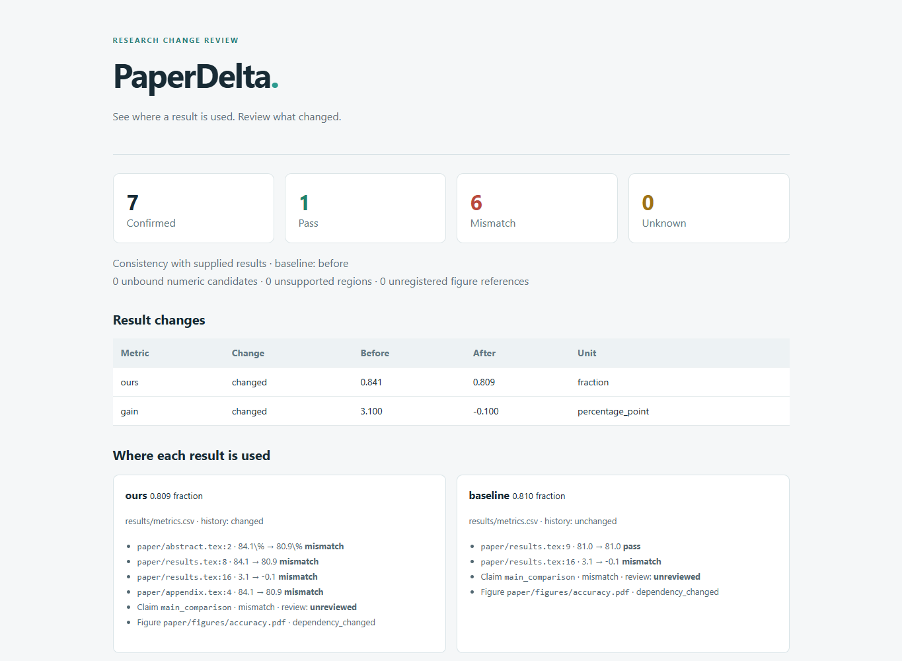

# PaperDelta

**Review how experiment changes affect an existing research paper.**

An accuracy value changes from **84.1% to 80.9%**. The paper still repeats the old
number in its abstract, table and appendix, reports a **3.1 percentage point**
gain, says the method outperforms an **81.0%** baseline, and keeps an old result
figure. PaperDelta traces
those statements to declared CSV/JSON evidence and presents them together for
review—even when no LaTeX file changed.

Local Python CLI · existing LaTeX · exact decimal arithmetic · offline HTML ·
optional MCP · no model key, GPU or TeX installation required for checking.



**Locally accepted alpha (0.1.0a2).** The local workflow is implemented. A small
[real-text evaluation](docs/evaluation.md) records both supported and unknown
cases. A [local CLI comparison](docs/comparison.md) exercises Calkit and
scitexlintr as well. Pre-release acceptance uses local machine tests and developer
review; see the [acceptance decision](docs/release-acceptance.md). Windows and Linux
have local evidence; macOS and remote CI are unverified.
Independent first-use feedback is planned after launch. No package-index publication yet.
See the [evidence ledger](docs/progress.md) for measured results and follow-up work.

**Moving this project to a Mac?** Use the [Mac quick start](START_ON_MAC.md).
The transfer package includes a wheel and native validation script, with separate
Apple Silicon and Intel CI jobs. Native macOS results are still pending.

## Try it from this checkout

Use Python 3.11+ in a virtual environment, then run from the repository root:

```sh
python -m pip install -e .
paperdelta -C examples/research-paper check --report build/review
python tools/demo.py --out build/demo
```

Open `build/demo/comparison-reversed/review/report.html`. The demo creates copies
of the supplied original fixture, changes only their data, and produces two cases:

| Case | Expected result |
| --- | --- |
| 84.1% → 80.9% | Four stale numeric occurrences, a false comparison, and changed figure inputs; related numeric fixes are withheld |
| 84.1% → 84.5% | Four proposed replacements across three files; apply, recheck and restore original bytes |

The demo preserves existing output; choose a different `--out` when repeating it.
It is a synthetic regression example, not an accuracy benchmark on real papers.
Watch the [52-second recording](docs/assets/paperdelta-demo.webm).
The first case includes an actually generated PDF and an imported source record;
the second isolates the numeric patch workflow. Checking never executes the plot
script. To explicitly regenerate the first case's figure, install `.[demo]` and
run its `scripts/plot_accuracy.py --project PATH_TO_CASE`.

Two smaller examples expose important boundaries:
[an ambiguous table](examples/ambiguous-table/README.md) intentionally exits 2;
[Chinese paths and a literal macro](examples/unicode-macro/README.md) pass and
support a verified BOM/CRLF patch-and-recovery check.

## Connect an existing paper

```sh
paperdelta init --paper paper/main.tex --data results/metrics.csv
paperdelta scan --format json
paperdelta schema proposal-input
paperdelta propose --input mapping-input.json --out proposed-mapping.json
paperdelta bind --proposal proposed-mapping.json
paperdelta bind --proposal proposed-mapping.json --interactive
paperdelta check --report build/paperdelta
```

`init` records discovery hints and creates an empty mapping configuration. CSV
column types, record keys, experiment scope, units and mappings need explicit
declarations. `scan` shows candidates; equal numbers do not establish a match.
`bind` previews evidence. In a terminal, `--interactive` shows each mapping's
paper context and selected data; choose `y` or `n` and type `accept` at the end
to save the selection. Scripted workflows can instead use repeated
`--accept occurrences:ID` options.
See the [quick start](docs/quickstart.md) for a complete mapping input.

## Review the next experiment update

```sh
paperdelta snapshot create submitted-v1
# Run your experiments using your existing workflow.
paperdelta check --baseline submitted-v1 --report build/paperdelta
paperdelta fix --report build/paperdelta/report.json --out changes.pdpatch.json
paperdelta apply changes.pdpatch.json --dry-run
paperdelta apply changes.pdpatch.json --write
```

Only verified numeric spans are eligible for patches. File, configuration and
evidence hashes must still match; stale or overlapping edits are refused. Writes
have a recovery journal. `paperdelta recover TRANSACTION_ID` previews restoration;
add `--write` to restore, provided no later author edit would be overwritten.

Named snapshots, numeric fixes and author review records are separate actions.
A review record identifies a specific claim and evidence state. It cannot turn
a failing check into a pass.

For pull requests, the [CI guide and workflow example](docs/ci.md) use the target
commit's snapshot and separately list changes to mappings, rules and review
declarations. A passing numeric check can then be reviewed alongside any removed
bindings. Try the two local Git scenarios with `python tools/demo_ci.py --out build/ci-demo`.

## Use with an agent

The CLI emits JSON and machine-readable schemas. The optional stdio server uses
the official MCP Python SDK:

```sh
python -m pip install -e '.[mcp]'
paperdelta -C /path/to/paper-project mcp
```

Its five tools scan, propose bindings, check, explain findings and propose patches.
They do not write files, accept mappings or record author review. See the
[agent guide](docs/agent-guide.md).

For saved-proposal evaluation, a [12-case mapping suite](evaluations/mapping-v1/README.md)
separates numeric consistency from experiment identity. A
[local Qwen3-8B experiment](docs/local-model-evaluation.md) produced twelve invalid
proposals, all rejected; this model setup is not an automatic mapping solution.
The documented explicit workflow passed a ten-binding developer walkthrough.
Independent model accuracy and user confirmation times remain unmeasured.

## Scope and exit codes

- **0:** all required, confirmed checks pass against the supplied evidence.
- **1:** at least one confirmed check fails.
- **2:** configuration, required evidence or parsing is incomplete; or there are
  no confirmed bindings.

Every report also lists unbound numeric candidates, unsupported regions and
unregistered figure references. Set `require_complete_coverage: true` to make
these block a successful exit. A green result describes declared checks, not
the scientific correctness of a whole paper.

Literal `input/include`, UTF-8/BOM/CRLF, configured literal macro arguments,
CSV/JSON, explicit aggregations, unit-aware derived values, limited comparisons
and declared figure provenance are supported. Dynamic TeX, arbitrary macro
expansion, significance inference and global SOTA claims are outside this alpha's
scope. [Rules and limitations](docs/rules.md) explain the contract.

## Related work

[Calkit](https://github.com/calkit/calkit) already connects evidence, conditional
answers and LaTeX. [scitexlintr](https://github.com/arjunrajlaboratory/scilintr/tree/main/tex/scitexlintr)
already detects and fixes numeric snapshot drift. PaperDelta's product hypothesis
is a useful workflow for incrementally mapping existing papers and reviewing the
cross-file impact of changes. A lower adoption cost is **not yet demonstrated**.
The [workflow comparison](docs/comparison.md) records actual CLI behavior and
necessary source edits for one case. The [research notes](docs/research.md)
record inspirations, source revisions and the original comparison plan.

## Develop

```sh
python -m pip install -e '.[dev,mcp]'
python tools/run_tests.py -q
python -m ruff check src tests tools
python -m ruff format --check src tests tools
python -m build
```

For separate code/evaluation artifacts and content verification, follow
[local validation and candidate builds](docs/local-validation.md).

[中文指南](docs/zh-CN.md) · [Development plan](docs/development-plan.md) ·
[Contributing](CONTRIBUTING.md) · [MIT license for original code](LICENSE) ·
[Third-party fixture licenses](THIRD_PARTY_NOTICES.md)
