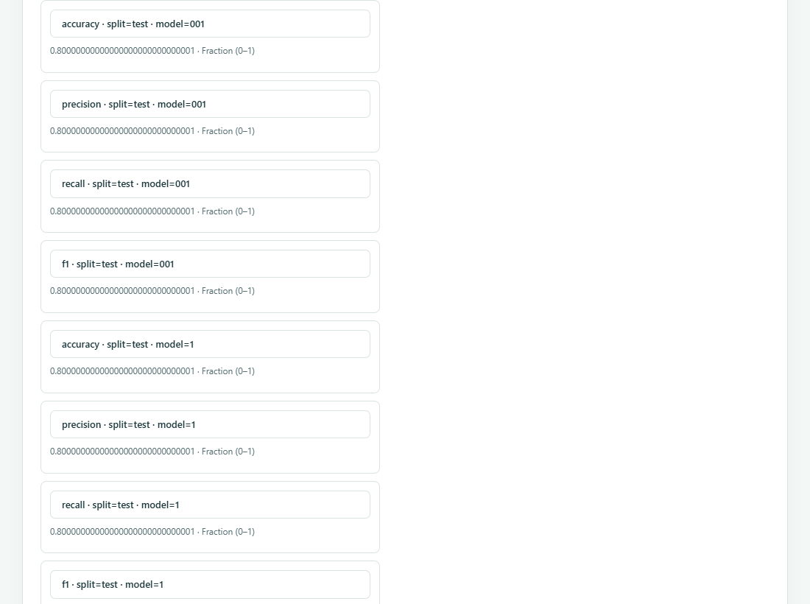

<h1 align="center">
  <picture>
    <source media="(prefers-color-scheme: dark)" srcset="docs/assets/brand/paperdelta-logo-dark.svg">
    
  </picture>
</h1>

<p align="center">
  <strong>Review how experiment changes affect an existing research paper.</strong>
</p>

<p align="center">
  <a href="https://github.com/amos689/paperdelta/actions/workflows/ci.yml"></a>
  <a href="https://github.com/amos689/paperdelta/releases/tag/v0.8.0"></a>
  <a href="LICENSE"></a>
</p>

<p align="center">
  <a href="pyproject.toml"></a>
  <a href="pyproject.toml"></a>
  <a href="docs/rules.md"></a>
  <a href="docs/pdf.md"></a>
  <a href="docs/agent-guide.md"></a>
</p>

<p align="center">
  <a href="https://github.com/amos689/paperdelta/actions/workflows/ci.yml"></a>
  <a href="docs/languages.md"></a>
</p>

<p align="center">
  <strong>English</strong> · <a href="README.zh-CN.md">简体中文</a> ·
  <a href="docs/quickstart.md">Quick start</a> ·
  <a href="https://github.com/amos689/paperdelta/releases">Releases</a> ·
  <a href="https://github.com/amos689/paperdelta/issues/new/choose">Feedback</a>
</p>

An accuracy result changes from **84.1% to 80.9%**. The abstract, table and
appendix still repeat the old number; a **3.1 percentage point** improvement and
an **outperforms baseline** claim no longer hold. PaperDelta traces those statements
to declared CSV/JSON evidence and brings the affected locations together for review,
even when no LaTeX file changed.

Local Python CLI · LaTeX + optional Word/PDF · exact decimal arithmetic · offline HTML · optional MCP.
Checking needs no model key, GPU or TeX installation.

<p>
  <picture>
    <source media="(prefers-reduced-motion: reduce)" srcset="docs/assets/v0.8/report.png">
    
  </picture>
</p>

A 22-second walkthrough of real Studio screens: reuse experiment settings,
inspect exact identities, select result cells and accept only reviewed bindings.
Playback is paced for reading.
[Open the full-size animation](docs/assets/v0.8/demo.en.gif?raw=true) ·
[View the static screenshot](docs/assets/v0.8/report.png).

**0.8.0** adds batch binding, portable experiment templates and graphical review
of CLI/MCP proposals. A reproducible 24-metric workflow takes 103 recorded browser
interactions versus 270 in 0.6.0; [scope and raw traces](docs/v0.8.md) are published.
Snapshot comparison, ongoing checks and local draft recovery remain available.
Run `paperdelta studio` to start. The interface supports English/Chinese throughout.
See the [Studio guide](docs/studio.md) and [upgrade notes](docs/v0.8.md).
The project has received positive informal feedback from several users; it is
not presented as a measured usability study. Releases use normal version numbers.

## Install and see the first report

For the source/PDF example, install `paperdelta[pdf]` and run
`paperdelta demo --document pdf --out pdf-demo --open`.
The report highlights original pages; PDF review is read-only and does not perform OCR.

For a Word example, install `paperdelta[docx]` and run
`paperdelta demo --document docx --out word-demo --open`.
Word review is read-only; [supported structures and positions](docs/word.md) are explicit.

Use Python 3.11 or newer. In a virtual environment:

```sh
python -m pip install paperdelta
paperdelta demo --out paperdelta-demo --open
```

If needed, create the environment first with `python -m venv .venv`. Activate it
with `.venv\Scripts\Activate.ps1` on Windows PowerShell or
`source .venv/bin/activate` on macOS/Linux (use `python3` when creating it there).

The installed package includes the complete offline example. Open
`paperdelta-demo/review/report.html` if it does not open automatically. Choose
English or Chinese in the report. The default scenario intentionally finds stale
numbers, a false comparison and changed figure dependencies. Related numeric edits
are withheld until the conclusion is addressed. No paper changes are applied.

`--scenario baseline` shows unchanged evidence; `--scenario safe-update` prepares
four numeric edits and a readable diff. Each run needs a new `--out` directory.
The demo command returns 0 on successful creation; its report retains the actual
check result, normally 1 for the changed scenario. See [demo details](docs/workflows.md).

A wheel, source archive and separately licensed evaluation bundle are also
available from [GitHub Releases](https://github.com/amos689/paperdelta/releases).
Verify the wheel with the release's `SHA256SUMS`, then run
`python -m pip install ./paperdelta-0.8.0-py3-none-any.whl`.

## Connect an existing paper

Run `paperdelta studio` in the paper folder to create a configuration, declare evidence,
select locations and explicitly confirm bindings in a local browser. No hand-written YAML
is needed for this workflow. Start with the [workbench guide](docs/studio.md).
The CLI workflow remains available:

```sh
paperdelta init --paper paper/main.tex --data results/metrics.csv
paperdelta batch guide
paperdelta check --report build/paperdelta
```

`init` discovers inputs without accepting bindings. The batch guide reuses explicit
source, record identity, units, aggregation and seed choices across a CSV results
table. It suggests locations from context, lets you choose repeated occurrences,
and shows the final selection before `accept`. Equal numbers alone are not evidence
of identity. JSON sources and individual/derived metrics use `paperdelta guide`.

Start with a selected file or region through `scope set`; record a justified
non-result number through `scope exclude`. Both preview before `--accept`.
Changes to excluded text require review, and accepted failing bindings cannot be
hidden by changing scope. See [batch binding and coverage](docs/workflows.md),
[guided binding and repairs](docs/guided-bindings.md), and the
[complete JSON tutorial](docs/quickstart.md).

Use `--lang zh-CN` before a subcommand or save `settings --language zh-CN`.
Language preferences do not change scientific results or evidence identity.

## Review the next experiment

```sh
paperdelta snapshot create submitted-v1
# Run experiments in your existing workflow.
paperdelta watch --baseline submitted-v1 --report build/paperdelta --open
```

Saving data, paper or configuration triggers a complete check after a short quiet
period. The report marks observed changes as **pending** until rechecked and
refreshes in the browser. Its review queue identifies evidence issues, broken
bindings, conclusions, numeric updates and figures. Stop with `Ctrl+C`.
A one-off check remains available with `check --baseline submitted-v1`.

```sh
paperdelta fix --report build/paperdelta/report.json --out changes.pdpatch.json
paperdelta apply changes.pdpatch.json --dry-run
paperdelta apply changes.pdpatch.json --write
```

Only verified numeric locations enter a patch. Changed inputs, ambiguous or
overlapping edits are refused; invalid related claims block numeric changes.
A transaction preserves original bytes. `paperdelta recover TRANSACTION_ID`
previews recovery; add `--write` to restore when no later author edits intervene.
The checker never runs experiment or plotting scripts.

The [CI adapter](docs/ci.md) compares the target commit and reports changes in
bindings, rules, scope and review declarations alongside consistency results.

## Work with an Agent

```sh
python -m pip install 'paperdelta[mcp]'
paperdelta -C /path/to/paper-project mcp
```

Seventeen optional MCP tools provide checks, evidence, proposals and repairs.
Four batch-session tools let an Agent select candidate IDs while the program
assembles the proposal. Sessions are in memory, bounded and invalidated by changed
inputs. The tools do not accept mappings or write paper files. The
[Agent guide](docs/agent-guide.md) includes the workflow and host configuration.
CLI JSON and schemas remain available without MCP.

Deterministic protocol tests verify tool behavior. Historical
[Qwen3-8B trials](docs/staged-model-evaluation.md) did not produce complete valid
mappings; this release does not claim proven automatic mapping accuracy.

## Supported scope

- **Exit 0:** required accepted checks agree with the supplied evidence.
- **Exit 1:** an accepted check fails.
- **Exit 2:** evidence, configuration or parsing is incomplete, no bindings exist,
  or a live check is pending.

Reports keep unbound, excluded, outside-scope and unsupported content visible.
`require_complete_coverage` can require numeric coverage in the declared scope;
existing bindings always run. Agreement is not certification of scientific truth.

Supported inputs include literal LaTeX `input/include`, declared literal macro
arguments, bounded literal table cells, CSV/JSON, explicit aggregation, derived
values with units, limited comparisons and figure provenance. Dynamic TeX,
arbitrary macro expansion, statistical inference and global SOTA verification
remain outside the supported contract. Word paragraphs and ordinary tables are supported
with `paperdelta[docx]`; revisions, fields and complex layouts remain unverified.
See [rules and limits](docs/rules.md) and the [Word boundary](docs/word.md).

Text PDFs use optional `paperdelta[pdf]`, native page/box coordinates and explicit
extraction identities. Scanned pages and unreliable layouts remain unverified.
Multiple manuscripts share explicitly declared metrics, with optional source/export
relations. See the [PDF boundary and workflow](docs/pdf.md).

[Cross-platform CI](https://github.com/amos689/paperdelta/actions/workflows/ci.yml)
covers Python 3.11–3.14 on Windows, Linux, Apple Silicon and Intel macOS.
[Historical validation](docs/v0.2-acceptance.md), [native Mac evidence](docs/macos-validation-2026-10-03.md)
and [current release checks](docs/v0.8.md) distinguish what each run established.

## Development

```sh
git clone https://github.com/amos689/paperdelta.git
cd paperdelta
python -m pip install -e '.[dev,mcp]'
python tools/run_tests.py -q
python -m ruff check src tests tools
python -m ruff format --check src tests tools
python tools/check_docs.py
```

[Contributing](CONTRIBUTING.md) · [Changelog](CHANGELOG.md) ·
[MIT license](LICENSE) · [Third-party notices](THIRD_PARTY_NOTICES.md) ·
[Security](SECURITY.md) · [Mac installation](START_ON_MAC.en.md)
