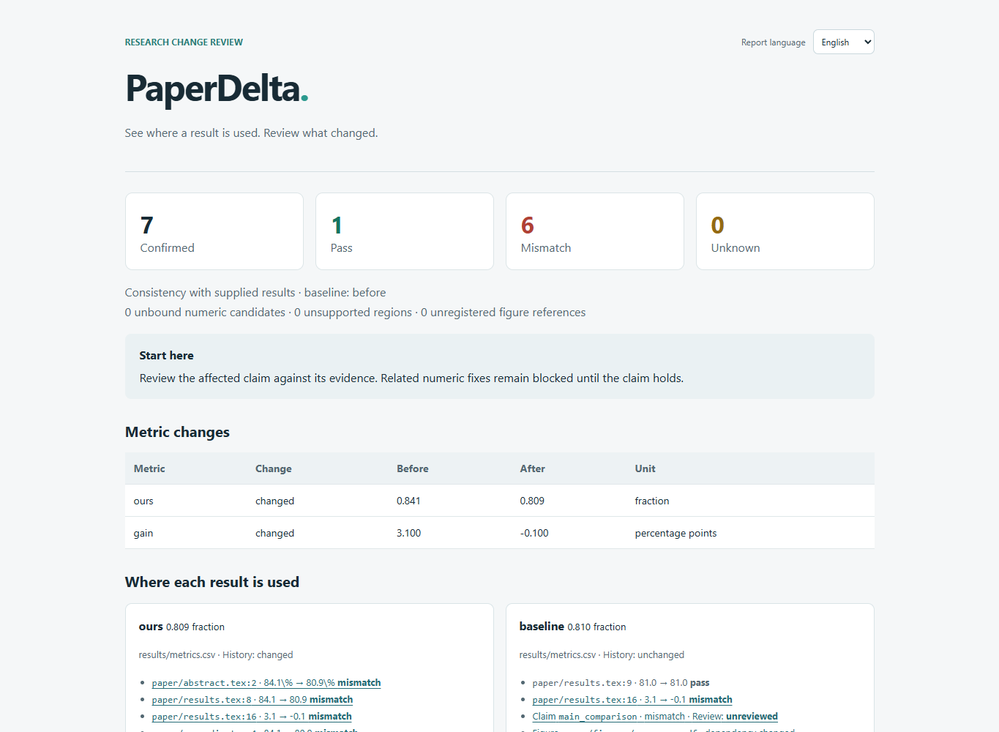

<h1 align="center">
  <picture>
    <source media="(prefers-color-scheme: dark)" srcset="docs/assets/brand/paperdelta-logo-dark.svg">
    
  </picture>
</h1>

<p align="center">
  <strong>Review how experiment changes affect an existing research paper.</strong>
</p>

<p align="center">
  <a href="https://github.com/amos689/paperdelta/actions/workflows/ci.yml"></a>
</p>

<p align="center">
  <strong>English</strong> · <a href="README.zh-CN.md">简体中文</a> ·
  <a href="docs/quickstart.md">Quick start</a> ·
  <a href="https://github.com/amos689/paperdelta/releases">Releases</a> ·
  <a href="https://github.com/amos689/paperdelta/issues/new/choose">Feedback</a>
</p>

An accuracy value changes from **84.1% to 80.9%**. The paper still repeats the old
number in its abstract, table and appendix, reports a **3.1 percentage point**
gain, says the method outperforms an **81.0%** baseline, and keeps an old result
figure. PaperDelta traces
those statements to declared CSV/JSON evidence and presents them together for
review—even when no LaTeX file changed.

Local Python CLI · existing LaTeX · exact decimal arithmetic · offline HTML ·
optional MCP · no model key, GPU or TeX installation required for checking.



**v0.2 alpha (0.2.0a1).** New features include
English/Chinese interfaces, an offline report language switch, environment diagnosis,
guided mapping, explicit location repair and staged agent tools. Follow the
[v0.2 delivery ledger](docs/v0.2-plan.md). A small
[real-text evaluation](docs/evaluation.md) records both supported and unknown
cases. A [local CLI comparison](docs/comparison.md) exercises Calkit and
scitexlintr as well. Pre-release acceptance uses local machine tests and developer
review; see the [v0.2 acceptance decision](docs/v0.2-acceptance.md). Windows
3.11–3.14 and local Linux have current installed-package evidence with exact run limits.
Native Apple Silicon macOS 27.0.1 now has installed-wheel evidence on Python 3.12.14
and 3.14.6. The [GitHub Actions matrix](https://github.com/amos689/paperdelta/actions/workflows/ci.yml)
adds Windows, Linux, Apple Silicon and Intel macOS on Python 3.11–3.14;
individual run results and artifacts show what passed.
Independent first-use feedback is planned after launch. No package-index publication yet.
See the [evidence ledger](docs/progress.md) for measured results and follow-up work.

**Native Mac validation completed on 2026-10-03.** Both tested Python versions pass
all 241 final tests without skips. Runtime code and the accepted wheel are unchanged;
see the [Mac results and limits](docs/macos-validation-2026-10-03.md). The
[Mac quick start](START_ON_MAC.en.md) remains the reproduction and return guide.

## Try the demo

Clone the repository and use Python 3.11+ in a virtual environment:

```sh
git clone https://github.com/amos689/paperdelta.git
cd paperdelta
python -m venv .venv
```

Activate it with `.venv\Scripts\Activate.ps1` in Windows PowerShell, or
`source .venv/bin/activate` on macOS/Linux (`python3` may be needed to create it).
Then run:

```sh
python -m pip install -e .
paperdelta --lang en -C examples/research-paper doctor
paperdelta -C examples/research-paper check --report build/review
python tools/demo.py --out build/demo
```

Open `build/demo/comparison-reversed/review/report.html`. The demo creates copies
of the supplied original fixture, changes only their data, and produces two cases:

| Case | Expected result |
| --- | --- |
| 84.1% → 80.9% | Four stale numeric occurrences, a false comparison, and changed figure inputs; related numeric fixes are withheld |
| 84.1% → 84.5% | Four proposed replacements across three files; apply, recheck and restore original bytes |

The demo preserves existing output; choose a different `--out` when repeating it.
It is a synthetic regression example, not an accuracy benchmark on real papers.
The [bilingual v0.2 recordings](docs/demo.md) show the current report and review workflow.
The first case includes an actually generated PDF and an imported source record;
the second isolates the numeric patch workflow. Checking never executes the plot
script. To explicitly regenerate the first case's figure, install `.[demo]` and
run its `scripts/plot_accuracy.py --project PATH_TO_CASE`.

Two smaller examples expose important boundaries:
[an ambiguous table](examples/ambiguous-table/README.md) intentionally exits 2;
[Chinese paths and a literal macro](examples/unicode-macro/README.md) pass and
support a verified BOM/CRLF patch-and-recovery check.

For an existing paper without the demo, download the wheel from
[v0.2.0a1](https://github.com/amos689/paperdelta/releases/tag/v0.2.0a1), verify it
against the release's `SHA256SUMS`, and install it in a virtual environment with
`python -m pip install ./paperdelta-0.2.0a1-py3-none-any.whl`.
Use the source checkout for examples and validation tools. There is no PyPI release.

## Connect an existing paper

```sh
paperdelta init --paper paper/main.tex --data results/metrics.csv
paperdelta --lang en guide
paperdelta check --report build/paperdelta
```

`init` records discovery hints and creates an empty mapping configuration. CSV
column types, record keys, experiment scope, units and mappings need explicit
declarations. `scan` shows candidates; equal numbers do not establish a match.
`guide` selects these declarations step by step, supports multiple locations and
shows the resulting evidence. Choose each binding and type `accept` at the final
prompt to save it. For moved files or rewritten sentences, use `repair guide`.
The [guided workflow](docs/guided-bindings.md) explains both. Existing JSON proposals
and explicit `bind --accept occurrences:ID` remain supported; the
[quick start](docs/quickstart.md) includes a complete programmatic example.

Use `--lang zh-CN` for Chinese, or save `settings --language zh-CN` independently
of the evidence configuration. The offline report switches languages in the same
file while preserving filters and expanded evidence. See [language behavior](docs/languages.md).

## Review the next experiment update

```sh
paperdelta snapshot create submitted-v1
# Run your experiments using your existing workflow.
paperdelta check --baseline submitted-v1 --report build/paperdelta
paperdelta fix --report build/paperdelta/report.json --out changes.pdpatch.json
paperdelta apply changes.pdpatch.json --dry-run
paperdelta apply changes.pdpatch.json --write
```

Only verified numeric spans are eligible for patches. File, configuration and
evidence hashes must still match; stale or overlapping edits are refused. Writes
have a recovery journal. `paperdelta recover TRANSACTION_ID` previews restoration;
add `--write` to restore, provided no later author edit would be overwritten.

Named snapshots, numeric fixes and author review records are separate actions.
A review record identifies a specific claim and evidence state. It cannot turn
a failing check into a pass.

For pull requests, the [CI guide and workflow example](docs/ci.md) use the target
commit's snapshot and separately list changes to mappings, rules and review
declarations. A passing numeric check can then be reviewed alongside any removed
bindings. Try the two local Git scenarios with `python tools/demo_ci.py --out build/ci-demo`.

## Use with an agent

The CLI emits JSON and machine-readable schemas. The optional stdio server uses
the official MCP Python SDK:

```sh
python -m pip install -e '.[mcp]'
paperdelta -C /path/to/paper-project mcp
```

Its thirteen read-only tools include the original five operations, six staged
construction steps and two repair operations.
They do not write files, accept mappings or record author review. See the
[agent guide](docs/agent-guide.md).

For saved-proposal evaluation, a [12-case mapping suite](evaluations/mapping-v1/README.md)
separates numeric consistency from experiment identity. A
[local Qwen3-8B experiment](docs/local-model-evaluation.md) produced twelve invalid
proposals in the original one-request setup, all rejected. That failure record remains
available. The separate [staged evaluations](docs/staged-model-evaluation.md) also
produced no complete valid mappings; the model is not an accepted automatic mapper.
The documented explicit workflow passed a ten-binding developer walkthrough.
Independent model accuracy and user confirmation times remain unmeasured.

## Scope and exit codes

- **0:** all required, confirmed checks pass against the supplied evidence.
- **1:** at least one confirmed check fails.
- **2:** configuration, required evidence or parsing is incomplete; or there are
  no confirmed bindings.

Every report also lists unbound numeric candidates, unsupported regions and
unregistered figure references. Set `require_complete_coverage: true` to make
these block a successful exit. A green result describes declared checks, not
the scientific correctness of a whole paper.

Literal `input/include`, UTF-8/BOM/CRLF, configured literal macro arguments,
CSV/JSON, explicit aggregations, unit-aware derived values, limited comparisons
and declared figure provenance are supported. Dynamic TeX, arbitrary macro
expansion, significance inference and global SOTA claims are outside this alpha's
scope. [Rules and limitations](docs/rules.md) explain the contract.

## Related work

[Calkit](https://github.com/calkit/calkit) already connects evidence, conditional
answers and LaTeX. [scitexlintr](https://github.com/arjunrajlaboratory/scilintr/tree/main/tex/scitexlintr)
already detects and fixes numeric snapshot drift. PaperDelta's product hypothesis
is a useful workflow for incrementally mapping existing papers and reviewing the
cross-file impact of changes. A lower adoption cost is **not yet demonstrated**.
The [workflow comparison](docs/comparison.md) records actual CLI behavior and
necessary source edits for one case. The [research notes](docs/research.md)
record inspirations, source revisions and the original comparison plan.

## Develop

```sh
python -m pip install -e '.[dev,mcp]'
python tools/run_tests.py -q
python -m ruff check src tests tools
python -m ruff format --check src tests tools
python -m build
```

For separate code/evaluation artifacts and content verification, follow
[local validation and candidate builds](docs/local-validation.md).

[中文指南](README.zh-CN.md) · [Development plan](docs/v0.2-plan.md) ·
[Contributing](CONTRIBUTING.md) · [MIT license for original code](LICENSE) ·
[Third-party fixture licenses](THIRD_PARTY_NOTICES.md) ·
[Changelog](CHANGELOG.md) · [Security policy](SECURITY.md)
