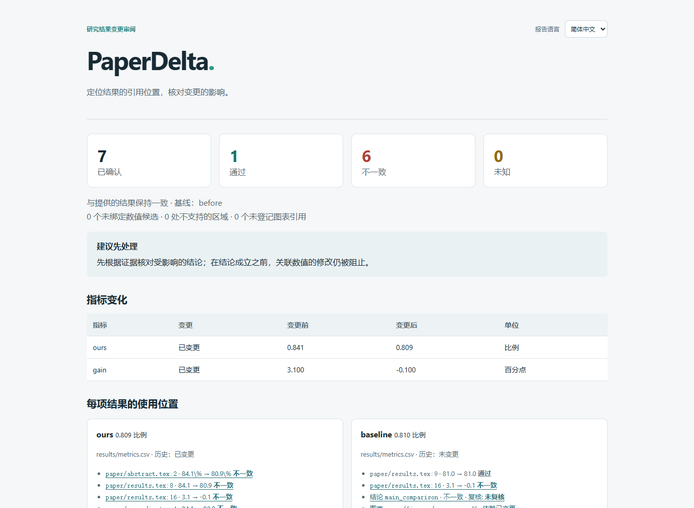

# PaperDelta

[English](README.md)

[](https://github.com/amos689/paperdelta/actions/workflows/ci.yml)
[下载发行版](https://github.com/amos689/paperdelta/releases) · [反馈问题](https://github.com/amos689/paperdelta/issues/new/choose)

**检查实验结果变化影响了现有论文的哪些位置。**

准确率从 **84.1% 变成 80.9%**，论文的摘要、表格和附录却还保留旧值，正文仍报告
**3.1 个百分点**的提升、声称优于 **81.0%** 的基线，结果图也没有更新。PaperDelta
将这些表述关联到明确声明的 CSV/JSON 证据，集中展示需要复核的位置，即使 LaTeX
文件本身没有变化。

本地 Python 命令行 · 现有 LaTeX 论文 · 精确十进制计算 · 离线 HTML · 可选 MCP。
检查不需要模型密钥、GPU 或 TeX 安装。



**v0.2 Alpha 预览版（0.2.0a1）**。新功能包括中英文界面、离线报告
语言切换、环境诊断、接入向导、明确的位置
修复和分步 Agent 工具，进度见 [v0.2 交付记录](docs/zh-CN/v0.2-plan.md)。
[真实文本评测](docs/zh-CN/evaluation.md)同时保留支持和未知案例，
[本地命令行对比](docs/zh-CN/comparison.md)也运行了 Calkit 和 scitexlintr。
上线前采用机器测试及开发者判断，详见 [v0.2 验收决定](docs/zh-CN/v0.2-acceptance.md)。
Windows 3.11–3.14、本地 Linux，以及 Apple Silicon macOS 27.0.1 的 Python
3.12.14 / 3.14.6 均有安装包证据。[GitHub Actions 矩阵](https://github.com/amos689/paperdelta/actions/workflows/ci.yml)
覆盖 Windows、Linux、Apple Silicon 和 Intel macOS 的 Python 3.11–3.14，
具体通过情况以每次运行结果及产物为准。
独立真人反馈放到上线后，尚未发布到包索引。实测与后续工作见[证据记录](docs/zh-CN/progress.md)。

**2026-10-03 已完成本机原生 Mac 验证**。两个 Python 版本最终各 241 项通过，
零跳过；运行代码及已验收 wheel 未修改。详见[Mac 结果与范围](docs/zh-CN/macos-validation-2026-10-03.md)，
复现与回传仍按 [Mac 快速开始](START_ON_MAC.md)执行。

## 运行演示

克隆仓库，使用 Python 3.11 以上版本创建虚拟环境：

```sh
git clone https://github.com/amos689/paperdelta.git
cd paperdelta
python -m venv .venv
```

Windows PowerShell 执行 `.venv\Scripts\Activate.ps1` 激活；macOS/Linux 执行
`source .venv/bin/activate`（创建环境时可能需要用 `python3`）。然后运行：

```sh
python -m pip install -e .
paperdelta --lang zh-CN -C examples/research-paper doctor
paperdelta --lang zh-CN -C examples/research-paper check --report build/review
python tools/demo.py --out build/demo
```

打开 `build/demo/comparison-reversed/review/report.html`，在右上角选择简体中文。
演示复制原创样例，只改变数据，生成两种情况：

| 情况 | 预期结果 |
| --- | --- |
| 84.1% → 80.9% | 四处旧数字、一处失效比较及图表依赖变化；关联数值修改被阻止 |
| 84.1% → 84.5% | 跨三个文件提出四处替换，应用后重查并恢复原始字节 |

演示不覆盖已有输出，重复执行时换一个 `--out`。它是合成回归样例，不代表真实论文
上的准确率。[v0.2 双语录像](docs/zh-CN/demo.md)展示当前报告和审查流程。
第一种情况包含实际生成的 PDF 及导入来源记录；第二种只验证数值补丁。检查不会
执行绘图脚本。若要明确重新生成第一种情况的图，请安装 `.[demo]`，再运行该样例的
`scripts/plot_accuracy.py --project PATH_TO_CASE`。

另有两个边界样例：[歧义表格](examples/ambiguous-table/README.zh-CN.md)预期返回 2；
[中文路径和字面宏](examples/unicode-macro/README.zh-CN.md)预期通过，并支持已验证的
BOM/CRLF 补丁及恢复检查。

如只想接入已有论文，可从 [v0.2.0a1](https://github.com/amos689/paperdelta/releases/tag/v0.2.0a1)
下载 wheel，与发行页的 `SHA256SUMS` 核对后，在虚拟环境执行
`python -m pip install ./paperdelta-0.2.0a1-py3-none-any.whl`。
示例和验证工具需使用源码仓库。目前没有 PyPI 发行版。

## 接入已有论文

```sh
paperdelta init --paper paper/main.tex --data results/metrics.csv
paperdelta --lang zh-CN guide
paperdelta --lang zh-CN check --report build/paperdelta
```

`init` 只创建空配置和发现提示。CSV 列类型、记录身份、实验范围、单位及映射都须
明确声明；`scan` 展示候选，数值相同本身不能证明匹配。`guide` 逐步完成这些选择，
支持多个位置并展示证据。逐项选择后，最后输入“确认”才保存。文件移动或句子改写
后可用 `repair guide`。详见[向导与修复教程](docs/zh-CN/guided-bindings.md)。
原有 JSON 提案及 `bind --accept occurrences:ID` 仍支持，
[快速开始](docs/zh-CN/quickstart.md)提供完整的程序化示例。

`--lang en` 可切换英文；`settings --language zh-CN` 将界面语言独立保存，不改变
证据配置。离线报告可在同一文件内切换语言，保留筛选和证据展开状态。
[语言说明](docs/zh-CN/languages.md)解释具体行为。

## 复核下一轮实验结果

```sh
paperdelta snapshot create submitted-v1
# 用原有流程执行实验。
paperdelta --lang zh-CN check --baseline submitted-v1 --report build/paperdelta
paperdelta fix --report build/paperdelta/report.json --out changes.pdpatch.json
paperdelta apply changes.pdpatch.json --dry-run
paperdelta apply changes.pdpatch.json --write
```

只有已验证的数值范围可进入补丁，文件、配置和证据哈希必须仍匹配。过期或重叠
修改会被拒绝。写入有恢复日志：`paperdelta recover TRANSACTION_ID` 预览恢复；
加 `--write` 才恢复，并且不能覆盖作者之后的编辑。

快照、数值修正和作者复核记录是独立动作。复核记录绑定具体结论及证据状态，不能
把失败检查变成通过。[CI 指南和工作流示例](docs/zh-CN/ci.md)使用目标提交的快照，
并独立列出映射、规则和复核声明的变化，让通过的数值检查与删除的绑定一起接受
审查。可运行 `python tools/demo_ci.py --out build/ci-demo` 查看两个本地 Git 场景。

## 与 Agent 一起使用

CLI 提供 JSON 和机器可读 schema。可选 stdio 服务使用官方 MCP Python SDK：

```sh
python -m pip install -e '.[mcp]'
paperdelta --lang zh-CN -C /path/to/paper-project mcp
```

十三个只读工具包括原有五项操作、六个分步构造步骤和两项修复操作，不写文件、
不确认映射、不记录作者审阅。详见 [Agent 指南](docs/zh-CN/agent-guide.md)。

[十二例映射评测](evaluations/mapping-v1/README.md)区分数值一致和实验身份。
[本地 Qwen3-8B 原始试验](docs/zh-CN/local-model-evaluation.md)的一次性请求流程产生
十二份无效提案，全部被拒绝；失败证据保留，v0.2 的[分步评测](docs/zh-CN/staged-model-evaluation.md)
也没有有效完整映射，该模型未通过自动映射验收。已有明确
工作流通过十处绑定的开发者验证，独立模型准确率和真人确认耗时仍未测量。

## 范围与退出码

- **0**：所有必需且已确认的检查与提供的证据一致。
- **1**：至少一项已确认检查失败。
- **2**：配置、必要证据或解析不完整，或尚无已确认绑定。

报告还列出未绑定数值候选、不支持的区域和未登记图引用。设置
`require_complete_coverage: true` 可让这些情况阻止成功退出。通过只描述已声明
的检查，不认证整篇论文的科学正确性。

支持字面 `input/include`、UTF-8/BOM/CRLF、已声明字面宏参数、CSV/JSON、明确聚合、
带单位的派生值、有限比较以及已声明的图表来源。动态 TeX、任意宏展开、显著性
推断和全局 SOTA 声明不在本预览版范围内。[规则与限制](docs/zh-CN/rules.md)说明约定。

## 相关工作

[Calkit](https://github.com/calkit/calkit)已将证据、条件答案和 LaTeX 关联，
[scitexlintr](https://github.com/arjunrajlaboratory/scilintr/tree/main/tex/scitexlintr)
已能发现并修正数值快照变化。PaperDelta 的产品假设是：为现有论文逐步建立映射，
并集中复核跨文件影响。[工作流对比](docs/zh-CN/comparison.md)记录一个案例中实际
CLI 行为及必要的源码修改；更低的接入成本**尚未证明**。
[调研记录](docs/zh-CN/research.md)保留灵感来源、版本和原始对比计划。

## 参与开发

```sh
python -m pip install -e '.[dev,mcp]'
python tools/run_tests.py -q
python -m ruff check src tests tools
python -m ruff format --check src tests tools
python -m build
```

源码及评测产物的分包和内容核验见[本地验证及候选构建](docs/zh-CN/local-validation.md)。

[开发计划](docs/zh-CN/v0.2-plan.md) · [贡献指南](CONTRIBUTING.zh-CN.md) ·
[原创代码的 MIT 许可证](LICENSE) · [第三方样例许可](THIRD_PARTY_NOTICES.zh-CN.md) ·
[更新日志](CHANGELOG.zh-CN.md) · [安全政策](SECURITY.zh-CN.md)
