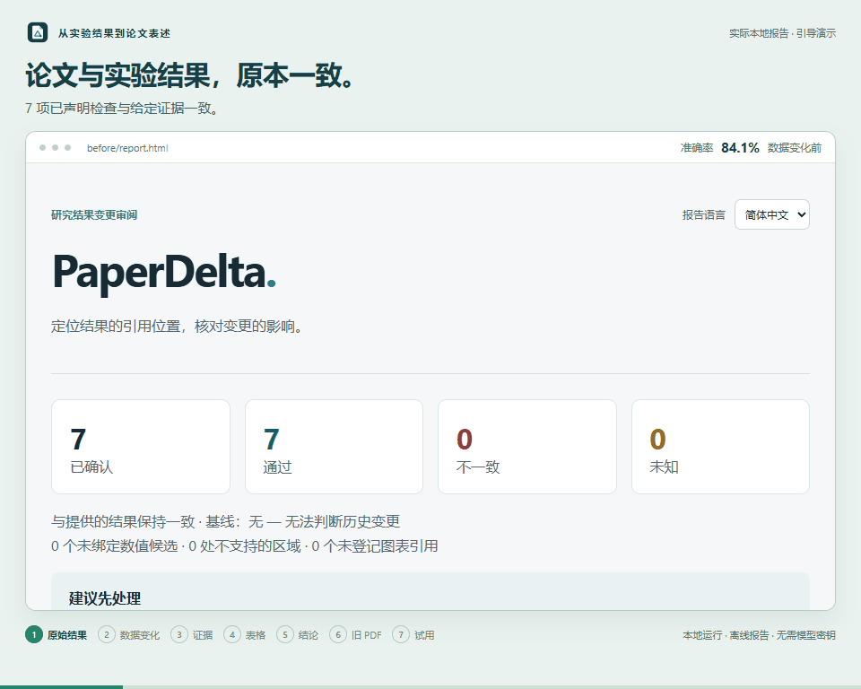

<h1 align="center">
  <picture>
    <source media="(prefers-color-scheme: dark)" srcset="docs/assets/brand/paperdelta-logo-dark.svg">
    
  </picture>
</h1>

<p align="center">
  <strong>检查实验结果变化影响了现有论文的哪些位置。</strong>
</p>

<p align="center">
  <a href="https://github.com/amos689/paperdelta/actions/workflows/ci.yml"></a>
  <a href="https://github.com/amos689/paperdelta/releases/tag/v1.8.0"></a>
  <a href="LICENSE"></a>
</p>

<p align="center">
  <a href="pyproject.toml"></a>
  <a href="pyproject.toml"></a>
  <a href="docs/zh-CN/rules.md"></a>
  <a href="docs/zh-CN/markdown-quarto.md"></a>
  <a href="docs/zh-CN/pdf.md"></a>
  <a href="docs/zh-CN/agent-guide.md"></a>
</p>

<p align="center">
  <a href="https://github.com/amos689/paperdelta/actions/workflows/ci.yml"></a>
  <a href="docs/zh-CN/languages.md"></a>
</p>

<p align="center">
  <a href="README.md">English</a> · <strong>简体中文</strong> ·
  <a href="docs/zh-CN/quickstart.md">快速开始</a> ·
  <a href="https://github.com/amos689/paperdelta/releases">下载发行版</a> ·
  <a href="https://github.com/amos689/paperdelta/issues/new/choose">问题反馈</a>
</p>

准确率从 **84.1% 变为 80.9%**，摘要、表格和附录仍保留旧数字，正文中
**提高 3.1 个百分点**及**优于基线**的结论也不再成立。PaperDelta 将这些表述关联到
明确声明的实验证据，集中展示需要复核的位置，即使论文文件本身没有变化。

本地 Python 命令行 · LaTeX / Markdown / Quarto + 可选 Word/PDF · 精确十进制计算 · 离线 HTML · 可选 MCP。
检查不需要模型密钥、GPU 或 TeX 安装。

<p>
  <picture>
    <source media="(prefers-reduced-motion: reduce)" srcset="docs/assets/v1.3/report.zh-CN.png">
    
  </picture>
</p>

约 27 秒的真实报告演示：改变实验证据，查看受影响的摘要、表格与结论，再打开
另一个源稿/PDF 示例，检查过期的导出文件。
[打开原尺寸动图](docs/assets/v1.3/demo.zh-CN.gif?raw=true) ·
[查看静态截图](docs/assets/v1.3/report.zh-CN.png)。

**1.8.0** 支持经过预览和明确确认的 Word 批注副本与 PDF 高亮副本，保留原稿不变。
改进完整上标科学计数值与静态 PDF 打开视图的识别；无法确认的结构继续显示为未知。
[批注副本指南](docs/zh-CN/v1.8.md) · [按任务开始](docs/zh-CN/tasks.md) ·
[修订工作台](docs/zh-CN/v1.7.md) · [Notebook/Quarto 流程](docs/zh-CN/v1.6.md)。

静态 [LaTeX](docs/zh-CN/rules.md)、[Markdown/Quarto](docs/zh-CN/markdown-quarto.md)、
[Word](docs/zh-CN/word.md) 和 [PDF](docs/zh-CN/pdf.md) 共用明确声明的
[实验证据](docs/zh-CN/experiment-evidence.md)及[统计契约](docs/zh-CN/statistics.md)。
运行 `paperdelta --lang zh-CN studio` 进行本地绑定复核、快照比较、持续检查和草稿恢复，
界面全程支持中英文切换。详见[工作台指南](docs/zh-CN/studio.md)和[交付路线图](docs/zh-CN/roadmap.md)。
项目已收到数位用户的正面试用反馈；这是非正式反馈，不作为量化易用性研究。
发行继续采用正式版本号。

## 安装并查看第一份报告

试用源稿/PDF 示例：安装 `paperdelta[pdf]`，然后运行
`paperdelta --lang zh-CN demo --document pdf --out pdf-demo --open`。
报告提供原页高亮；PDF 检查为只读，不进行 OCR。

试用 Word 示例：安装 `paperdelta[docx]`，然后运行
`paperdelta --lang zh-CN demo --document docx --out word-demo --open`。
Word 检查为只读，[支持结构与原生位置](docs/zh-CN/word.md)均有明确说明。

静态源码演示可运行 `paperdelta demo --document markdown --out md-demo --open` 或
`paperdelta demo --document quarto --out qmd-demo --open`，无需扩展或渲染器。

使用 Python 3.11 以上版本，在虚拟环境中运行：

```sh
python -m pip install paperdelta
paperdelta --lang zh-CN demo --out paperdelta-demo --open
```

已[安装 uv](https://docs.astral.sh/uv/getting-started/installation/) 时，也可使用隔离环境：
`uvx --python 3.12 paperdelta@1.8.0 --lang zh-CN demo --out paperdelta-demo --open`。
每次运行使用新输出目录。详见[可选原生读取与启动诊断](docs/zh-CN/v1.3.md)。

如需先创建环境，运行 `python -m venv .venv`。Windows PowerShell 使用
`.venv\Scripts\Activate.ps1` 激活，macOS/Linux 使用 `source .venv/bin/activate`
（创建时可能需要使用 `python3`）。

完整离线示例已包含在安装包中。若没有自动打开，手动打开
`paperdelta-demo/review/report.html`，在报告中切换中英文。默认场景会有意检出旧数字、
失效比较及图表依赖变化；处理结论前，关联的数值修改会被阻止，不会自动修改论文。

`--scenario baseline` 展示未变证据，`--scenario safe-update` 准备四处数值修改及可读
差异。每次运行需指定新的 `--out` 目录。演示创建成功退出 0，报告仍保留实际检查
结果，变化场景通常为 1。详见[演示说明](docs/zh-CN/workflows.md)。

也可从 [GitHub Releases](https://github.com/amos689/paperdelta/releases) 下载 wheel、
源码包及单独许可的评测材料。将 wheel 与发行页的 `SHA256SUMS` 核对后，运行
`python -m pip install ./paperdelta-1.8.0-py3-none-any.whl`。

## 接入已有论文

在论文目录运行 `paperdelta --lang zh-CN studio`，即可通过本地浏览器完成配置创建、
证据声明、位置选择和明确确认，无需手写 YAML。新用户可从[工作台指南](docs/zh-CN/studio.md)开始。
以下 CLI 流程也继续可用：

```sh
paperdelta init --paper paper/main.tex --data results/metrics.csv
paperdelta --lang zh-CN batch guide
paperdelta --lang zh-CN check --report build/paperdelta
```

`init` 只发现输入，不接受绑定。批量向导在已声明的结果表中复用明确的来源、记录身份、
单位、聚合及种子选择，依据上下文建议位置，可选择重复引用，并在最终“确认”前
展示全部选择。数字相同不能证明身份一致。JSON 来源及单项、派生指标继续使用
`paperdelta guide`。

可通过 `scope set` 先审查选定文件或区域，通过 `scope exclude` 为非结果数字记录
排除理由；二者不加 `--accept` 只预览。排除文本变化后需要重新复核，改变范围不能
隐藏已经接受的失败绑定。详见[批量绑定与覆盖范围](docs/zh-CN/workflows.md)、
[接入及修复向导](docs/zh-CN/guided-bindings.md)和[完整 JSON 教程](docs/zh-CN/quickstart.md)。

子命令前加 `--lang en` 切换英文，或用 `settings --language zh-CN` 保存中文偏好。
语言设置不会改变科学检查结果和证据身份。

## 审查下一轮实验

```sh
paperdelta snapshot create submitted-v1
# 使用自己的流程运行实验。
paperdelta --lang zh-CN watch --baseline submitted-v1 --report build/paperdelta --open
```

保存数据、论文或配置后，短暂等待连续保存结束，再进行完整检查。已发现变化但
尚未检查的报告标为**等待重查**，并在浏览器中刷新。处理清单区分证据问题、失效
绑定、结论、数值和图表更新，按 `Ctrl+C` 停止。单次检查仍可使用
`check --baseline submitted-v1`。

```sh
paperdelta fix --report build/paperdelta/report.json --out changes.pdpatch.json
paperdelta apply changes.pdpatch.json --dry-run
paperdelta apply changes.pdpatch.json --write
```

只有验证过的数值位置可进入补丁。过期输入、歧义或重叠修改会被拒绝，失效关联
结论会阻止数值更新。事务保留原始字节；`paperdelta recover TRANSACTION_ID` 预览
恢复，没有作者后续编辑时加 `--write` 才执行。检查器不会运行实验或绘图脚本。

[CI 适配器](docs/zh-CN/ci.md)比较目标提交，同时报告绑定、规则、范围和复核声明的变化。

## 与 Agent 一起使用

```sh
python -m pip install 'paperdelta[mcp]'
paperdelta --lang zh-CN -C /path/to/paper-project mcp
```

二十二个可选 MCP 工具提供检查、证据、提案及位置修复。其中四个批量会话工具让
Agent 选择候选 ID，由程序组装复杂提案。会话在内存中保存，有数量和时效限制，
输入变化后失效；工具不接受映射、不写论文文件。宿主配置与完整流程见
[Agent 指南](docs/zh-CN/agent-guide.md)。不安装 MCP 也可使用 CLI JSON 和 schema。

新的有界映射会话返回类型化错误和纠错提示，保留最后有效草稿，并允许明确拒答。
确定性协议测试验证工具行为。[v1.4 真实模型试验](validation/mapping-v4/README.zh-CN.md)
首次运行和独立冻结的修订均为 0/9 完整映射、0/3 正确拒答；自动映射仍属实验性能力。

## 支持范围

- **退出 0**：必需且已接受的检查与提供的证据一致。
- **退出 1**：至少一项已接受检查失败。
- **退出 2**：证据、配置或解析不完整，没有绑定，或持续检查正在等待重查。

报告保留未绑定、排除、范围外和不支持内容。`require_complete_coverage` 可要求
声明范围内的数字覆盖完整；已有绑定始终运行。一致性不等于科学正确性认证。

支持字面 LaTeX `input/include`、已声明字面宏参数、限定的字面表格单元格、CSV/TSV/JSON、静态 Excel 与实验导出、
明确聚合、带单位派生值、有限比较和图表来源。动态 TeX、任意宏展开、自动显著性判断及
全局 SOTA 验证仍不在支持范围内。安装 `paperdelta[docx]` 可检查 Word 段落和普通
表格；修订、域和复杂排版仍标为未验证。详见[规则与限制](docs/zh-CN/rules.md)及
[Word 支持边界](docs/zh-CN/word.md)。

安装可选 `paperdelta[pdf]` 可核对文字型 PDF，保留原页坐标与解析身份；扫描页和
不可靠版式保持未验证。多稿件共享明确声明的指标，可以额外声明源稿与导出稿关系。
参见 [PDF 边界与工作流](docs/zh-CN/pdf.md)。

[跨平台 CI](https://github.com/amos689/paperdelta/actions/workflows/ci.yml) 覆盖 Windows、
Linux、Apple Silicon 和 Intel macOS 的 Python 3.11–3.14。
[历史验收](docs/zh-CN/v0.2-acceptance.md)、[Mac 实机记录](docs/zh-CN/macos-validation-2026-10-03.md)
及[当前发行检查](docs/zh-CN/v1.3.md)分别说明各次运行验证的范围。

## 参与开发

```sh
git clone https://github.com/amos689/paperdelta.git
cd paperdelta
python -m pip install -e '.[dev,mcp]'
python tools/run_tests.py -q
python -m ruff check src tests tools
python -m ruff format --check src tests tools
python tools/check_docs.py
```

[贡献指南](CONTRIBUTING.zh-CN.md) · [更新日志](CHANGELOG.zh-CN.md) ·
[MIT 许可证](LICENSE) · [第三方许可](THIRD_PARTY_NOTICES.zh-CN.md) ·
[安全政策](SECURITY.zh-CN.md) · [Mac 安装](START_ON_MAC.md)
