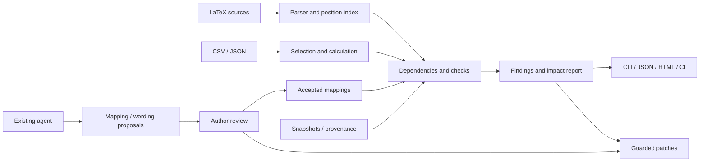

# PaperDelta original development plan

[简体中文](zh-CN/development-plan.md)

Scope baseline 0.1, originally planned 2026-10-02; acceptance policy amended
2026-10-03. This is the historical design plan. Current interfaces are in README,
evidence in [progress](progress.md), and new work in the [v0.2 ledger](v0.2-plan.md).
The original a2 decision is [recorded separately](release-acceptance.md).
Estimates and proposed interfaces below describe the plan, not measured delivery.

## Pre-launch acceptance policy

The owner explicitly chose local machine tests and Codex acting as developer/first
user. Independent users and feedback follow launch. This overrides the original
independent-first-use requirement.

- Retain deterministic checks, wrong-identity controls, writes/recovery, installation,
  examples, documentation and package audits.
- Accept only tested Windows/Linux scope; macOS and remote CI remain unverified
  until actually run. Later the owner deferred Mac work until product convergence.
- Separate structural proposal validity, reference agreement and AI developer review.
  Human timing, independent precision and adoption benefit remain unmeasured.
- Three independent trials, ten-minute onboarding and competitor timing move to
  post-launch research. Machine runs never count as human participants.
- Deliver a locally accepted candidate; external repository/index publication is separate.

## 1. Product purpose and conditions

**Help researchers and agents review experiment changes in existing papers.**
Given LaTeX and results, establish explicitly confirmed mappings, then show affected
numbers, tables, comparisons and figures with original evidence.

Initial users are students/researchers using Git, LaTeX and Python, especially
empirical projects that repeat changing results. Begin with common ML result tables.
[Calkit](https://github.com/calkit/calkit) and
[scitexlintr](https://github.com/arjunrajlaboratory/scilintr/tree/main/tex/scitexlintr)
already generate/check numbers; those are not original inventions.
[Research](research.md) motivates three hypotheses:

1. Incrementally connect existing papers without replacing their build or all numbers
   with special macros.
2. Review one result change across affected locations, including unchanged source lines.
3. Bound AI proposals with evidence/confirmation; make confirmed checks repeatable
   and edits previewable/recoverable.

If existing tools achieve these tasks with similar modest configuration, preserve
the onboarding/agent/report layer and adapt their core instead of duplicating it.

## 2. Required first scenario

A main paper, appendix, table, figure and CSV initially report Ours 84.1% versus
Baseline 81.0%, a 3.1 percentage point gain and an outperforming claim.
Change only Ours data to 80.9%:

| Object | Finding | Action |
| --- | --- | --- |
| Abstract 84.1% | Expected 80.9% | Local numeric suggestion |
| Table 84.1% | Another stale occurrence of the same metric | Same impact group |
| 3.1 point improvement | Current difference -0.1 points | Review number and direction |
| Outperforms Baseline | Confirmed predicate becomes false | Show both sides for author review |
| Result figure | Declared inputs changed since provenance record | Locate script/data; do not infer all visual content |

Cards show files, filters, participating rows, units and calculations. Checking
text-internal consistency alone is insufficient. Lead the offline demonstration
with this case, then missing seeds, train/test confusion and equal-value ambiguity.

## 3. Version scope

| Area | v0.1 commitment | Later candidates |
| --- | --- | --- |
| Paper | UTF-8 LaTeX, project-local literal input/include, ordinary text/tables/figures | Complex macros, Quarto/Markdown, editors |
| Evidence | Local CSV/JSON, readable selectors, explicit aggregation | Calkit/DVC/MLflow/W&B metadata or exports |
| Numbers | Single value, count, mean, difference, ratio, percentage point and relative change; units/rounding | Explicit SD/SEM/CI contracts |
| Claims | Bound comparisons, thresholds, named-set ranking | Compound predicates, domain templates |
| Figures | File plus optional provenance, missing/changed content and dependencies | Build integration; visual analysis separately evaluated |
| Agents | Structured CLI, proposal contract/guide, optional stdio MCP after stable core | Hosts and batch confirmation |
| Review/edits | Terminal, JSON, Markdown, offline HTML, previewable local numeric patches | VS Code and reviewdog |
| Runtime | Local CLI, measured Windows/Linux; Mac pending; no model/experiment/TeX execution for checks | Additional platforms, caching and teams |

Exclude arbitrary PDF/Word reconstruction, paper ghostwriting, training, choosing
statistical tests, citation authenticity and full Overleaf synchronization.
Unbound, unsupported or missing evidence must never be counted as checked passes.

## 4. User workflow

First use: select main TeX/data → scan supported files, columns, numbers and unknowns
→ author or existing agent proposes location-to-selector mappings → explicitly
confirm important abstract/table/comparison mappings → check current consistency
→ optionally create a named baseline such as `submitted-v1`. A snapshot is history,
not author approval.

Routine use: run experiments normally → check with an optional baseline → group
affected statements by changed evidence → review numeric and wording suggestions
separately → apply selected patches, recheck and optionally record review. Never
silently replace the baseline.

Historical CLI sketch:

```text
paperdelta init --paper paper/main.tex --data results/metrics.csv
paperdelta scan --format json
paperdelta bind --proposal mapping-proposal.json
paperdelta check --baseline submitted-v1 --report build/paperdelta
paperdelta snapshot create submitted-v1
paperdelta fix --report build/paperdelta/report.json --out changes.pdpatch.json
paperdelta apply changes.pdpatch.json --dry-run
paperdelta apply changes.pdpatch.json --write
paperdelta review record --claim main-comparison --state <fingerprint>
```

These were proposals; consult current help for complete arguments. Start the first
vertical slice with check, accepted mappings and JSON. Binding requires explicit
selection; apply previews by default; agents cannot automatically record author review.
Exit 0: required bound checks pass; 1: mismatch; 2: configuration/evidence/required
parsing incomplete, including zero bindings. Coverage always appears; optional
complete-coverage policy also blocks unhandled candidates. Exit 0 is not paper truth.

## 5. Data and file contracts

| Entity | Main contents and purpose |
| --- | --- |
| Source | Relative path, format, fingerprint, record key, optional provenance |
| Metric | Selector, field, aggregation, expected count/seeds, unit |
| DerivedMetric | Restricted operator, input metrics, unit/rules version |
| Occurrence | Paper path, stable ID, anchor, display, metric |
| Claim | Statement location, confirmed predicate, scope and metric dependencies |
| Figure | Output and recorded script/input identities |
| Snapshot / ReviewRecord | Historical state versus a reviewed content fingerprint |
| Finding / Patch | Rule, evidence, affected positions, severity, replacements/preconditions |

Use dictionaries/topological ordering for a DAG, not a graph database. Initially
reread inputs linearly; hashes establish identity before adding measured caching.

```text
paperdelta.yaml                 Accepted human-readable mappings/rules; usually tracked
.paperdelta/proposals/          Unaccepted proposals
.paperdelta/baselines/          Explicit named history
.paperdelta/reviews/            Separate review declarations
.paperdelta/patches/            Optional saved patch proposals
.paperdelta/transactions/       Write journals/backups; ignored by default
build/paperdelta/               Generated reports; ignored by default
```

Configuration has schema_version; reports also identify tool/ruleset/report schema.
Reject unknown major versions and fields. Parse numeric input directly to Decimal,
retaining inspectable serialization. Direct configuration edits are accepted project
declarations; agent proposals remain separate until explicitly accepted. Snapshots
retain selected evidence, identities, text and definitions without copying all data.
Do not silently overwrite names or subtract values whose definitions changed.

Figure records include output, inputs and script paths/hashes, timestamp and method.
Imported/manual provenance remains a declaration, not proof of execution.

Historical illustrative configuration (consult current schema for the executable contract):

```yaml
schema_version: 1
paper:
  entry: paper/main.tex
rounding: half_up

sources:
  benchmark:
    path: results/metrics.csv
    format: csv
    primary_key: [dataset, model, split, seed]
    columns:
      dataset: string
      model: string
      split: string
      seed: integer
      accuracy: decimal

metrics:
  ours_accuracy:
    source: benchmark
    where: {dataset: Data-A, model: Ours, split: test}
    field: accuracy
    reduce: mean
    expected_seeds: [1, 2, 3]
    unit: fraction
  baseline_accuracy:
    source: benchmark
    where: {dataset: Data-A, model: Baseline, split: test}
    field: accuracy
    reduce: mean
    expected_seeds: [1, 2, 3]
    unit: fraction
  gain_pp:
    op: percentage_point_difference
    args: [ours_accuracy, baseline_accuracy]

occurrences:
  abstract_accuracy:
    file: paper/abstract.tex
    anchor:
      prefix: 'Our method achieves '
      suffix: ' accuracy on Data-A.'
    metric: ours_accuracy
    display: {kind: percent, places: 1}

claims:
  main_comparison:
    file: paper/results.tex
    anchor:
      exact: 'Our method outperforms Baseline on Data-A.'
    predicate:
      op: greater_than
      left: ours_accuracy
      right: baseline_accuracy
    scope: {dataset: Data-A, split: test}
```

Use standard JSON Pointer rather than ambiguous dotted paths; CSV selector types
are explicit. No fuzzy identity matching, Python eval, arbitrary calls or executable
YAML. Do not infer SEM from SD or significance from a larger mean.

## 6. Correctness rules

Data: unique selects exactly one record; aggregations declare selection and validate
keys, seeds and range. Diagnose duplicates, missing seeds, empty selection, columns,
NaN/Infinity and zero denominator. Dataset, variant and split are semantic identity.
Distinguish fraction/percent/points, precision, rounding, scientific notation and
supported TeX formatting without one universal float tolerance. Ranking declares
direction, set and ties; it is not global SOTA. Unrelated rows may change a raw file
hash without changing selected metric identity.

Locations: syntax restricts checkable regions, excluding comments, verbatim, citation
keys and structural values. Retain bytes, BOM, CRLF and Unicode offsets; never
silently replace undecodable bytes. Use unique exact/context anchors, with line
numbers for display only. Refuse ambiguous matches instead of taking the first.
Do not silently relocate after rewriting, require special macros, or execute TeX,
scripts or dynamic configuration. Report include cycles and root escapes.

| Dimension | Examples | Meaning |
| --- | --- | --- |
| Mapping | proposed / confirmed / ambiguous / unresolved | Whether experiment-to-text identity is accepted |
| Consistency | pass / mismatch / unknown | Current agreement with declared evidence/rules |
| History | unchanged / changed / unavailable | Difference from explicit snapshot |
| Provenance | unchanged_since_record / dependency_changed / unknown | Declared identities, not execution proof |
| Review | unreviewed / reviewed / superseded | A declaration for this evidence/statement state |

Review identity covers wording, mapping, calculation, units and selected evidence.
Returning to an old state may match an old review; retain observed intermediate
history, never invent unseen history. Rounding can hide changed low-order evidence.
Equal figure hashes establish bytes only. Missing records are unknown; Git age or
a mutable local record alone does not prove staleness or execution.

## 7. Architecture and technology



Python 3.11+ and one pip package fit research workflows. Use strict Pydantic and
safe duplicate-key-rejecting YAML, standard csv/json/decimal/hashlib without pandas
or a database. Trial pylatexenc against TexSoup based on actual positions/coverage.
Typer/Rich and escaped Jinja2 were candidates, not mandatory dependencies; final
implementation chose argparse and escaped templates. Core API, CLI and optional
official MCP share one result. Test with pytest, lint, platform and installed-package
checks. Core checking requires no model, GPU, TeX or MCP.

Planned modules cover models, sources, LaTeX, metrics, bindings, analysis, reports,
patches and integrations, plus CLI; tests cover fixtures, end-to-end and frozen
paper-separated benchmarks. Exact source layout follows implementation needs.

## 8. Agent and write boundaries

Agents may inspect local data/excerpts, propose bindings, explain findings and
suggest wording. Every proposal cites real locations/selectors; core recomputes
values rather than trusting model arithmetic. Confirmed relationships can be
checked again without repeated inference.

No bulk ignores, baseline changes or review attestations through agent tools.
A host with separate write access can still edit files; show declaration changes,
and do not call local records authenticated approvals. The initial five tools were
scan_project, propose_bindings, check_project, explain_finding and propose_patch.
The final adapters return proposals without writes. Model-host data handling still
applies; local deterministic checking does not imply all agent inference is offline.
Supply relevant excerpts/rows instead of automatically transmitting everything.

Patches retain original hashes/text/byte ranges, mapping/evidence fingerprints and
finding IDs. Recheck all before writing. Numeric automation is limited to explicitly
bound displays. Reversed/unresolved comparisons group wording and numbers for review;
do not change numbers alone while leaving contradictory claims.

Preflight every selected change and reject overlap. Replace each file atomically,
with multi-file journal/backups; do not claim one atomic multi-file operation.
Detect incomplete transactions. Recovery verifies current bytes before restoring,
protecting later author edits. Reparse/recheck after changes and verify outside bytes.
Acceptance, apply, review and baseline updates remain distinct actions.

## 9. Reports and CI

Lead with confirmed/pass/mismatch/unknown/unbound/unsupported counts, not a synthetic
paper-quality score. Each impact group shows source/old-new values, affected text,
calculation or predicate, next action and coverage limits. Offline HTML filters by
file/source/rule/state; no account, backend or CDN. CLI performs writes/acceptance.

CI uses identical core output and exit codes, artifacts and job summaries. A CSV-only
PR must recheck dependent unchanged TeX lines. Historical comparison reads a target
commit's committed snapshot; list PR changes to mappings, rules, baselines and reviews.
Without a baseline, check current state and report history unavailable. Untrusted
paper PRs do not run their scripts or require write tokens. Future inline comments
are separate; lack of permission must still leave downloadable reports.

## 10. Sequence and milestones

Original estimate for one main developer: **25 working days plus about 5 buffer
days, roughly 5–6 weeks**; participant waiting excluded. Demo by week two, internal
candidate weeks three–four. Recalibrate after parser/adoption experiments.

| Stage / estimate | Tasks and deliverables | Gate |
| --- | --- | --- |
| 0 / 2 days | PD-001 three ordinary/multifile/macro examples incl. Chinese/Windows; PD-002 Calkit/scitexlintr task comparison; PD-003 parser positions/includes/bytes; PD-004 contract/scope/name review | Key results without template rewrite, two useful scenarios; otherwise adapt existing manifests |
| 1 / 3 days | PD-101 package/models/errors; PD-102 typed CSV/JSON/Decimal; PD-103 data-to-text bindings; PD-104 check and JSON | One change locates two bound sites; no fake unbound passes; offline core |
| 2 / 5 days | PD-201 aggregation/seeds/derivation; PD-202 predicates/ranking/dependencies; PD-203 snapshots/groups; PD-204 figure records; PD-205 independent states/report schema | All affected bindings, unrelated rows separate, low-order changes visible, missing evidence unknown |
| 3 / 5 days | PD-301 Markdown/offline HTML/coverage/filters; PD-302 guarded diffs; PD-303 atomic files/journal/recovery; PD-304 review records | Stale/overlap refusal, exact outside bytes, detectable partial writes, idempotence, review cannot hide mismatch |
| 4 / 5 days | PD-401 init/scan/confirmation/priorities; PD-402 agent guide/evidence/proposals; PD-403 read-only MCP; PD-404 CI and data-only PR | Developer/scripts connect ten results; manual use without model; invalid selectors/locations rejected |
| 5 / 5 days | PD-501 frozen real-text injection; PD-502 platforms/performance; PD-503 bilingual docs/examples; PD-504 30–60 s demo, outcomes/comparison; PD-505 metadata/licenses/candidate audit | All declared local gates, actual files/counterexamples rather than video alone |

Each stage depends on earlier contracts. If delayed, retain reliable mapping,
deterministic checking, impact review and guarded edits; defer MCP, ranking, extra
figure provenance or filtering before weakening identity/byte checks or auto-accepting.

## 11. Evaluation and release gates

All initial thresholds were targets, not measurements. Start with three owned examples
and at least ten licensed real-source projects/fragments, split by paper into
development/held-out. Predeclare selectors, positions and expected states for roughly
150 correlated scenarios; count alone does not establish validity. Compare appropriate
manual diff, agent, Calkit/scitexlintr configurations without scoring unconfigured
features as algorithm failures.

Required counterexamples include wrong dataset/split/variant with equal values,
duplicate keys, missing seeds/columns, empty selection, nonfinite values, division
by zero and JSON keys with dots/slashes; percent/points, negative differences,
rounding boundaries, hidden low-order changes, scientific notation and TeX escapes;
reversed direction, ties, changed candidate sets and unsupported significance;
comments/verbatim/nested macros/duplicate literals/includes/cycles/dynamic paths;
Unicode/BOM/CRLF/overlap/stale reports/interrupted/repeated writes; unrelated rows,
changed configuration, evidence rollback, superseded review and data-only PRs.

| Measure | Target or handling |
| --- | --- |
| Supported deterministic checks | Every fixed acceptance case correct; failures block release or return explicitly unsupported unknown |
| Writes | Zero wrong file/span or out-of-range edits; all stale/overlap cases refused; exact outside bytes |
| Real-source diagnostics | Publish errors/misses/unknowns; initial ≤5% false-positive target needs adequate observations |
| AI mappings | Preserve validity, reference agreement and developer review/failures/abstentions; 90% candidate correctness remains later research, no automatic acceptance |
| Onboarding | Developer/scripts connect ten key results now; three novice trials and ~10 min later |
| Performance | Declared laptop, 20 TeX files, 10 MB CSV, 500 bindings, core P95 <3 s; publish hardware/cold-warm conditions, exclude models |
| Platforms | Test Windows/Linux installed paths including spaces/Chinese; native Mac and remote CI explicitly pending |
| Honest coverage | All reports distinguish confirmed, unbound, unknown and unsupported |

Tests should target actual risk, not mirror implementation. Compile the owned minimal
TeX fixture before/after patches separately; everyday checking must not require TeX.

## 12. Main risks

| Risk / signal | Response |
| --- | --- |
| Duplicate existing value; no measured setup/review benefit | Early comparison; focus on interoperability/onboarding/reporting |
| Mapping costs exceed reuse | Bind repeated key results first, improve proposals/review, decide UI from observations |
| Macro variability requires unreliable matching | Explicit subset and literal macro declarations; unknown/refuse unsupported fixes |
| Equal numbers hide wrong identity | Show rows/selectors and require identity |
| Agent invents source or stronger claim | Recompute/validate proposals; review free text |
| Figure states overinterpreted | Missing record unknown; provenance distinct from visual correctness |
| Stale offsets, line endings, concurrent edits | Hashes/bytes/journal/guarded recovery |
| Scope expands into writing/training/literature | Require a link to the core scenario; use adapters |

## 13. Open-source delivery and continued use

Suggested description: **An experiment-aware change reviewer for research papers.**
PaperDelta was provisional; name lookup is not a reservation. Use MIT for original
code and retain dependency/reused-source notices. README should show before/after
impact, a local demo command and explicit inputs/outputs/limits. No model key/GPU
needed to try the core. Publish failures, unknowns, selection rules and fair comparison
conditions; favor ecosystem cooperation. Offer scoped adapters/macros/docs contribution
tasks, with design review for core schema changes.

Measure first successful mapping, return use after a second experiment, caught
omissions and recommendation reasons. Stars measure attention, not correctness,
retention or a guaranteed planning outcome.

## 14. Original later-version priorities

Historical candidates were: one Calkit/DVC or scitexlintr interoperability adapter;
easier local/editor binding review if adoption remains hard; common experiment
exports with offline snapshots; explicit richer statistics and Quarto/Markdown;
team review only after the individual workflow proves useful. Each needs real cases,
scope, failure behavior and tests. The approved [v0.2 plan](v0.2-plan.md) supersedes
this tentative order.

## 15. Original first delivery

Begin with stages 0–1: comparisons/parser probes, minimum contract, then an executable
LaTeX+CSV mismatch checker with JSON. Demonstrate one passing case, cross-location
data change and deliberately refused ambiguity. Implementation had not started when
this plan was first written. Subsequent measurements, not code/CI presence, determine
performance, real-paper outcomes, onboarding and compatibility.
