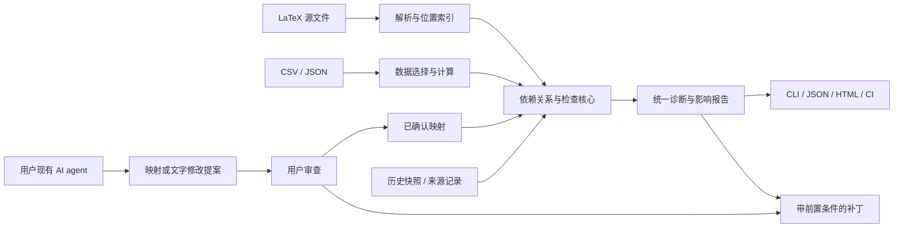

# PaperDelta 开发计划

版本：范围基线 0.1，验收安排于 2026-10-03 经项目方调整。原规划日期：2026-10-02。
实际可运行接口见 README，完成证据见 [progress.md](progress.md)，
当前本地 alpha 的决定见[上线前验收](release-acceptance.md)。

## 当前上线前验收安排

项目方于 2026-10-03 明确：当前只安排机器的本地测试，由 Codex 同时担任开发者和
首位试用者，其开发者判断可作为发布验收依据。独立真人使用与反馈安排在上线后。
此安排优先于下文原计划中的首次用户试验要求。

- 上线前保留全部确定性检查、错误身份反例、写入与恢复、安装、示例、文档和发行包核验。
- 用已有 Windows/Linux 本地环境和开发者实际操作验收。macOS、远程 CI 暂列未验证；
  当前候选版的兼容性声明限定在已有实测范围，后续有环境时补测。
- 映射提案区分程序验证、参考答案一致性及 AI 开发者审查。未测得的真人确认耗时、
  独立用户正确率与接入收益继续留空，不作为当前发布阻塞。
- 3 次独立首次使用、10 分钟接入目标、竞品使用耗时比较转为上线后反馈任务。
  这些目标继续保留，机器运行不折算成真人参与者。
- 本轮交付目标为通过上述本地验收的候选发行包；外部仓库和包索引按发布安排处理。

## 1. 产品目标与成立条件

**PaperDelta 帮助研究者和 AI agent 审查实验结果变化对已有论文的影响。** 用户给出 LaTeX 源码和实验结果文件，工具建立可确认的对应关系；之后每次更新结果，就能看到受影响的数字、表格、比较结论和图表，以及带原始证据的修改建议。

首批目标用户是使用 Git、LaTeX 和 Python 实验脚本的学生及研究者，尤其是结果会反复更新、论文中有多处重复引用指标的实证研究项目。先支持机器学习论文常见的数据表结构，再扩展其他学科。

项目不以“自动生成数值”或“发现数字漂移”为原创卖点。这些能力已有 [Calkit](https://github.com/calkit/calkit) 和 [scitexlintr](https://github.com/arjunrajlaboratory/scilintr/tree/main/tex/scitexlintr) 等实现；具体调研和源码入口见[实现调研](research.md)。独立项目需要证明下面三个优势：

1. 已有论文可以逐步接入，不必先改成另一套论文构建项目，也不必批量替换为专用数值宏。
2. 一次结果变化对应一份集中审查报告，包含未被修改、但已受影响的论文位置。
3. AI 建议有明确的证据和确认边界；经过确认的检查可重复执行，修改可预览和撤回。

若早期对比发现已有工具通过少量配置就能同样顺畅地完成这些任务，应保留 PaperDelta 的接入、agent 和报告层，将底层检查改为适配已有工具，避免重复开发。

## 2. 首版必须跑通的使用场景

示范项目有主文、附录、一张结果表、一幅图和一份 CSV。旧结果中，Ours 准确率为 84.1%，Baseline 为 81.0%；论文在摘要和表格中引用了 84.1%，正文声称提高 3.1 个百分点，并写了优于 Baseline 的结论。

实验更新后，Ours 准确率变为 80.9%。即使作者还没有修改任何 `.tex` 文件，PaperDelta 也应输出：

| 对象 | 检查结果 | 后续动作 |
| --- | --- | --- |
| 摘要中的 84.1% | 与当前数据不符，应显示 80.9% | 提供局部数值修改建议 |
| 表格中的 84.1% | 同一个指标的另一处过期引用 | 与摘要归入同一影响组 |
| 提高 3.1 个百分点 | 当前差值为 -0.1 个百分点 | 标记数字与比较措辞均需复核 |
| “优于 Baseline” | 已确认的大小比较条件变为 false | 展示两侧数据，要求审阅结论 |
| 结果图 | 若有生成记录且上游数据已变，标记需重新生成 | 定位相关脚本与数据；不自行判断图片中的全部内容 |

数据来源卡片要显示文件、筛选条件、参与计算的行、指标单位和计算规则。仅检查文字内部一致，不能完成这个场景。

发布时的第一段演示就使用这个案例，并提供可离线运行的示例。后续再展示种子缺失、训练/测试集混用、相同数字误配等更复杂的情况。

## 3. 版本范围

| 范围 | v0.1 承诺 | 后续版本 |
| --- | --- | --- |
| 论文输入 | UTF-8 LaTeX；主文件与项目内的字面量 `input/include`；常见正文、表格和图引用 | 更复杂自定义宏；Quarto/Markdown；编辑器插件 |
| 实验输入 | 本地 CSV、JSON；可读的选择器和明确的聚合规则 | Calkit、DVC、MLflow、W&B 导出或元数据适配 |
| 数值检查 | 单值、计数、均值、差值、比值、百分点差和相对变化；明确单位与舍入 | 显式约定的 SD/SEM/CI 计算及更复杂统计 |
| 结论检查 | 已绑定的数值比较、阈值和指定集合内排序 | 更多复合条件和领域模板 |
| 图表检查 | 读取图文件及可选来源记录，报告缺失、内容变化和已声明依赖变化 | 构建工具接入与图表重新生成；图像内容分析单独评估 |
| AI 协作 | CLI 结构化输出、映射提案格式、agent 使用指南；核心稳定后提供可选 stdio MCP | 更多宿主集成和交互式批量绑定 |
| 审查与修改 | 终端、JSON、Markdown、离线 HTML；可预览的局部数值补丁 | VS Code 交互审查、reviewdog 等适配 |
| 运行方式 | 本地 CLI；Windows、Linux 已实测，macOS 待验证；核心检查不调用模型、不运行实验、不编译 TeX | 补充平台验证；大项目缓存和团队协作功能 |

首版不覆盖任意 PDF/Word 的可靠还原、通用论文代写、自动训练、自动选统计检验、外部引文真实性核验，以及完整 Overleaf 同步。没有绑定、解析不支持或证据缺失的内容，必须显示为未检查，不能计入已通过。

## 4. 用户工作流程

### 4.1 首次接入

1. 选择主 `.tex` 文件和结果文件。扫描器列出可处理的文件、结果列、候选数字及未支持区域。
2. 使用者手动选择，或由其现有 AI agent 提议“论文位置 → 结果选择器”。每个提案显示原文、数据行、单位、计算方法和歧义。
3. 使用者确认关键映射。优先覆盖摘要、主结果表和核心比较结论，允许逐步扩展。
4. 运行当前一致性检查。已有错误直接展示，不要求先创建基线。
5. 保存一个命名快照，例如 `submitted-v1`，作为之后变更比较的参照。快照记录状态，不代表科学结论已经获得人工认可。

### 4.2 日常更新

1. 用户按原有方式运行实验或导出结果。
2. `check` 读取当前论文、数据和映射，可选与指定快照比较。
3. 报告按变更源分组，列出被影响的位置、数值差异、失效条件和未检查项。
4. 用户或 agent 查看证据，生成修改提案；局部数值修改和结论措辞修改分别呈现。
5. 应用选定的补丁后重新检查；必要时由作者记录一次审阅。基线不会被自动改写。

### 4.3 拟议 CLI

```text
paperdelta init --paper paper/main.tex --data results/metrics.csv
paperdelta scan --format json
paperdelta bind --proposal mapping-proposal.json
paperdelta check --baseline submitted-v1 --report build/paperdelta
paperdelta snapshot create submitted-v1
paperdelta fix --report build/paperdelta/report.json --out changes.pdpatch.json
paperdelta apply changes.pdpatch.json --dry-run
paperdelta apply changes.pdpatch.json --write
paperdelta review record --claim main-comparison --state <fingerprint>
```

这些是产品接口草案。第一条纵向原型只实现 `check`、已确认映射和 JSON 输出；其余命令随里程碑加入。`bind` 需要明确选择待接受的提案；`apply` 默认预览，只有显式写入才修改文件；人工审阅记录不由 agent 工具自动提交。

退出码约定：0 表示所有必需且已绑定的检查通过，1 表示检查失败，2 表示配置、证据读取或必需解析不完整。零个已确认绑定时返回 2，并提示完成接入。未绑定候选单独统计；启用完整覆盖策略时，未处理候选也会阻止通过。报告在所有情况下都展示覆盖范围，退出码 0 不等于整篇论文正确。

## 5. 数据模型和文件约定

### 5.1 核心实体

| 实体 | 关键内容 | 作用 |
| --- | --- | --- |
| Source | 相对路径、格式、内容指纹、记录主键、可选生成记录 | 标识具体结果来源 |
| Metric | 来源选择器、字段、聚合、期望记录数或种子集、单位 | 得到一个含义明确的数值 |
| DerivedMetric | 操作符、输入指标、单位及规则版本 | 计算差值、比值等派生结果 |
| Occurrence | 论文路径、稳定 ID、位置选择器、显示规则、绑定指标 | 将一个指标连接到一个或多个论文位置 |
| Claim | 原文位置、已确认的比较条件、比较范围、依赖指标 | 判断条件是否保持成立 |
| Figure | 图路径、生成记录、输入/脚本/输出指纹 | 判断已记录来源是否变化 |
| Snapshot / ReviewRecord | 当时的数据和配置状态；被审阅的内容指纹与说明 | 分开表达历史状态和人工判断 |
| Finding / Patch | 规则、证据链、受影响位置、严重性、替换范围与前置条件 | 服务报告、CI 和可审核修改 |

以简单有向无环图连接这些实体。首版使用普通字典和拓扑排序，不引入图数据库。每次检查可以重新线性读取文件；指纹首先用于正确判断变化，后续有性能证据再增加缓存。

### 5.2 计划采用的目录

```text
paperdelta.yaml                 人工可读的映射与检查规则，建议进入 Git
.paperdelta/
  proposals/<id>.json            尚未接受的映射提案，不参与正式通过判断
  baselines/<name>.json          显式创建的命名快照，按项目决定是否提交
  reviews/<record-id>.json       独立审阅记录，适合进入 Git
  patches/<patch-id>.json        可选择保留的修改提案
  transactions/<id>/             写入日志和恢复文件，默认忽略
build/paperdelta/                每次检查生成的报告，默认忽略
```

配置带 `schema_version`；JSON 报告另外带 `tool_version`、`ruleset_version` 和 `report_schema_version`。不认识的主版本或字段应明确报错。CSV/JSON 数字从原始文本进入十进制类型，序列化时保留可复核表示，避免先经过二进制浮点再假装精确。

`paperdelta.yaml` 中的映射视为项目已接受的声明；agent 只产生独立 proposal，由显式确认动作合入。快照保存选定指标、记录身份、相关原文片段、映射及规则指纹，不必复制全量数据。快照名称不能静默覆盖；映射变更单独展示，不把不同含义的新旧指标直接作差。

图表来源记录至少包含图路径和输出哈希、已声明输入路径及哈希、生成脚本路径及哈希、记录方式和记录时间。手工导入记录标明为声明性来源；PaperDelta 的读取和检查行为不能把它升级成一次实际执行证明。

### 5.3 配置示例

下面展示一个小型契约草案。字段在第 0 阶段评审后冻结，不是现有可执行配置。

```yaml
schema_version: 1
paper:
  entry: paper/main.tex
rounding: half_up

sources:
  benchmark:
    path: results/metrics.csv
    format: csv
    primary_key: [dataset, model, split, seed]
    columns:
      dataset: string
      model: string
      split: string
      seed: integer
      accuracy: decimal

metrics:
  ours_accuracy:
    source: benchmark
    where: {dataset: Data-A, model: Ours, split: test}
    field: accuracy
    reduce: mean
    expected_seeds: [1, 2, 3]
    unit: fraction
  baseline_accuracy:
    source: benchmark
    where: {dataset: Data-A, model: Baseline, split: test}
    field: accuracy
    reduce: mean
    expected_seeds: [1, 2, 3]
    unit: fraction
  gain_pp:
    op: percentage_point_difference
    args: [ours_accuracy, baseline_accuracy]

occurrences:
  abstract_accuracy:
    file: paper/abstract.tex
    anchor:
      prefix: 'Our method achieves '
      suffix: ' accuracy on Data-A.'
    metric: ours_accuracy
    display: {kind: percent, places: 1}

claims:
  main_comparison:
    file: paper/results.tex
    anchor:
      exact: 'Our method outperforms Baseline on Data-A.'
    predicate:
      op: greater_than
      left: ours_accuracy
      right: baseline_accuracy
    scope: {dataset: Data-A, split: test}
```

JSON 数据采用标准 JSON Pointer 定位字段，避免点号与真实键名冲突；CSV 使用明确列条件，键列类型通过初次确认的 schema 固定。字段名和数值选择不采用模糊匹配。

派生运算使用受限的操作符树，不使用 Python `eval`、任意函数调用或可执行 YAML。统计含义必须由配置声明，工具不能自行把标准差解释成标准误，也不把“均值更大”自动写成“显著更优”。

## 6. 正确性规则

### 6.1 数据读取与计算

- 单值查询必须恰好命中一条记录；集合查询必须声明聚合，并验证主键唯一性、期望种子和记录范围。重复行、缺少种子、空结果、NaN、Infinity 和分母为零都有单独诊断。
- 只有显式允许的数值列参与计算。训练集、验证集、测试集，以及数据集和模型变体属于语义身份，不能因数字接近而互换。
- 区分比例、百分数和百分点。84.1% 对 81.0% 的百分点差是 3.1；相对变化按其自己的公式计算，不能混用标签。
- 显示检查按声明的小数位、舍入方式和单位生成期望值。允许明确支持的 TeX 空白或尾随零写法，但不使用一个通用浮点容差忽略所有差异。
- 指标的优化方向必须明确。集合内排名须声明比较集合和并列规则；不能据此确认全球 SOTA。首版只检查作者已明确绑定的条件。
- 同一文件的无关行变化只作为来源文件变动记录，不让所有无关指标都进入待审状态。选中行的主键、数值、单位和计算配置共同决定指标语义指纹。

### 6.2 论文解析与定位

- 使用解析器识别正文、宏参数、环境和原始位置，排除注释、代码环境、引用键及结构编号等明显非结果区域。
- 保留原始文件字节、换行和编码信息。解析器若使用字符偏移，必须显式转换为统一的 UTF-8 字节范围；中文、CRLF、BOM 均进入验证集。不可静默替换无法解码的字节。
- 默认通过唯一的前后文或精确片段定位，位置行号仅用于展示。数字替换后，前后文锚点仍可定位同一处结果。
- 若匹配不唯一，要求扩大上下文或重新绑定；不选“第一个相同数字”。作者改写段落导致锚点失效时，也不悄悄迁移绑定。
- 首版不强制向 `.tex` 插入专用宏或注释。对已有生成宏，可在适配器阶段识别；无法可靠理解的宏或动态包含路径显示为不支持。
- 包含图有循环或路径离开项目根目录时报告问题。只读取选定项目内的输入，不执行 TeX、生成脚本或配置中的命令。

### 6.3 将不同含义的状态分开

| 维度 | 状态例子 | 含义 |
| --- | --- | --- |
| 绑定 | proposed / confirmed / ambiguous / unresolved | 是否确认论文位置对应这一实验结果 |
| 当前一致性 | pass / mismatch / unknown | 当前论文是否与指定数据及规则一致 |
| 历史变化 | unchanged / changed / unavailable | 相比选定快照发生了什么 |
| 来源状态 | unchanged_since_record / dependency_changed / unknown | 已记录的生成依赖是否改变；不证明实验真实执行 |
| 人工审阅 | unreviewed / reviewed / superseded | 这一个证据与表述状态是否有审阅记录 |

人工审阅指纹覆盖规范化的相关表述、已确认映射、计算规则、单位及选定证据。证据恢复到旧值时，历史匹配的审阅可以显示为可追溯的旧记录，同时保留已有快照中的中间变化；没有观测记录的变化不能凭空恢复。

只改变显示舍入后看不见的低位数值，可能仍然数值检查通过，同时被报告为证据变化。图文件哈希一致也只说明内容相同，不说明图画得正确。UI 应使用“与提供的结果一致”等准确措辞。

来源记录若缺失，标记 unknown。仅因 Git 提交较旧不能断言实验过期；仅存在一份可修改的本地记录也不能证明实验真实发生。

## 7. 系统架构与技术选择



| 层次 | 初始选择 | 理由与约束 |
| --- | --- | --- |
| 语言与发行 | Python 3.11+，一个 pip 包 | 贴近研究者工具链；具体支持版本在兼容性试验后写入项目元数据 |
| 数据契约 | Pydantic 严格模型；安全 YAML 解析并拒绝重复键 | 提早发现映射问题，产生结构化错误；不接受任意对象反序列化 |
| 数据计算 | 标准库 csv、json、decimal、hashlib | 首版无需 pandas、数据库或训练框架 |
| LaTeX | 优先试验 pylatexenc，以 TexSoup 为对照 | 由真实文件中的位置精度、覆盖和安装体验决定版本；通过内部接口隔离 |
| CLI | Typer / Rich 候选 | 清楚展示位置、状态与下一步动作；JSON 输出不含终端控制字符 |
| 报告 | 同一数据模型生成 Markdown 和离线 HTML，可用 Jinja2 自动转义 | 首版不引入前端构建服务；HTML 不加载外部资源、不嵌入未转义源码 |
| Agent 接口 | 核心 Python API → CLI → 可选官方 MCP SDK | 三者使用同一判断结果；避免重复实现规则 |
| 工程验证 | pytest、静态检查、跨平台 CI；打包安装验证 | 版本在开工试验后锁定，避免此处虚构兼容结果 |

核心包只依赖完成当前检查所必需的库。MCP 作为额外安装选项；没有模型服务、GPU、TeX 或 MCP 时，确认映射后的检查仍可运行。

拟议源码结构：

```text
src/paperdelta/
  model/              配置、结果、审阅、补丁契约
  sources/            CSV / JSON 读取与选择
  latex/              解析器适配、文件包含、位置索引
  metrics/            类型、运算、单位与显示
  bindings/           候选、唯一定位、确认后的映射
  analysis/           依赖关系、规则、快照比较
  reports/            终端、JSON、Markdown、HTML
  patches/            补丁生成、前置校验、事务与恢复
  integrations/       可选 MCP；后续外部格式适配
  cli.py
tests/
  fixtures/           小型有明确预期的论文与结果
  integration/        端到端和跨平台案例
  benchmark/          按论文划分的冻结评测样本
examples/             可离线运行的完整演示
docs/                 用户指南、格式契约、设计决定
```

## 8. Agent、审查与修改边界

### 8.1 Agent 负责什么

Agent 可以读取数据结构和局部原文、提出候选绑定、解释诊断、建议修改比较措辞。每个提案都要附带实际存在的原文位置和数据选择器；程序重新计算结果，不把模型给出的数值当计算依据。

候选确认后，日常检查不需要再次让模型理解同一关系。PaperDelta 提供的 agent 接口不允许批量加忽略项、改基线或自行声明已审阅。若宿主 agent 本身拥有工作区写权限，本工具无法单独阻止它直接编辑文件，因此报告仍要显式展示规则和基线变化；本地审阅记录也只是可追溯的声明，不是防伪认证。

计划提供五个小型 MCP 工具：`scan_project`、`propose_bindings`、`check_project`、`explain_finding`、`propose_patch`。其中提案工具最多写入待审记录，不接受绑定、不写论文、不创建人工审阅。首版先提供等价 CLI 和输入输出契约，协议接入安排在核心稳定后。

核心检查完全本地。用户调用现有 agent 时，所选上下文会按该 agent 的运行方式处理；不能因此宣称所有 AI 推理始终离线。PaperDelta 默认只提供相关片段和必要数据行，不自动发送整份论文或全量实验数据。

### 8.2 补丁生成和应用

补丁记录文件原始哈希、精确原文、替换的字节范围、映射与证据指纹及对应诊断 ID。写入前再次核验这些条件；有任何变化就拒绝旧补丁，并要求重新生成。

自动可修复范围先限于已确认绑定、含义明确的数值展示。涉及方向逆转或比较条件失效时，将数字和文字列为一个待审组；不在批量数值修复中只改数字而留下矛盾措辞。自由文本重写始终作为建议展示，不自动宣告语义问题已解决。

应用时预先验证全部选定修改，拒绝重叠范围；对单文件使用临时文件和原子替换，对多文件保存事务日志与恢复材料。多文件写入无法凭普通文件系统操作宣称整体原子性，异常中断后应能识别未完成事务并恢复。撤回也校验修改后的文件状态，避免覆盖作者随后作出的编辑。

修改完成后重新解析和检查，并验证补丁之外的文件内容保持不变。更新基线、确认映射、应用补丁和记录审阅分别是独立动作。

## 9. 报告设计与 CI 行为

报告顶部给出已确认绑定数量、通过/失败/未知数量、发现但未绑定的候选数量，以及未支持区域。用这些分母说明实际检查了什么，不生成一个看似代表论文质量的综合分。

每个影响组包含：

1. **变更来源**：旧、新结果，单位，筛选条件和相关文件。
2. **受影响位置**：摘要、正文、表格或图注的文件位置和原文片段。
3. **判断依据**：计算步骤或条件、当前是否仍成立、来源状态。
4. **建议动作**：可修正数字、需要重写的表述、需要补充的证据。
5. **覆盖限制**：尚未绑定、解析失败或没有生成记录的部分。

HTML 提供按文件、来源、规则和状态筛选的轻量交互，以及补丁预览。它是可复制的离线报告，不需要账号、后端服务或外部 CDN。首版在 CLI 完成接受绑定和写入操作，HTML 负责阅读和审查。

CI 使用相同核心输出：默认生成 job summary 和报告文件，以退出码阻止已确认问题通过。仅修改 CSV 的 PR 也要重新检查依赖它的论文位置；不能简单以“哪些 `.tex` 行出现在 diff 中”决定展示范围。

PR 的历史比较优先读取目标分支中的已提交快照；PR 自身对映射、规则或基线的修改单独列出。没有可用基线时仍执行当前一致性检查，并清楚标明无法计算历史影响；不能假造旧状态或把新快照视为旧审核。

未受信任的 PR 检查不运行论文仓库中的脚本，也不依赖有写权限的令牌。以后增加 PR 行内评论时，评论能力作为独立适配层；缺少权限时仍可下载完整报告。外部 CI 的执行器和 Action 版本在实现时固定并核验。

## 10. 开发顺序与里程碑

按一名主要开发者、先 Python 后扩展界面的方式估算：**25 个净开发工作日，加约 5 日兼容性与反馈缓冲，即 5–6 周。** 试用者反馈等待时间另计。前两周应有完整演示，第三至第四周形成内测版本。它比最初粗略 MVP 估算更具体，但仍须用第 0 阶段的解析和接入结果校正。

### 阶段 0：验证差异与技术可行性，2 日

**任务**：

- PD-001：建立 3 个代表场景：普通手写结果表、多文件论文、含自定义宏的论文；其中包含 Windows 路径与中文文本。
- PD-002：在同一“结果变化、论文未变化”的任务上试用 Calkit 与 scitexlintr，记录安装、必要改写、映射耗时和报告覆盖，不只做功能勾选表。
- PD-003：对 pylatexenc 与 TexSoup 做位置和解析试验，核验宏、注释、表格、包含文件和字节范围；选定可用版本。
- PD-004：评审配置示例、状态语义和补丁前置条件；确定 v0.1 的支持清单；检查项目名及发行包名是否可用。

**交付**：可复核的竞品试验记录、解析兼容矩阵、冻结的第一版 schema 草案、3 个带预期答案的示例。

**通过条件**：能在不改论文模板的情况下定位关键结果；至少两个场景体现出明确的接入或审查收益。若需大规模改写宏才能工作，改用现有工具的 manifest 接入与报告方案。复杂宏暂不支持不构成失败，但必须明确列出。

### 阶段 1：完成最小检查流程，3 日

依赖阶段 0 的格式与解析决定。

- PD-101：建立包结构、严格模型、版本字段和错误分类。
- PD-102：实现 CSV/JSON 读取、唯一主键、明确类型和单值选择；精确数值表示与单位格式化。
- PD-103：用已确认映射连接一个数据值和一个正文或表格位置。
- PD-104：实现 `check` 的终端和 JSON 输出，在同一示例中稳定复现通过、错误及未知。

**交付**：一个可以安装、读取实际文件并给出可定位诊断的 CLI 原型。

**通过条件**：修改一个结果后，能定位至少两处绑定引用；无绑定的内容不被标记通过；核心检查无模型、无 TeX、无网络运行。

### 阶段 2：实现变更影响和比较结论，5 日

依赖阶段 1 的数据身份、位置和诊断契约。

- PD-201：实现显式集合选择、种子完整性、均值及受限派生运算。
- PD-202：建立指标到论文位置及条件的依赖关系，支持大小比较、阈值和限定集合内排序。
- PD-203：实现命名快照、语义差异与受影响对象分组；区分无关行变更和选中证据变更。
- PD-204：读取可选图表来源记录，检查其已声明输入、脚本和输出指纹。
- PD-205：实现 binding、check、change、provenance 和 review 等独立状态，冻结统一报告 schema。

**交付**：第 2 节所述的完整变更演示；能显示数字改变、比较条件反转和来源未知。

**通过条件**：同一个变更传递到所有已绑定位置；不因 CSV 无关记录变动使全部结论失效；数值显示不变但证据变化仍有说明；缺数据不继续计算出伪正常结果。

### 阶段 3：让结果可审查、可修改、可恢复，5 日

依赖阶段 2 的稳定诊断与证据指纹。

- PD-301：实现 Markdown、离线 HTML、覆盖范围展示和影响组筛选。
- PD-302：实现数值补丁、统一 diff、前置条件及重叠拒绝策略；关联结论失效时形成待审组。
- PD-303：实现单文件安全替换、多文件事务记录和有前置条件的恢复。
- PD-304：实现显式审阅记录；修改、审阅和基线更新互不混同。

**交付**：可向论文作者演示和试用的内测版本。

**通过条件**：旧报告无法覆盖新文件；修改范围外的字节不变；任何半完成写入均可识别；重复运行不会反复改变已正确内容；手动审阅不会隐去数值错误。

### 阶段 4：降低接入成本并接入 agent，5 日

依赖阶段 3 的提案、诊断和补丁契约。

- PD-401：实现 `init`、`scan` 和交互式确认；优先展示摘要、主表和重复引用的候选。
- PD-402：提供 agent 使用指南、最小上下文和结构化提案示例；支持一次提议多个映射，但逐项或明确选组确认。
- PD-403：加入可选 MCP 适配层，保持与 CLI 完全一致的结果；不得暴露自动确认或写入论文工具。
- PD-404：完成标准 CI 配方、报告产物与机器可读退出状态；验证只改数据的 PR。

**交付**：既能人工使用、也能被现有 agent 调用的候选发布版。

**当前上线前通过条件**：开发者与本地脚本完成 10 个关键结果的接入流程；模型不可用时仍能手动绑定和完成检查；模型提出的无效选择器或不存在的原文被核心拒绝。独立新使用者的接入试验转为上线后任务。

### 阶段 5：评测、打包与发布准备，5 日

依赖全部核心功能；此阶段不再增加新的输入格式。

- PD-501：在冻结的真实论文样本和注入缺陷上测量准确性、覆盖、误报与修复行为。
- PD-502：完成跨平台安装、路径、换行和 CLI 验证；测量执行时间。
- PD-503：完成英文 README、中文指南、快速开始、限制清单、规则文档、贡献指南和示例。
- PD-504：制作 30–60 秒演示、公开可复核的评测结果和竞品对比；清楚说明不支持的情况。
- PD-505：核验发行元数据、依赖和引用许可，生成候选发行包；按项目发布安排再推送到外部仓库和包索引。

**交付**：可发布的 v0.1 候选包、演示项目、用户文档和评测报告。

**通过条件**：满足下一节发布门槛；不以演示视频成功替代实际文件和反例验证。

### 工期变化时的取舍

优先保住“可靠映射 → 确定性检查 → 影响报告 → 可审核补丁”。如果解析或接入比预期困难，按顺序延期 MCP、集合排名、图表来源增强、报告筛选等扩展；保留 CLI 供 agent 调用。不能通过减少歧义检查、跳过字节校验、默认接受 AI 映射来追赶工期。

## 11. 评测方法与发布门槛

以下数值都是开发目标，尚未测量。

### 11.1 样本与对照

先建立 3 个自有小型示例；内测扩展至至少 10 个许可允许的 LaTeX 项目或项目片段，包含不同模板、表格、宏、中文文本与多文件结构。实际论文材料的许可证单独记录。

按论文划分开发样本和保留测试样本，避免同一论文的数字变化同时进入两边。每个注入缺陷都有预先记录的结果选择器、受影响位置和期望状态。初始目标约 150 个检查情境，覆盖正常案例和错误案例；这个数量不是有效性的保证，必要时调整组成。

对照包括：人工查看 Git diff、仅让 agent 阅读论文和结果、Calkit/scitexlintr 各自适合的配置，以及 PaperDelta。涉及不同配置前提的比较要单独列出，不把竞品未配置的功能记为算法错误。

### 11.2 必须覆盖的反例

| 类别 | 关键案例 |
| --- | --- |
| 身份错误 | 相同数字对应不同数据集；train/test 混淆；模型变体同名；重复主键 |
| 数据不完整 | 少一个种子；空筛选；缺列；NaN；零分母；JSON 键中有点号或斜杠 |
| 显示错误 | 百分数与百分点；负差值；低位变化但显示相同；舍入边界；科学记数法；TeX 百分号转义 |
| 结论错误 | 优化方向相反；比较关系翻转；并列；集合范围变更；没有证据支持“显著” |
| 解析问题 | 注释、verbatim、嵌套宏、表格中的相同值、多文件包含、循环、动态路径 |
| 写入问题 | 中文字节位置、CRLF、BOM、重叠补丁、生成报告后继续编辑、部分写入中断、重复应用 |
| 状态问题 | 无关 CSV 行变化；修改配置但不改数据；证据回退；旧审阅失效；数据改动但论文行不在 PR diff |

### 11.3 指标与初始门槛

| 指标 | 门槛或处理规则 |
| --- | --- |
| 已确认绑定的确定性检查 | 所有已支持类型的固定验收案例必须给出正确状态和计算；发现任何确定性误判都阻止发布，或明确移出支持范围并返回 unknown |
| 修改正确性 | 评测中零错误文件/错误位置写入，零越界覆盖；全部过期或重叠补丁被拒绝；范围外字节保持不变 |
| 真实样本诊断 | 报告误报、漏报和未覆盖比例，初始目标为已确认绑定上的误报率不高于 5%；样本规模和计数随结果公开 |
| AI 映射提案 | 上线前记录结构有效性、参考映射一致性和开发者审查，保留失败及拒答；90% 候选正确率为后续质量目标，未经真人测量不宣称达标；不自动接受提案 |
| 接入成本 | 上线前由开发者和本地脚本验收 10 个关键结果的接入流程；约 10 分钟及 3 次独立新用户试验作为上线后目标 |
| 检查性能 | 目标：指定普通笔记本上，20 个 TeX 文件、总计 10 MB CSV、500 个绑定的核心检查 P95 小于 3 秒；公开硬件、样本与冷热运行条件，不包含模型调用 |
| 跨平台 | 当前按已实测 Windows/Linux 环境验收安装、核心场景及空格/中文路径；macOS 和远程 CI 明确标为未验证，后续补测 |
| 覆盖诚实性 | 所有报告展示确认、未绑定、未知和不支持范围；不存在“未检查但显示通过” |

解析测试、数值属性测试和端到端缺陷注入应各自检验真实风险，而不是照着实现逐行写测试。为自有最小 TeX 示例保留单独的编译回归检查，确认数值补丁没有破坏语法；这不让终端用户的日常检查依赖 TeX 安装。

## 12. 主要风险与应对

| 风险 | 早期信号 | 应对 |
| --- | --- | --- |
| 与已有工具重合，独立价值不足 | 同一任务上配置和审查耗时无改善 | 阶段 0 即调整为接入、agent 和报告层；优先互通 |
| 绑定成本高于手动检查收益 | 用户为每个数字都需要复杂长配置 | 先绑定复用次数高的主结果；用 agent 生成候选，确认后长期复用；以实际接入时间决定是否开发交互界面 |
| LaTeX 宏与排版差异过大 | 有效数字只能通过不可靠文本匹配找到 | 明确支持子集，允许小型宏配置；不支持处返回 unknown；延期自动修复 |
| 单纯数字一致掩盖错误实验身份 | 不同 split 或种子组误关联 | 展示来源行与完整选择器；身份成为绑定的一部分；不凭数值相同自动绑定 |
| Agent 扩大结论或编造依据 | 提案包含不存在的路径、数据或强统计结论 | 用结构化提案和核心重算拒绝无效部分；自由文本修改必须审阅 |
| 图表状态被过度解释 | 没有来源记录却声称图已验证 | 缺记录显示 unknown；区分来源变化与视觉正确性 |
| 修改文件造成损失 | 旧偏移、换行差异、并发编辑 | 哈希前置条件、原始字节范围、事务日志、受保护的恢复流程 |
| 规则越来越多，产品变重 | 写作、训练、文献核验进入同一待办 | 每次需求必须服务首版场景；通过适配器接现有系统 |

## 13. 开源发布与持续使用设计

对外描述建议为：**An experiment-aware change reviewer for research papers.** 名称 PaperDelta 暂定，发行前重新检查包名和仓库名。首版建议采用 MIT，并在依赖及源码复用记录中保留相应声明；开工时再落正式许可证文件。

README 首屏应包括结果变更前后的报告、一条本地演示命令，以及明确的输入、输出和限制。示例不需要模型密钥或 GPU，能帮助访问者先确认工具价值，再决定是否接入自己的 agent。

公开评测应包含失败和未知案例、数据选择规则以及竞品适用条件。与 Calkit、scitexlintr 等项目互通，比宣称替代所有论文工具更有利于建立清楚的使用场景。预留易贡献的 CSV 格式、宏适配和规则说明任务，但核心 schema 变更先经过设计讨论。

早期衡量首次接入成功率、第二次结果更新时是否继续使用、实际发现的遗漏及用户愿意推荐的原因。GitHub star 可以作为传播指标；它不能代替留存和正确性，也无法在规划阶段保证。

## 14. v0.2 及以后的优先顺序

1. **已有生态互通**：根据试用者需求，优先选择 scitexlintr manifest 或 Calkit/DVC 来源导入之一，避免同时开发所有适配器。
2. **更方便的绑定审查**：如果接入时间仍高，增加本地交互界面或 VS Code 入口；沿用现有 schema 与检查核心。
3. **更多结果格式**：支持常用实验追踪导出格式，再决定是否需要在线读取；先保留可离线复核的快照。
4. **更丰富的论文和统计支持**：以明确的计算契约扩展标准差、区间和复合条件；新增 Quarto/Markdown 时保持同一证据模型。
5. **团队审查与协作**：待单人工作流证明价值后，再考虑更完整的审阅与远端协作；不提前引入账户系统。

每项扩展都要求真实用例、支持范围、失败行为和验证样本，避免依靠长功能清单吸引短期关注。

## 15. 原计划的首份交付安排（历史）

下一步应按阶段 0–1 开工：完成竞品与解析试验，冻结最小数据契约，然后交付一个读取 LaTeX + CSV、识别结果不一致并输出 JSON 的可运行原型。第一份演示必须包含一个正常案例、一个跨多个论文位置的结果变更，以及一个主动拒绝判断的歧义案例。

以上计划最初提交时尚未开始实现。后续已进入开发，原计划中的性能、真实论文准确率、首次接入时间与跨平台兼容性仍以实际证据为准，不因代码和 CI 配方存在而视为达标。
