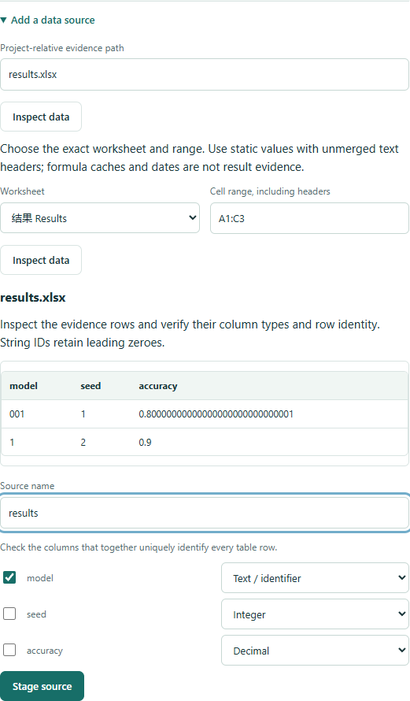
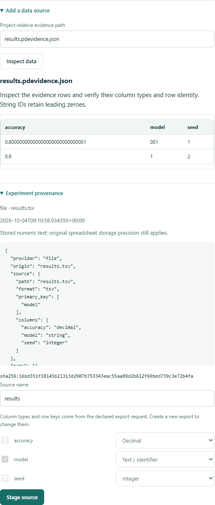

# Experiment evidence: tables, MLflow and W&B

[简体中文](zh-CN/experiment-evidence.md)

PaperDelta checks declared results against paper locations. Version 0.9 adds TSV,
static Excel tables and portable experiment exports. CSV and JSON remain supported.
All checks are local; only an explicit `evidence import` request to MLflow or W&B
uses the network. Imports never accept a manuscript binding.

## Choose an input

| Input | Selection | Stored precision and location |
| --- | --- | --- |
| CSV / TSV | Column types, primary key, filters | Exact numeric text and original line |
| `.xlsx` | Worksheet, rectangular range, types, primary key | Stored numeric lexemes and `sheet!cell` |
| JSON | Exact JSON Pointer | Exact JSON numbers and pointer |
| `.pdevidence.json` | Preserved export contract, explicit run/metric/step filters | Source snapshot hash, native pointer, precision declaration |

Open `paperdelta studio`, inspect the file, and declare its columns and row identity.
For Excel, explicitly select a worksheet and a range such as `A1:F20`, including
the header. Switching languages keeps that selection and your draft. Export files
already contain their declared column types/key; inspect them before staging the source.
The same table sources work in the terminal guide, Studio batches, templates and
read-only MCP drafts. JSON continues to use pointer-based individual bindings.

<details>
<summary>Actual Studio worksheet and range selection</summary>



</details>

## Static Excel contract

The core package reads supported SpreadsheetML directly without Excel, a formula
engine or an extra Python spreadsheet dependency. Supported `.xlsx` tables have:

- A unique, nonempty text header for each column in the selected rectangle.
- Static numeric, inline-text or shared-string cells. Text IDs `001` and `1` stay distinct.
- No formulas, cached formula results, intersecting formula ranges, merged cells,
  date/time cells, boolean/error cells or macros in the evidence contract.
- At most 100,000 data rows and 1,000,000 cells in the selected range. XML parts are
  bounded at 32 MiB and the expanded archive at 128 MiB. Project input files are
  bounded at 32 MiB. UTF-8 transitional SpreadsheetML is supported; encrypted,
  legacy `.xls`, `.xlsb` and strict/other XML encodings are not.

Hidden rows remain included. Empty numeric TSV cells and absent Excel cells remain
missing; they never become zero. A selection involving a missing value is unknown,
while an independent available result can still resolve. Missing primary keys are
rejected. A numeric Excel cell formatted to display leading zeroes is not a text ID.
Convert identifiers to actual text and review them before using the workbook.

Numeric cell text is read from the stored XML without another float conversion.
This cannot restore digits that Excel already rounded before saving. Formula results
must be exported as reviewed static values; PaperDelta neither evaluates formulas
nor silently trusts a potentially stale cache.

Example accepted source declaration (configuration schema 5):

```yaml
sources:
  experiment:
    path: results.xlsx
    format: xlsx
    sheet: Results
    cell_range: A1:D20
    primary_key: [model, split, seed]
    columns: {model: string, split: string, seed: integer, accuracy: decimal}
```

The [owned native-evidence example](../examples/evidence-native/README.md) runs
without any provider account or optional dependency.

## Create a portable local export

Save an explicit request as `import.json` in your project:

```json
{
  "provider": "file",
  "origin": "results.tsv",
  "source": {
    "path": "results.tsv", "format": "tsv",
    "columns": {"model": "string", "seed": "integer", "accuracy": "decimal"},
    "primary_key": ["model", "seed"]
  }
}
```

```sh
paperdelta -C my-project evidence import import.json --out evidence/run-01.pdevidence.json
paperdelta -C my-project evidence inspect evidence/run-01.pdevidence.json
paperdelta -C my-project studio
```

The export is a single file containing the import selection, source snapshots,
normalized rows, declared types, primary key, creation time and content identities.
It remains usable after the original file or platform becomes unavailable. Inspection
rechecks snapshot hashes and recomputes rows from those snapshots. Editing rows alone
and recalculating a file hash cannot pass that validation. Hashes establish consistency,
not authenticity of a provider or scientific correctness.

<details>
<summary>Actual Studio export provenance</summary>



</details>

Each import creates a new path and refuses to replace an existing export. A later
experiment therefore needs a new explicit import and a reviewed source change; a
normal check never fetches newer remote data. To compare imports, first save a
PaperDelta snapshot, import to a new path, then use Studio to preview and accept the
source-path change. The resulting source hash, provenance and metric changes remain
visible. A portable export is bounded at 32 MiB with at most 100,000 normalized rows;
each embedded source snapshot is bounded at 16 MiB. Narrow the selected runs or metrics
when those limits are exceeded.

## MLflow

No MLflow SDK is required. The adapter performs read-only `runs/get` and fully
paginated `metrics/get-history` REST requests. It does not substitute the run's
latest-value summary for its history. Use a terminated run (`FINISHED`, `FAILED` or
`KILLED`); live runs are refused. The server must implement those documented endpoints.

```json
{
  "provider": "mlflow",
  "origin": "https://your-tracking-server.example",
  "runs": ["YOUR_RUN_ID"],
  "metrics": ["accuracy"],
  "identity": {
    "seed": {"scope": "param", "field": "seed", "type": "integer"},
    "split": {"scope": "param", "field": "split", "type": "string"},
    "checkpoint": {"scope": "tag", "field": "checkpoint", "type": "string"}
  }
}
```

Set `MLFLOW_TRACKING_TOKEN`, or both `MLFLOW_TRACKING_USERNAME` and
`MLFLOW_TRACKING_PASSWORD`, in the import process environment when authentication
is required. Credentials are neither request-file fields nor saved metadata.
Use HTTPS; HTTP is supported for localhost development. URLs containing credentials,
query strings or fragments and HTTP redirects are refused. Raw MLflow response
snapshots include the selected runs' metadata, so review an export's content before
sharing it publicly.

Rows retain the run ID, metric, sequence index, step, original timestamp in
milliseconds, value/status, explicitly mapped identities, and any returned
model/dataset IDs. Repeated steps remain separate observations. Selecting only a
run and metric does not silently choose the last or best checkpoint.

The API represents metric values as doubles. The export preserves received numeric
text and declares `api-double` precision; it cannot recover pre-upload decimal digits.
Sources: [MLflow REST API](https://mlflow.org/docs/latest/api_reference/rest-api.html).

## Weights & Biases

```sh
python -m pip install 'paperdelta[wandb]'
```

Set `WANDB_API_KEY` in the importing process environment. The optional adapter uses
the tested 0.30 SDK series and requires an explicit API endpoint and full run paths:

```json
{
  "provider": "wandb",
  "origin": "https://api.wandb.ai",
  "runs": ["YOUR_ENTITY/YOUR_PROJECT/YOUR_RUN_ID"],
  "metrics": ["accuracy", "loss"],
  "identity": {
    "seed": {"scope": "config", "field": "seed", "type": "integer"},
    "split": {"scope": "config", "field": "split", "type": "string"},
    "checkpoint": {"scope": "history", "field": "checkpoint", "type": "string"}
  }
}
```

Only finished/failed/crashed/killed runs are imported. The adapter uses
`scan_history(page_size=1000, use_cache=False)`, with no multi-key filter. This
retains sparsely logged metrics and crosses empty step pages. `history()` sampling
and mutable run summaries are not used. Exported snapshots contain the selected
config fields, selected history fields, step and timestamp; unrelated config and
history fields are not included. The snapshot is an SDK projection, not a byte-for-byte
copy of the remote wire response.

An absent metric produces a missing row; nonfinite values retain a `nonfinite` status
with no numeric value. No record is silently filled with zero or dropped.
An entirely empty requested metric history has a `not_logged` placeholder, distinct
from a metric missing within a real history row (`missing`).
Filter the exact intended step/checkpoint and declare expected counts/seeds. Missing grouping
identities stay unknown in batch review. Missing metrics across a requested set
cannot produce an apparently complete mean.

The SDK exposes binary64 values. Round-trip text preserves those returned values
without claiming original decimal precision; the export labels this `sdk-binary64`.
See the [official `scan_history` contract](https://docs.coreweave.com/products/wandb/ref/python/public-api/run).
Local verification exercises the installed SDK's real scanner and protobuf pagination
with controlled transport responses. It does not claim a live account or every
self-hosted W&B deployment has been tested.

## Bind an imported result

The import command prints a ready-to-inspect source declaration. The normalized
remote table uses primary key `run_id + metric + record_index`. Select the intended
`run_id`, `metric`, `step` and experiment identity fields, choose numeric field
`value`, and declare its unit and calculation. `record_index` distinguishes repeated
history records; it is not a ranking or an automatic “best run” choice.

Timestamps retain their provider units in `timestamp_unit` (`ms` or `s`). Missing
identities remain null, and integer/text identities are not silently interchanged.
MLflow `checkpoint` is explicit run metadata; a W&B checkpoint can be a per-history-row
field. Nothing infers a checkpoint from the largest step or an artifact filename.
`count` counts selected records, including missing measurement records; use an
explicit `status: observed` filter only when that is the intended count, and retain
expected counts/seeds to avoid hiding missing runs.

Each resolved metric records snapshot locations and provenance in schema 5. The
offline HTML and Studio expose this information in both languages. General JSON
and ordinary CSV projects preserve their older report/identity contracts. See
[report versioning](report-format.md) and [0.9 upgrade notes](v0.9.md).

Machine clients can obtain strict schemas with `paperdelta schema evidence-import`
and `paperdelta schema evidence-export`. Importing is an explicit CLI operation;
MCP tools continue to build and inspect local drafts without network or write authority.
