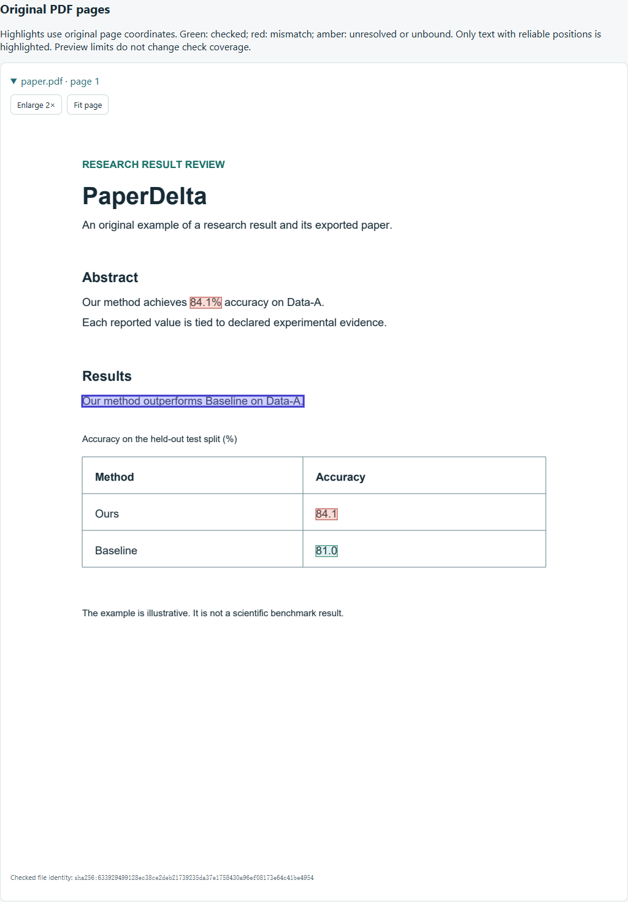

# PDF and multiple manuscripts

[简体中文](zh-CN/pdf.md)

PaperDelta 0.5 reads supported text-based PDFs and checks their explicitly bound
results against CSV/JSON evidence. The same configuration can contain LaTeX,
Word and PDF manuscripts. PDF and Word files remain read-only.

## Try an exported-paper example

```sh
python -m pip install 'paperdelta[pdf]'
paperdelta demo --document pdf --out pdf-demo --open
```

The original example includes a small LaTeX source and its PDF. It needs no TeX
installation. Evidence changes from 84.1% to 80.9% and the source is corrected,
while the PDF still shows 84.1%. The report identifies the stale export and the
comparison that no longer holds. Open `pdf-demo/review/report.html` to switch
English/Chinese, inspect original-page highlights or enlarge the page. A new
output directory is required for each demo. `--scenario baseline` leaves both
documents and evidence consistent; `safe-update` demonstrates another stale export.
Native formats do not produce a writeback patch in either scenario.



## Connect your PDF

```sh
paperdelta init --paper paper.pdf --data results.csv
paperdelta pdf inspect --file paper.pdf
paperdelta guide
paperdelta check --report build/review
```

Use `paperdelta batch guide` for CSV result tables. Candidate IDs retain file,
page, bounding box, original text and extraction identity. Choose the correct
experiment, unit, aggregation and location explicitly; identical values do not
prove that two results mean the same thing. Claims still need explicit predicates.

`pdf inspect --format json` lists page dimensions, supported numeric locations,
declared regions and extraction limitations. Coordinates use PDF points (1/72
inch), with the **top-left** of the page as origin: `[x0, top, x1, bottom]`. Pages
start at 1. Coordinates are decimal values; extracted text offsets are not PDF
byte offsets. There are no fabricated source lines or writable addresses.

## Declare regions

```sh
paperdelta pdf region-add --file paper.pdf --name abstract --page 1 --bbox 30 120 570 240 --kind abstract
# Inspect the preview, then repeat with --accept to save it.
paperdelta pdf region-remove --file paper.pdf --name abstract
```

Use coordinates from **your** PDF, not the illustrative box above. Regions are
named, non-overlapping page boxes. `text` groups prose; `abstract` also supports
the existing abstract scope; `table` requires an entire regular ruled grid. A box
cannot clip or hide a detected table. Unruled/merged tables are not inferred as
reliable table cells. Ordinary ruled tables are also detected without a region.

Selecting a region does not exclude the rest of the document. Use `scope` for
review scope or a justified exclusion; existing failing bindings remain visible.
Changing/removing a region can invalidate its bindings. Review the preview and
use `repair` to select their new positions. Configuration changes require explicit
`--accept`, recheck input hashes under the write lock and save a configuration
backup. They never edit the PDF.

## Share metrics across manuscripts

Starting from an initialized source project:

```sh
paperdelta manuscript add --file submitted.pdf --export-of paper/main.tex
paperdelta manuscript add --file submitted.pdf --export-of paper/main.tex --accept
paperdelta manuscript list
paperdelta guide
paperdelta check --report build/review
```

The first command previews the declaration. In `guide`, choose the **existing
metric** and its occurrence in the PDF. For a Word source, install
`paperdelta[docx,pdf]` and use `--export-of paper.docx`. Additional manuscripts
can omit `--export-of`; they still share the same explicitly selected evidence.

```yaml
schema_version: 4
paper:
  entry: paper/main.tex
  companions:
    - entry: submitted.pdf
      export_of: paper/main.tex
```

Only an explicit `export_of` relation triggers source/export checks. The source
must be a declared LaTeX or Word entry. Its included LaTeX files belong to that
entry. Duplicate/overlapping entries are refused to avoid conflicting parser
settings. At most 20 companions can accompany the primary manuscript.

The report compares each metric's **declared bindings**:

| State | Meaning |
| --- | --- |
| `aligned` | Both documents' bound occurrences agree with current evidence. |
| `stale` | All bound source occurrences pass, but at least one PDF occurrence mismatches. |
| `source_outdated` | At least one resolved source occurrence needs review. |
| `unknown` | One side lacks a binding or a binding cannot be checked. |

An aligned result does not certify whole-document equivalence, completeness,
statistical validity or publication readiness. Broken/missing counterparts stay
explicit. A stale PDF adds `EXPORT_STALE` and a re-export action; it does not edit
the exported file. Review any false claims before re-exporting.

`manuscript remove --file supplement.docx` previews removal of an unreferenced
companion; add `--accept` to commit. Referenced manuscripts and the primary
manuscript cannot be removed this way. Watch monitors all declared entries,
including recovery after a partial PDF/Word save. Existing batch, scope, snapshot,
repair and read-only MCP flows retain native PDF positions.

## Reliability and extraction identity

Supported examples include ordinary horizontal English/Chinese text, separated
columns, split drawing runs, decimal/scientific/signed numbers, multipage documents
and rectangular ruled tables with explicit header/row identities. Extraction uses
[pdfplumber](https://github.com/jsvine/pdfplumber) and pdfminer.six; original-page
rendering uses the PDFium dependency distributed with pdfplumber.

The adapter fails closed for recognized unsupported content: scanned/blank pages,
OCR text over images, undecodable glyphs, superscripts/subscripts, overlapping or
rotated text, hidden/translucent/clipped content, forms/layers and complex table
cells. Image and Form XObject areas remain unverified; ordinary prose outside
those areas may still be checked. Rotated/cropped/nonzero-origin pages are
currently unsupported. Password-protected, malformed or oversized PDFs return
explicit errors. There is **no OCR** and no guarantee that every visual or PDF
encoding anomaly can be recognized. Always inspect the original-page preview.

PDF anchors and positions record the PaperDelta adapter, pdfplumber and pdfminer
versions. A changed/missing extractor identity returns `PDF_EXTRACTION_CHANGED`;
recheck and explicitly repair bindings. Do not copy a new parser string into an
old proposal to bypass review. Moving a paragraph to another page, changing text,
headers or regions may also require repair. A numeric-only correction in stable
context can keep the same binding. Proposals additionally retain tool and input
identities; rebuild unaccepted proposals after an upgrade.

Current bounds: 32 MiB/file, 200 pages, 200 named regions, 100,000 glyphs and
10,000 edges/page; extracted native text is limited to 4 MiB and 10,000 blocks.
These are resource guards, not performance guarantees at the limits. The offline
HTML embeds up to 12 original pages, 12 million rendered pixels and 8 MiB of PNG
data, with at most 500 highlights/page. Preview omissions are separate from
checking coverage. Rendering failure does not change numerical verdicts. A PDF
whose bytes changed after checking is not used for a mismatched preview.

See [report schema 4](report-format.md), [release checks](v0.5.md) and
[Word support](word.md). Scanned OCR, general table reconstruction, visual binding
editing, native-document writeback and statistical inference remain outside 0.5.
