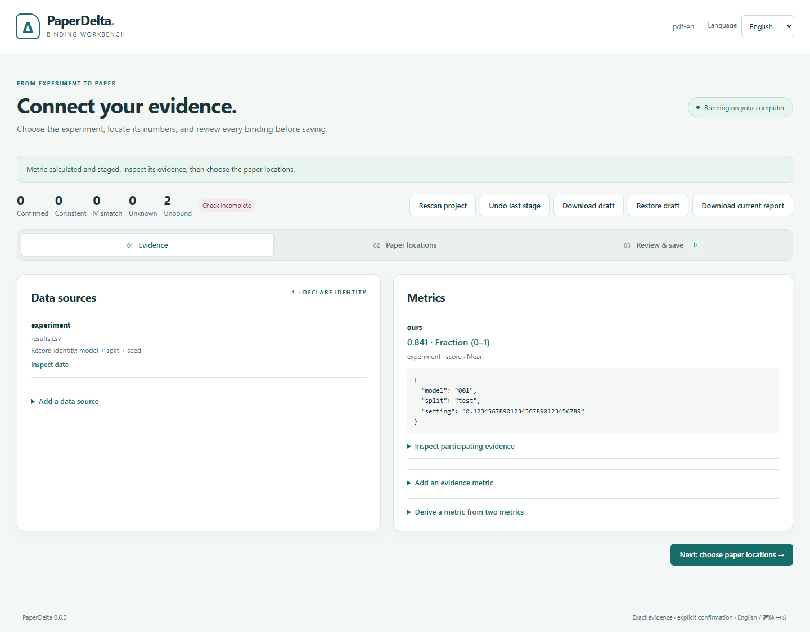

# Visual binding workbench

[简体中文](zh-CN/studio.md)

PaperDelta 0.6 adds `paperdelta studio`: a local browser interface for connecting
CSV/JSON evidence to numbers in existing LaTeX, Word and text-PDF manuscripts.
It uses the same typed drafts, exact calculations, anchors and explicit acceptance
as the CLI. The interface can switch between English and Simplified Chinese.



## Start

```sh
python -m pip install --upgrade paperdelta
paperdelta -C path/to/your/project studio
```

For Word/PDF, install `paperdelta[docx,pdf]` instead. Python 3.11+ and a modern
browser are sufficient; no Node.js, model key, cloud account or TeX installation
is needed. The browser opens automatically. If needed, copy the **complete URL**
printed in the terminal, including its fragment after `#`.

```sh
paperdelta --lang zh-CN -C path/to/your/project studio --no-open
paperdelta -C path/to/your/project studio --port 8765
```

The terminal must stay running. Stop it with Ctrl+C. The address is always
`127.0.0.1`; a free port is chosen by default. This is a local desktop tool, not a
network service. A new server creates a new session URL. Open the URL on the same
computer. macOS/Linux users may use `python3` to create their virtual environment.

## Connect a paper

1. **Create the configuration.** In a folder without `paperdelta.yaml`, enter the
   main manuscript and CSV/JSON paths relative to the project folder. File discovery
   suggests common inputs. It skips hidden/generated directories; an explicit
   project-relative path can still be entered. Creation confirms no mappings.
   An existing configuration opens directly. Use global `--config` for a different
   configuration path.

2. **Inspect and declare a source.** Open *Add a data source*, enter its path and
   inspect the sample rows. Give it a name such as `experiment`. Choose each CSV
   column type and the columns that jointly identify every row. Keep model IDs
   such as `001` as text. A typical key is `dataset + model + split + seed`.
   Duplicate keys and invalid types are rejected.

3. **Calculate a metric.** Choose the source and numeric column (or exact JSON
   Pointer), enable every experiment identity filter, declare the unit, calculation
   and expected record count. Unchecked columns do not filter rows; an enabled
   empty string is an actual empty-string filter. For three runs, choose mean,
   count 3 and optionally enter all three expected seeds, one per line. Fractions
   such as `0.841` use the fraction unit. Inspect the participating records and
   exact result. Derived metrics support difference, ratio, percentage-point
   difference and relative percent change.

4. **Select paper locations.** Filter by file or nearby text and select individual
   candidate numbers. LaTeX shows source context/lines; Word shows native
   paragraph/table positions; PDF shows page/box positions and original-page
   previews. Click highlighted PDF numbers or use the context list, with keyboard
   selection and 2× enlargement. Repeated equal numbers remain separate choices.
   Already bound or staged positions cannot be selected again.

5. **Stage bindings.** Choose the metric, a binding name, display and precision.
   Multiple positions use a numbered name prefix. Explain the experiment identity
   and what the locations mean. Percent display can convert `0.841` to `84.1%`;
   the unit declaration, not matching text, determines that conversion.

6. **Preview and save.** Preview runs the existing checker. Each card shows the
   exact location/context, actual and expected display, reason and evidence. No
   save checkbox is preselected. Select the bindings you have reviewed, confirm
   the evidence/positions and click *Save selected bindings*.
   The selected bindings and required sources/metrics are saved to the configuration,
   with the previous file backed up under `.paperdelta/config-backups/`.
   Unselected staged work is discarded after acceptance. A valid binding may
   intentionally expose a mismatch; saving a mapping does not fix the paper.

The top counts describe the **accepted** configuration. Staged previews are shown
separately. Unbound numbers, unsupported content and incomplete checks stay visible.
The workbench never writes manuscript or evidence files.

## Drafts, changes and reports

- **Undo last stage** reverses one in-memory stage (up to 20 stages), including a
  restored draft. It does not undo a previously accepted configuration.
- **Download draft** saves the exact typed draft as JSON. **Restore draft** checks
  its tool version, configuration and all recorded input hashes before using it.
  Long decimals and numeric-looking string IDs survive the browser roundtrip.
- Refreshing the browser tab reconnects to the running session. Stopping the
  terminal loses in-memory work. Download unfinished drafts before stopping.
- **Rescan project** explicitly discards staged work and reads current inputs.
  If a paper, data source or configuration changed, stale stages cannot be saved.
  Recreate bindings against the current inputs instead of editing a hash to force
  an old draft through. A second browser tab cannot overwrite a newer session revision.
- **Download current report** produces an offline HTML report from the accepted
  configuration, excluding staged additions. The report keeps its own bilingual
  switch. Workbench language selection changes presentation, not declarations.

## Boundaries and troubleshooting

The browser workbench covers **numeric binding onboarding**. Claims, figure
provenance, changing/removing accepted declarations, anchor repairs, PDF region or
companion-manuscript management, scope exclusions, snapshots and paper patches
continue through the [CLI workflows](workflows.md), [guided repairs](guided-bindings.md)
and [PDF commands](pdf.md). Existing companion manuscripts and derived metrics can
be used in Studio. Word/PDF remain read-only; scanned PDFs still require OCR outside
PaperDelta, with no guarantee that OCR output is checkable.

Views show at most 5,000 numeric candidates, 500 staged definitions, 200 selected
bindings per stage, 100 CSV sample rows per page and 50 JSON leaf samples.
Source inspection is a preview, not a full JSON browser. Draft import is bounded
below 1 MiB. PDF previews inherit [page/image limits](pdf.md) and show at most
500 boxes per page; the context list remains available. Use the CLI or smaller
batches for projects outside these interactive limits.

If the browser cannot connect, keep the terminal running and open its latest
complete URL. If a format extra is missing, install it in the environment running
Studio. Unsupported structures stay explicit; a missing PDF preview does not change
the checker verdict. A document edited while a draft is open requires a fresh scan.

No CDN, analytics, external fonts or remote API is used. Project data endpoints
require the session token, exact local origin and valid project-relative paths.
The server exposes a fixed asset list, not a filesystem browser or shell.
These controls protect the local browser boundary; the session is not a multi-user
authentication system. Keep the session URL private.

## Reproduce browser validation

The regular Python tests exercise real local HTTP and all three formats.
For browser acceptance, install the project with `.[dev]`, install Playwright
separately, then run `node tools/validate_studio_browser.cjs build/studio-check`
from the checkout. Use a new output directory. `PAPERDELTA_PYTHON`,
`PLAYWRIGHT_MODULE` and `BROWSER_EXECUTABLE` optionally identify your runtimes.
The script checks six full workflows (three formats × two languages), exact
selectors, draft restoration, subset acceptance, source-file hashes, desktop/mobile
layout and network/console errors, and writes screenshots and a JSON receipt.
These are machine acceptance results, not measured human usability.
