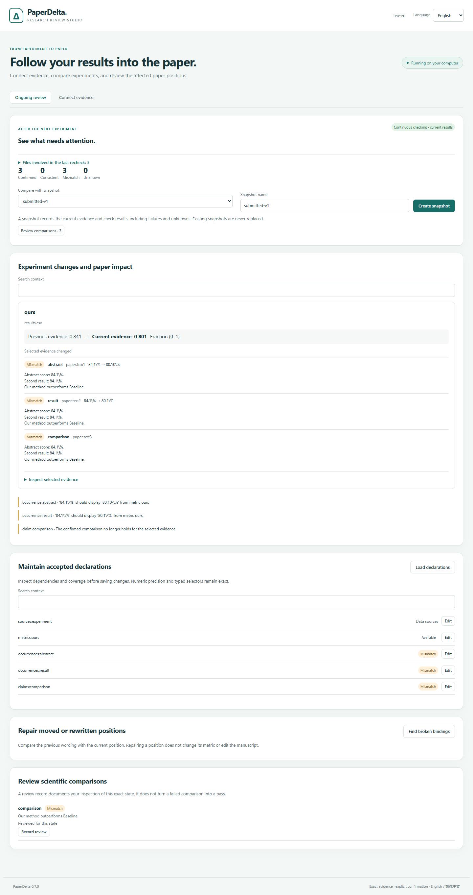

# Research review Studio

[简体中文](zh-CN/studio.md)

Version 1.0 statistical bindings declare seeds, n, SD convention and interval
method explicitly. Compound displays, batch templates and read-only agents share
the [statistical contract](statistics.md).

PaperDelta 0.8 combines first-time and batch binding with ongoing review of
LaTeX, Word and text-PDF manuscripts against CSV/TSV/JSON, static Excel and imported experiment evidence in `paperdelta studio`.
It uses the same typed drafts, exact calculations, anchors and explicit acceptance
as the CLI. The interface can switch between English and Simplified Chinese.



## Start

```sh
python -m pip install --upgrade paperdelta
paperdelta -C path/to/your/project studio
```

For Word/PDF, install `paperdelta[docx,pdf]` instead. Python 3.11+ and a modern
browser are sufficient; no Node.js, model key, cloud account or TeX installation
is needed. The browser opens automatically. If needed, copy the **complete URL**
printed in the terminal, including its fragment after `#`.

```sh
paperdelta --lang zh-CN -C path/to/your/project studio --no-open
paperdelta -C path/to/your/project studio --port 8765
```

The terminal must stay running. Stop it with Ctrl+C. The address is always
`127.0.0.1`; a free port is chosen by default. This is a local desktop tool, not a
network service. A new server creates a new session URL. Open the URL on the same
computer. macOS/Linux users may use `python3` to create their virtual environment.

## Connect a paper

1. **Create the configuration.** In a folder without `paperdelta.yaml`, enter the
   main manuscript and evidence paths relative to the project folder. File discovery
   suggests common inputs. It skips hidden/generated directories; an explicit
   project-relative path can still be entered. Creation confirms no mappings.
   An existing configuration opens directly. Use global `--config` for a different
   configuration path.

2. **Inspect and declare a source.** Open *Add a data source*, enter its path and
   inspect the sample rows. Give it a name such as `experiment`. Choose each table
   column type and the columns that jointly identify every row. Keep model IDs
   such as `001` as text. A typical key is `dataset + model + split + seed`.
   Duplicate keys and invalid types are rejected. For XLSX, explicitly select
   the worksheet and rectangular range including its header. Portable exports
   preserve their column/key contract and expose snapshot provenance. See the
   [experiment-evidence guide](experiment-evidence.md).

3. **Calculate a metric.** Choose the source and numeric column (or exact JSON
   Pointer), enable every experiment identity filter, declare the unit, calculation
   and expected record count. Unchecked columns do not filter rows; an enabled
   empty string is an actual empty-string filter. For three runs, choose mean,
   count 3 and optionally enter all three expected seeds, one per line. Fractions
   such as `0.841` use the fraction unit. Inspect the participating records and
   exact result. Derived metrics support difference, ratio, percentage-point
   difference and relative percent change.

4. **Select paper locations.** Filter by file or nearby text and select individual
   candidate numbers. LaTeX shows source context/lines; Word shows native
   paragraph/table positions; PDF shows page/box positions and original-page
   previews. Click highlighted PDF numbers or use the context list, with keyboard
   selection and 2× enlargement. Repeated equal numbers remain separate choices.
   Already bound or staged positions cannot be selected again.

5. **Stage bindings.** Choose the metric, a binding name, display and precision.
   Multiple positions use a numbered name prefix. Explain the experiment identity
   and what the locations mean. Percent display can convert `0.841` to `84.1%`;
   the unit declaration, not matching text, determines that conversion.

6. **Preview and save.** Preview runs the existing checker. Each card shows the
   exact location/context, actual and expected display, reason and evidence. No
   save checkbox is preselected. Select the bindings you have reviewed, confirm
   the evidence/positions and click *Save selected bindings*.
   The selected bindings and required sources/metrics are saved to the configuration,
   with the previous file backed up under `.paperdelta/config-backups/`.
   Unselected staged work is discarded after acceptance. A valid binding may
   intentionally expose a mismatch; saving a mapping does not fix the paper.

The top counts describe the **accepted** configuration. Staged previews are shown
separately. Unbound numbers, unsupported content and incomplete checks stay visible.
The workbench never writes manuscript or evidence files.

## Batch binding and experiment templates

After declaring a table source, open **Batch binding**. Select its result columns,
the columns that identify each experiment group, and fixed filters such as the
test split. Declare the shared evidence unit, calculation, expected record count,
seed set and paper display. Use separate batches for different units or reductions.
Do not put the same column in both grouping and fixed filters.

**Inspect experiment groups** calculates every group without accepting anything.
Choose a metric, inspect its typed identity and evidence, then select its paper
positions. Suggestions explain which identity fields appear in the context and
which are missing. Suggestions never use numeric equality as identity and never
preselect locations. The context list includes all available positions, with
search and 20-item pages; PDF candidates also open highlighted original pages.
Unknown results, including missing records or seeds, cannot be staged.
The evidence card shows the first ten contributing records; calculation validates
all records. Final review provides the full evidence. Selections survive pagination
and language changes. Changed inputs invalidate the catalog and positions.

Provide a reason for the selected mappings, stage them, then use **Review and save**
to accept an explicit subset. Staging creates a recoverable draft. Location choices
made before staging stay only in the current browser tab. Changing the batch form
requires regenerating the catalog before staging.

Under **Experiment templates**, save a named template after generating a valid
catalog, or load/download an existing one. Import a downloaded template in another
project after choosing that project's declared source. Templates reuse column types,
primary keys, raw identity filters, units, aggregation, seeds and display settings.
They contain no paper positions or input hashes. Loading fills the form; inspect
the groups and choose the new paper positions explicitly. Source formats, required
column types and primary keys must match. Added columns are allowed. Templates are
stored in `.paperdelta/studio/templates/`; names cannot overwrite existing files.
There are at most 100 templates, each at most 64 KiB. A damaged template is reported
without hiding valid files.

## Review an existing CLI or MCP proposal

In **Review and save**, use **Import CLI / MCP proposal** to open a proposal JSON
generated by the existing CLI or read-only MCP tools. Finish or explicitly discard
the current staged draft first. The importer validates the original proposal's
identity, tool version, project configuration and input hashes. It does not silently
update a stale proposal; regenerate it against current inputs instead.

Numeric occurrences, comparison claims and figure declarations share the same
explicit review. Inspect locations, status, rationale and the expandable exact
definition. Select only reviewed bindings and confirm acceptance. Required sources
and metrics accompany that subset; unselected bindings are not accepted. Figures
show their actual paths rather than a fabricated text position. Imported proposals
also participate in local draft recovery. Proposal import does not make MCP writable.

See [0.8 notes and measured setup effort](v0.8.md) for reproducible examples.

## Drafts, changes and reports

Existing projects with accepted bindings open **Ongoing review**. Create a named
snapshot before the next experiment, choose it in the comparison menu, then save
your updated data or manuscript using your normal tools. The dashboard groups
changed evidence and affected numbers, comparisons and figures. Open evidence
details to inspect typed selectors and participating records. Snapshots retain
failures and unknowns too; creating one does not certify the paper or overwrite
an existing snapshot.

Continuous checking distinguishes changes waiting for a stable save from current
results. A partial Word/PDF save or incomplete CSV remains unknown until it can
be checked. An untouched binding draft refreshes automatically; a staged draft
stays available for recovery when its inputs change. Review continues against
accepted declarations independently of that draft.

**Maintain accepted declarations** lists sources, metrics, numeric bindings,
comparison claims and figures. Edit fields, provide a reason, preview the old/new
definition, dependent results and coverage, then explicitly confirm. Deletion
requires selecting every dependent declaration that must also be removed; nothing
is checked automatically. Removing a failed check reduces coverage and remains
visible when comparing with a snapshot. The configuration is backed up; manuscript
and evidence files are never written.

**Repair positions** shows old wording and current candidates. Numeric repairs
use selected positions, with original-page highlights for PDF. Claim repairs use
the exact current wording. Preview and confirm that the scientific meaning is
unchanged. **Record review** attaches an explicit note to a comparison's current
state; a failed comparison still fails after review.

- **Undo last stage** reverses one in-memory stage (up to 20 stages), including a
  restored draft. It does not undo a previously accepted configuration.
- **Download draft** saves the exact typed draft as JSON. **Restore draft** checks
  its tool version, configuration and all recorded input hashes before using it.
  Long decimals and numeric-looking string IDs survive the browser roundtrip.
- Each completed staging action also saves a local recovery copy under
  `.paperdelta/studio/`. Restarting the server offers restore, download or explicit
  discard. This is still a draft: restoring never accepts bindings. Conflicting
  servers cannot silently overwrite one another's recovery copy.
- Current and compatible earlier 0.6/0.7 drafts can be restored into 0.8 after their original
  identity and input hashes are verified. Future/unknown versions are refused.
- If inputs changed, **Rebuild selected draft declarations** shows the saved items.
  Select the work to retain, preview it against current inputs and confirm staging.
  Required dependencies are included explicitly in the preview; conflicting names
  or unresolved old positions are refused. Select only sources/metrics when paper
  positions need choosing again. The original recovery record is archived under
  `.paperdelta/studio/archives/`; rebuilding never accepts the configuration.
- **Rescan project** explicitly clears staged work, archives the saved copy and
  reads current inputs. Stale stages/previews cannot be accepted. A second browser
  tab cannot overwrite a newer session revision. Do not edit identity hashes.
- **Download current report** produces an offline HTML report from the accepted
  configuration, excluding staged additions. The report keeps its own bilingual
  switch. Workbench language selection changes presentation, not declarations.

## Boundaries and troubleshooting

New comparison/figure authoring, PDF regions, companion-manuscript management,
scope exclusions and paper patches continue through the [CLI workflows](workflows.md)
and [PDF commands](pdf.md). Existing proposals, including claims and figures, can
be imported for acceptance in Studio. Existing declarations can be maintained and
reviewed there. Existing companion manuscripts and derived metrics can
be used in Studio. Word/PDF remain read-only; scanned PDFs still require OCR outside
PaperDelta, with no guarantee that OCR output is checkable.

Candidate search reaches all scanned positions, including those beyond the former
5,000-item view limit. Candidate pages contain 30 items; metric and impact pages
contain 20, with search. Selections persist across pages and language changes;
changed input identity invalidates position selections. There are still limits of
500 staged definitions, 200 selected bindings per stage, 100 table sample rows per
page and 50 JSON leaf samples.
Source inspection is a preview, not a full JSON browser. Draft import is bounded
below 1 MiB; the local recovery record is bounded at 4 MiB. A malformed/oversized
recovery file is reported without preventing project inspection or overwriting it.
Keep a copy and move that named recovery file outside the project before starting
fresh work. PDF previews inherit [page/image limits](pdf.md) and show at most
500 boxes per page; the context list remains available. Use the CLI or smaller
batches for projects outside these interactive limits.

If the browser cannot connect, keep the terminal running and open its latest
complete URL. If a format extra is missing, install it in the environment running
Studio. Unsupported structures stay explicit; a missing PDF preview does not change
the checker verdict. A document edited while a draft is open requires a fresh scan.

No CDN, analytics, external fonts or remote API is used. Project data endpoints
require the session token, exact local origin and valid project-relative paths.
The server exposes a fixed asset list, not a filesystem browser or shell.
These controls protect the local browser boundary; the session is not a multi-user
authentication system. Keep the session URL private.

## Reproduce browser validation

The regular Python tests exercise real local HTTP and all three formats.
For browser acceptance, install the project with `.[dev,mcp]`, install Playwright
separately, then run `node tools/validate_studio_browser.cjs build/studio-check`
from the checkout. Use a new output directory. `PAPERDELTA_PYTHON`,
`PLAYWRIGHT_MODULE` and `BROWSER_EXECUTABLE` optionally identify your runtimes.
The script checks six full workflows (three formats × two languages), exact
selectors, draft restoration, subset acceptance, source-file hashes, desktop/mobile
layout and network/console errors, and writes screenshots and a JSON receipt.
These are machine acceptance results, not measured human usability.

Run `node tools/validate_review_browser.cjs build/review-check` for six complete
second-experiment flows including native repair, restart, changed-input recovery,
explicit dependent deletion and live language switching. Run
`node tools/validate_studio_scale.cjs build/scale-check` for 5,101 searchable
positions, cross-page acceptance and a 500-metric/10 MB CSV workload. Each output
directory must be new. The scale tool records actual local browser wall time;
those samples are not a latency promise for arbitrary projects.
