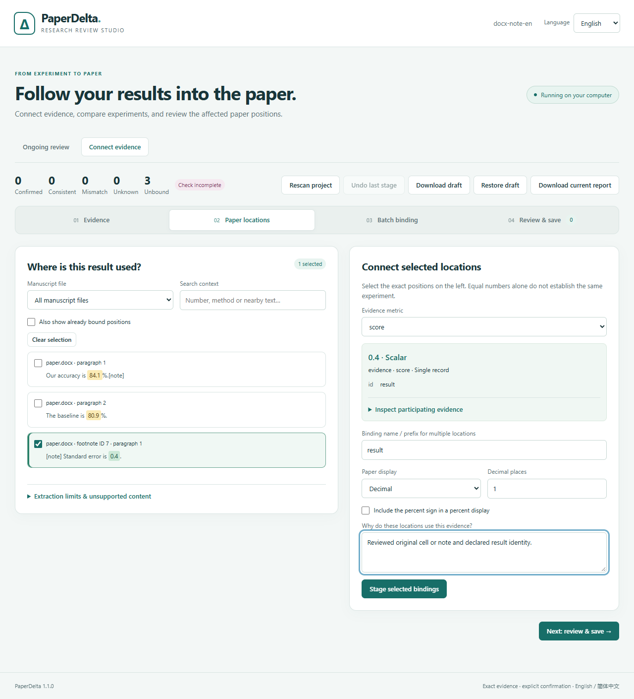
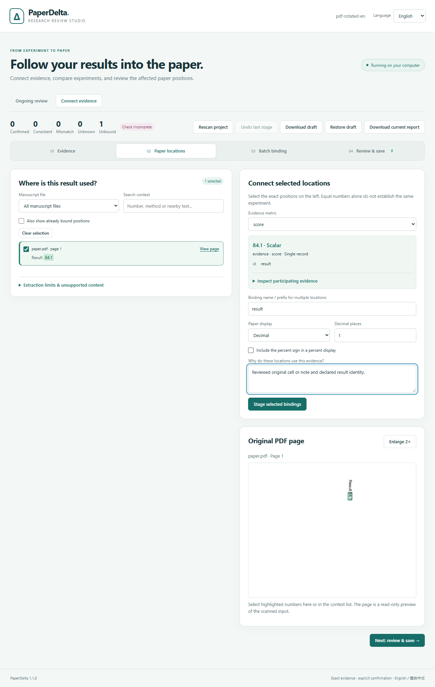

# PaperDelta 1.1: native document locations

[简体中文](zh-CN/v1.1.md)

Version 1.1 extends Word and PDF layout handling while keeping evidence choices
explicit and native files read-only. Install with `python -m pip install --upgrade 'paperdelta[docx,pdf]'`. No Word, TeX or cloud service is needed for checking.

## What changes

- Word: linked, visible footnotes/endnotes, horizontal merged headers and regular
  vertical merges retain original OOXML positions. Header depth and literal caption
  can distinguish result tables without using equal numbers as identity.
- PDF: 0/90/180/270-degree page rotation, CropBox/MediaBox offsets and clipped-page
  previews use the same original visible coordinates. Supported ruled tables can
  contain merged headers; consistent open outer borders can be completed from
  actual drawn geometry. General unruled or irregular tables remain unsupported.
- Scoped graphics-state checks refuse invisible, translucent, clipped or uncertain
  glyphs. Region selection and original-page highlights follow the same transform.
- English/Chinese Studio, terminal and offline reports show note parts and original
  positions; language switching keeps selected locations. Original document bytes
  remain unchanged through checking, binding and report generation.

See the [Word guide](word.md), [PDF guide](pdf.md) and [report contract](report-format.md).

## Upgrade

New header/caption anchors and Word note/merged-cell positions require schema 7.
Older configurations/reports retain their meaning; a reviewed addition upgrades
the configuration through preview, explicit acceptance and backup. Compatible
0.6–1.0 Studio drafts can be restored after validation.

The adapters are now `paperdelta-docx/2` and `paperdelta-pdf/2`. Existing PDF
bindings detect the changed extractor identity and require explicit repair.
Regenerate pending version-bound proposals; do not rewrite their parser strings
to bypass review. Ordinary legacy Word body positions remain compatible.

## Verification and measured limits

The [native study](../validation/native-v1/README.md) preserves four licensed PLOS
article families, eight original files, independent location annotations, a code
freeze and the first held-out result. It reports all four outcomes:

| Run | Targets | Supported | Missed | Mislocated | Unknown |
| --- | ---: | ---: | ---: | ---: | ---: |
| 1.0 development baseline | 64 | 1 | 0 | 0 | 63 |
| 1.1 development | 64 | 49 | 0 | 0 | 15 |
| 1.1 first held-out | 64 | 4 | 4 | 0 | 56 |

This is a small, single-publisher study, not a general accuracy claim. Unknowns
are failures to establish a supported binding, not successes. Multi-number cells
and uncertain table identities remain major limits; joined PDF words/numbers
caused four missed targets. The matching-evidence 1.0 baseline is narrower than
the 1.1 pass/change/mismatch check. Controlled evidence does not reproduce research.
The developer is also the annotator; no independent human validation is asserted.

Owned fixtures separately cover merged/irregular tables, hidden or unreferenced
notes, revisions, all page rotations, nonzero boxes, clipping and opacity, analytic
coordinates, raster alignment and stale-preview rejection. The
[eight-flow browser record](assets/v1.1/browser-evidence.json) covers two Word and
two PDF scenarios in both languages, explicit acceptance, changed evidence,
unchanged original hashes, offline previews and mobile width.





```sh
python -m pip install '.[dev,mcp,wandb]'
python tools/run_tests.py -q
node tools/validate_layout_browser.cjs build/layout-browser
python tools/replay_native.py --out build/native-replay
```

Use fresh output directories. `PAPERDELTA_PYTHON`, `PLAYWRIGHT_MODULE` and
`BROWSER_EXECUTABLE` may select local runtimes. The [delivery ledger](roadmap.md)
records release completion only after platform CI and public artifact checks.
Native study originals remain outside the MIT Python distributions. Earlier
evaluation directories and licenses remain byte-for-byte unchanged.
