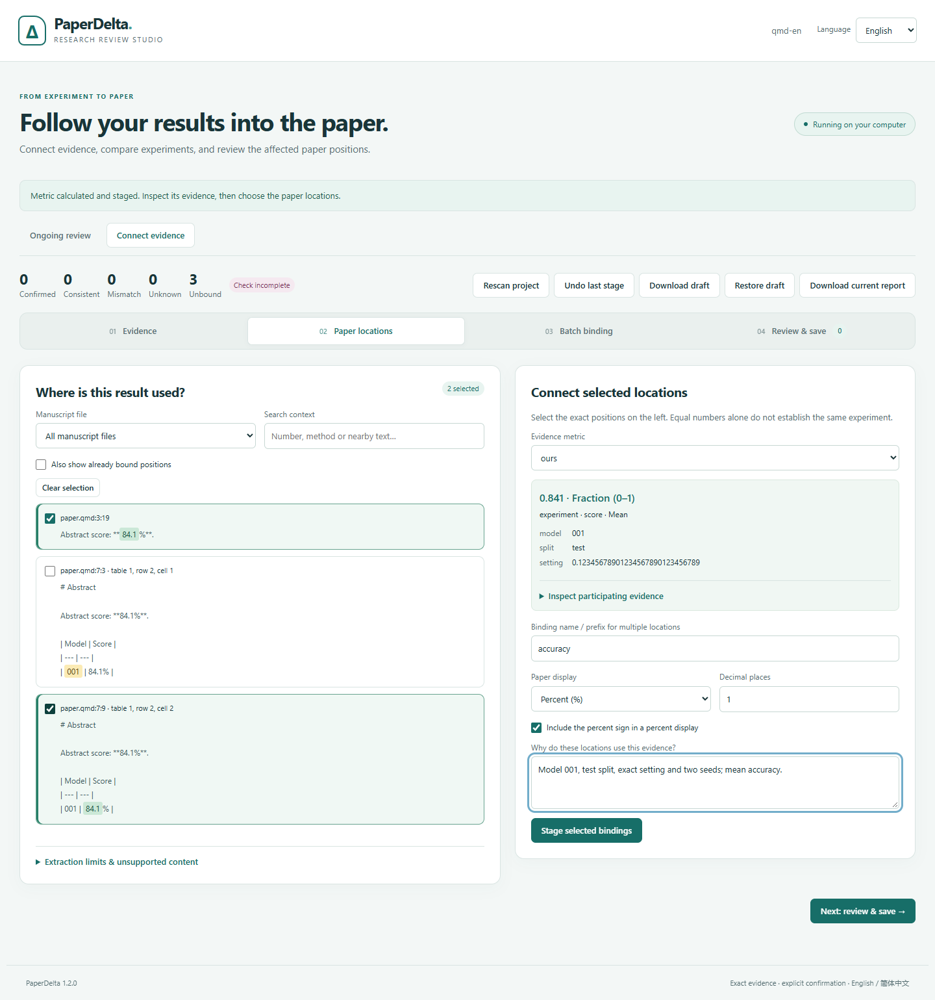
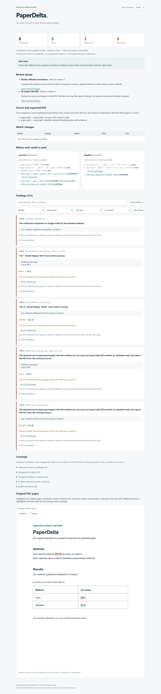

# 1.2: Static manuscript sources

[简体中文](zh-CN/v1.2.md)

Version 1.2 brings Markdown and Quarto into PaperDelta's existing evidence review
workflow. Literal source paragraphs and pipe tables retain their original UTF-8
bytes, line/column, sections and table positions. No renderer or execution engine
is used. The [source guide](markdown-quarto.md) defines the supported subset.

## Use it

```sh
python -m pip install --upgrade paperdelta
paperdelta demo --document markdown --out markdown-demo --open
paperdelta demo --document quarto --out quarto-demo --open
```

Core installation includes both demos. Studio discovers `.md`/`.qmd` files and
supports the same typed evidence, independent binding review, statistics, batches,
templates, snapshots, ongoing checks, source repair and local draft recovery.
The [owned example](../examples/static-manuscript/README.md) shares metrics across
a Quarto paper, Markdown supplement and explicitly declared PDF export.

## Limits and compatibility

Both formats are read-only. Code, front matter, raw HTML, images, dynamic includes,
math and uncertain syntax remain visible as unverified coverage. An unsupported
block produces exit 2 even when other accepted bindings pass; results are not a
claim of full rendered-document coverage. No generated content, Quarto project
configuration or remote input is evaluated.

Configuration/report schema 8 adds static-source locations and `.md`/`.qmd`
export sources. Schemas 1–7 remain readable; old accepted identities are preserved.
New companion declarations preview schema upgrades before acceptance and backup.
Compatible 0.6–1.1 Studio drafts can be restored after validation. A change in
literal source context or ambiguous identity requires explicit binding repair.

## Verification

The new browser checks cover fourteen format/language/workflow combinations:

- [Four onboarding flows](assets/v1.2/studio-browser.json): Markdown/Quarto ×
  English/Chinese, source and table selection, exact typed selectors, partial
  acceptance, retained state across language changes, mobile layout and stale
  preview rejection.
- [Eight statistical flows](assets/v1.2/statistics-browser.json): both formats and
  languages, declared statistical conventions, complete compound expressions,
  confidence levels, batch selections and saved templates.
- [Two offline source/PDF flows](assets/v1.2/static-reports.json): corrected source
  numbers, stale PDF exports, original-page highlights, translated filters,
  mobile layout, no JavaScript fallback and no remote requests.

Source tests use independently specified literal positions and negative cases,
including BOM/CRLF/Unicode, numeric table headers, duplicate contexts, code,
hidden divs, multiline math, split numbers, malformed tables, resource bounds,
reviewed repair, read-only MCP proposals and content-based watching. These are
authored regression cases, not a measured accuracy claim for all Markdown/Quarto.

The [1.1 native study](v1.1.md) remains frozen with its first held-out failures.
Its separate replay runs the exact archived implementation and original cases;
adding static-source support does not rescore or revise those outcomes.
[This release replay](assets/v1.2/native-replay.json) reproduces all 128 outcomes.





The final Windows installed suite passed 755 tests with three POSIX-only skips.
All seventeen named cross-platform/browser checks and distribution audits passed;
public artifact hashes match, and a fresh public installation ran all three core
demos in both languages. See [local evidence](assets/v1.2/local-validation.json),
[publication verification](assets/v1.2/publication.json) and the [delivery ledger](roadmap.md).
