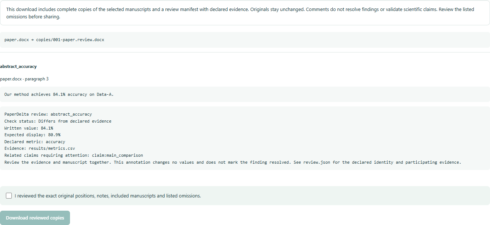

# 1.8: reviewed Word and PDF copies

[简体中文](zh-CN/v1.8.md)

This upgrade adds anchored Word comments and PDF highlights with review notes in
new copies. The original manuscript stays unchanged. Both the local Studio and
CLI show an exact-location preview and require explicit confirmation before export.
Stable publication and platform acceptance are recorded in the approved roadmap.

## Review and export

Install `paperdelta[docx,pdf]`. Open `paperdelta studio` in an accepted project.
In the revision workbench, select the native occurrences, preview the annotated
copies, review original context, expected display, evidence and related claim
warnings, then confirm and download. The ZIP contains new files under `copies/`
and `review.json` with original input hashes, selected locations, evidence and
copy hashes. It does not apply numeric corrections or certify a scientific claim.

The CLI uses the same workflow:

```sh
paperdelta annotate preview --only abstract_accuracy --only table_accuracy --out comments-preview.json
paperdelta annotate create --plan comments-preview.json --out annotated-copies.zip --attest-reviewed
```

Use occurrence names from your accepted project. For Chinese notes, put
`--lang zh-CN` before `annotate preview`. Every output path must be new. Changes to
the manuscript, evidence or configuration invalidate the saved plan. A new tool
version also requires a new preview. Studio language switching keeps selections
but clears the old preview and confirmation so the downloaded notes match the
language reviewed. A process restart never restores export permission.

Existing Word comments, run formatting and unrelated package parts are preserved.
Supported comments are anchored in the main document body or table paragraphs.
Footnote/endnote text remains checkable where already supported, but comments in
those parts, selected nested runs, and signed packages are explicitly refused.
PDF copies preserve page content, existing annotations, rotation and crop geometry.
Encrypted/signed documents and unresolved original locations are refused. Refused
selections stay visible; other supported files may still be exported. Limits are
500 selected occurrences, 48 MiB per copy and 128 MiB total archive.

## Native parsing

Whole `a × 10` values with a raised exponent can be checked when original Word
runs or PDF glyph geometry prove the exponent. All components must be visible,
supported and contiguous. Ambiguous, partially hidden or baseline-only formulas
are not flattened into a passing mantissa. The exponent arithmetic bound remains
1000; very small out-of-range values are never silently rounded to zero.

A PDF opening at a specific local page is distinguished from executable or
chained actions. Only a validated static local view is allowed. Interactive forms,
scripts, remote actions and unverified Form content remain outside the supported
boundary. Documents using these newly supported PDF cases carry parser identity
`paperdelta-pdf/4`; old bindings that no longer match must be repaired and reviewed.
Word uses `paperdelta-docx/3` when supported superscript values occur.

Literal header and row identity requirements still apply. For example, a table
with iteration numbers before variant labels can expose the complete scientific
value while requiring explicit review of its row identity. This does not count as
automatic binding success. Ranges, counts with percentages and confidence interval
cells are retained as complete targets in the new study; an unsupported whole
display is reported unknown, not scored as successful isolated fragments.

## Evidence and compatibility

[Native study 3](../validation/native-v3/README.md) records twelve unchanged licensed
originals from eight new families, selected and split before parser changes. Four
families are development inputs; four are held out until implementation freeze.
Independent original positions, all outcomes and failures are preserved. Earlier
studies retain their bytes. Rechecks of those inputs are regressions, not new
held-out measurements. Controlled evidence does not reproduce the papers' experiments.

The first new held-out run has 29 supported, 1 missed, 0 mislocated and 50 unknown
targets (80 eligible; 16 unfilled slots). Public 1.7 supports 18 on the same gold.
Development improves from 18 to 34 supported of 96; unknowns are not successes.
The original first miss and all automatic Word identity failures remain recorded.

Configuration schema 10 and report schema 9 remain in use. Annotation plans have
their own versioned schema and input identities; they are not manuscript patches.
Checking, Studio, MCP and the composite Action do not execute manuscript code.
The existing guarded LaTeX/Markdown/Quarto revision and recovery workflows remain
available. See [Word](word.md), [PDF](pdf.md) and [the approved roadmap](roadmap.md).





Eighty-two installed-browser cases cover bilingual onboarding, revisions/recovery,
annotations, statistics, native positions and scale. [Annotation flows](assets/v1.8/annotations-installed.json) ·
[native identity](assets/v1.8/reliability-installed.json) · [actual 1.7 draft upgrade](assets/v1.8/draft-upgrade.json) ·
[transaction recovery](assets/v1.8/transaction-upgrade.json). The first installed suite
passed 978 assertions with three POSIX-only skips, but its 499-second runtime exceeded
the old 480-second limit, so that attempt remains failed. The deadline change and
first native failures remain in [development adjustments](assets/v1.8/development-adjustments.json);
publication still requires completed final acceptance.

The final local installed suite then passed in 512.36 seconds (978 passed, three POSIX-only skips). First remote CI run [37577011131](https://github.com/amos689/paperdelta/actions/runs/37577011131) cancelled Windows/Python 3.13 and 3.14 at the separate 15-minute job deadline. The standard test job now allows 30 minutes with all assertions retained; the exact runtime wheel and frozen native study are unchanged. The new candidate still requires all seventeen jobs to finish successfully.
