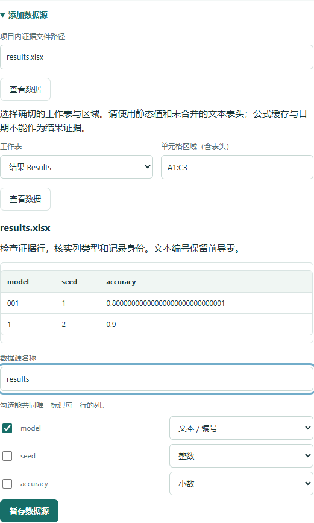
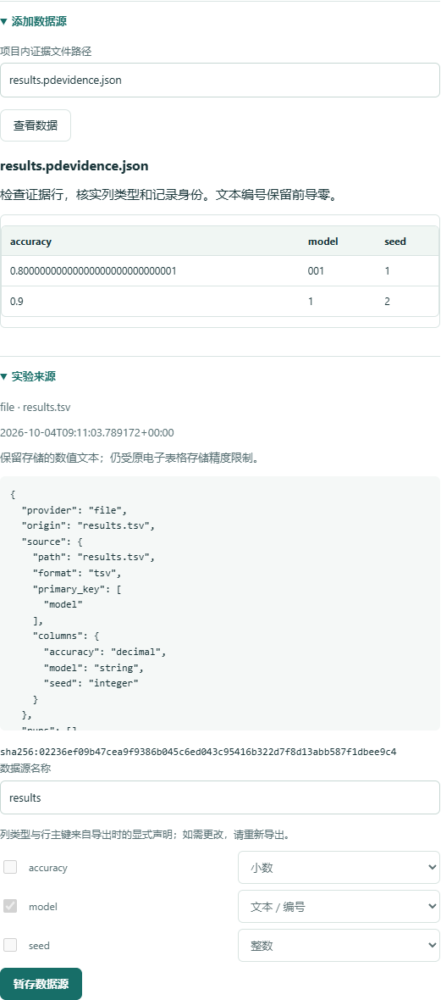

# 实验证据：表格、MLflow 与 W&B

[English](../experiment-evidence.md)

PaperDelta 根据明确声明的实验结果核对论文位置。0.9 新增 TSV、静态 Excel 和可移植
实验导出，继续支持 CSV 与 JSON。检查全程在本地运行；只有显式执行面向 MLflow 或
W&B 的 `evidence import` 才联网。导入数据不会接受任何论文绑定。

## 选择输入

| 输入 | 明确选择 | 精度与原始位置 |
| --- | --- | --- |
| CSV / TSV | 列类型、主键、筛选条件 | 精确数值文本与原始行号 |
| `.xlsx` | 工作表、矩形区域、类型、主键 | 存储的数值文本与“工作表!单元格” |
| JSON | 精确 JSON Pointer | 精确 JSON 数字与指针 |
| `.pdevidence.json` | 导出声明、运行/指标/步骤等筛选 | 来源快照哈希、原生指针与精度声明 |

运行 `paperdelta --lang zh-CN studio`，查看证据文件并声明列类型与行身份。Excel 必须
明确选择工作表和包含表头的区域，例如 `A1:F20`。切换语言保留选择与草稿。标准化
导出自带列类型和主键，检查后再暂存来源。这些表格来源都支持终端向导、Studio 批量
绑定、模板与只读 MCP 草稿；普通 JSON 继续使用基于指针的单项绑定。

<details>
<summary>查看真实 Studio 工作表与区域选择界面</summary>



</details>

## 静态 Excel 约定

核心包直接读取受支持的 SpreadsheetML，无需 Excel、公式引擎或额外表格依赖：

- 选定矩形的首行必须是唯一、非空的文本表头。
- 支持静态数字、内联文本和共享字符串；文本身份 `001` 与 `1` 保持不同。
- 不接受公式、公式缓存、与选区相交的公式范围、合并单元格、日期时间、布尔/错误
  单元格以及带宏的工作簿。
- 选区最多 100,000 条数据行、1,000,000 个单元格。XML 部件上限 32 MiB，解压后
  总上限 128 MiB，项目输入文件上限 32 MiB。支持 UTF-8 的 transitional
  SpreadsheetML，不支持加密、旧 `.xls`、`.xlsb`、strict 命名空间或其他 XML 编码。

隐藏行仍参与读取。TSV 的空数字字段和 Excel 缺失单元格保持缺失，不补零。选中缺失
值的指标保持未知，其他独立且可用的结果仍可解析。缺失主键会被拒绝。将数字设置为
显示前导零，并不能使其成为文本身份；应先将编号保存为真正的文本并检查。

读取 XML 中保存的数值文本时不再次转换为浮点数，但无法恢复 Excel 保存前已经舍入
的位数。公式结果必须先导出为经过检查的静态值；程序不执行公式，也不默信可能过期
的缓存。

配置 schema 5 中的 Excel 来源示例：

```yaml
sources:
  experiment:
    path: results.xlsx
    format: xlsx
    sheet: Results
    cell_range: A1:D20
    primary_key: [model, split, seed]
    columns: {model: string, split: string, seed: integer, accuracy: decimal}
```

[项目自有原生证据示例](../../examples/evidence-native/README.zh-CN.md)无需账号和可选依赖即可运行。

## 创建可移植的本地导出

在项目目录中保存 `import.json`：

```json
{
  "provider": "file",
  "origin": "results.tsv",
  "source": {
    "path": "results.tsv", "format": "tsv",
    "columns": {"model": "string", "seed": "integer", "accuracy": "decimal"},
    "primary_key": ["model", "seed"]
  }
}
```

```sh
paperdelta --lang zh-CN -C my-project evidence import import.json --out evidence/run-01.pdevidence.json
paperdelta --lang zh-CN -C my-project evidence inspect evidence/run-01.pdevidence.json
paperdelta --lang zh-CN -C my-project studio
```

导出是单个文件，包含明确选择、来源快照、标准化记录、列类型、主键、创建时间和
内容身份。原文件或平台离线后仍可使用。检查时会核对快照哈希，并从快照重新计算
记录；仅修改导出行并重算文件哈希仍无法通过验证。哈希证明内容一致性，不证明
平台来源真实性或科学结论正确性。

<details>
<summary>查看真实 Studio 导出来源界面</summary>



</details>

每次导入使用新路径，拒绝覆盖旧导出。后续实验需要再次明确导入并复核来源变更，
普通检查不会自动获取远程更新。比较两次导入时，先保存 PaperDelta 快照，再导入新
文件，并在 Studio 预览和接受来源路径修改；报告会记录哈希、来源和指标变化。
导出文件最多 32 MiB、100,000 条标准化记录，每个内嵌快照最多 16 MiB；超限时请缩小
所选运行或指标范围。

## MLflow

无需 MLflow SDK。适配器使用只读 `runs/get` 和完整分页的 `metrics/get-history`
REST 请求，不以运行摘要中的最新值代替历史。支持已经结束的 `FINISHED`、`FAILED`
或 `KILLED` 运行，拒绝仍在进行的运行；服务器需要实现相应官方接口。

```json
{
  "provider": "mlflow",
  "origin": "https://your-tracking-server.example",
  "runs": ["YOUR_RUN_ID"],
  "metrics": ["accuracy"],
  "identity": {
    "seed": {"scope": "param", "field": "seed", "type": "integer"},
    "split": {"scope": "param", "field": "split", "type": "string"},
    "checkpoint": {"scope": "tag", "field": "checkpoint", "type": "string"}
  }
}
```

需要认证时，在导入进程环境中设置 `MLFLOW_TRACKING_TOKEN`，或同时设置
`MLFLOW_TRACKING_USERNAME` 与 `MLFLOW_TRACKING_PASSWORD`。凭据不写入请求文件或
导出元数据。使用 HTTPS，本机开发地址可用 HTTP；拒绝包含凭据、查询参数或片段的
地址，也拒绝 HTTP 重定向。原始 MLflow 响应快照包含所选运行的元数据，公开分享前
应查看文件内容。

记录保留 run ID、指标、序号、step、原始毫秒时间戳、值及状态、明确映射的身份，
以及平台返回的模型和数据集标识。重复 step 保留为独立观测，不会因为只选择了
运行和指标，就自动取最后或最好的 checkpoint。

MLflow API 的指标值类型为 double。导出保留收到的数值文本并标明 `api-double`，
不声称能恢复上传前的十进制位数。依据：[MLflow REST API](https://mlflow.org/docs/latest/api_reference/rest-api.html)。

## Weights & Biases

```sh
python -m pip install 'paperdelta[wandb]'
```

在导入进程的环境中设置 `WANDB_API_KEY`。可选适配器使用已验证的 0.30 系列 SDK，
需要明确的 API 地址和完整运行路径：

```json
{
  "provider": "wandb",
  "origin": "https://api.wandb.ai",
  "runs": ["YOUR_ENTITY/YOUR_PROJECT/YOUR_RUN_ID"],
  "metrics": ["accuracy", "loss"],
  "identity": {
    "seed": {"scope": "config", "field": "seed", "type": "integer"},
    "split": {"scope": "config", "field": "split", "type": "string"},
    "checkpoint": {"scope": "history", "field": "checkpoint", "type": "string"}
  }
}
```

仅导入 finished、failed、crashed 或 killed 运行。适配器调用
`scan_history(page_size=1000, use_cache=False)`，不使用多个键共同过滤，因此不会遗漏
稀疏记录，并能继续读取空步骤页之后的结果。不使用 `history()` 的默认抽样或可变
运行摘要。快照保存选定的 config/history 字段、step 和时间戳，不包含无关配置及
历史字段。这是 SDK 返回值的明确投影，不是远程网络响应的逐字节副本。

未记录的指标产生缺失行；非有限值保留 `nonfinite` 状态且没有数字值，不静默补零或
删行。整个所选指标历史为空时，用 `not_logged` 占位，与实际历史行内缺失指标的
`missing` 区分。请筛选确切的 step/checkpoint，并声明预期数量与种子。批量分组中缺失身份
保持未知，缺失指标不能产生看似完整的平均值。

SDK 返回二进制双精度值；可往返文本保留该返回值，导出标明 `sdk-binary64`，不声称
恢复原始十进制精度。依据：[官方 scan_history 约定](https://docs.coreweave.com/products/wandb/ref/python/public-api/run)。
本地验证运行已安装 SDK 的真实扫描器和 protobuf 分页流程，仅将传输替换为受控
响应；这不等于已经验证真实账号或所有自托管部署。

## 绑定导入结果

导入命令返回可查看的来源声明。远程标准化表的主键为 `run_id + metric + record_index`。
选择目标 `run_id`、`metric`、`step` 及实验身份，数字字段选 `value`，明确单位和计算
规则。`record_index` 用于区分重复历史记录，不代表排名或自动挑选“最佳运行”。

`timestamp_unit` 保留平台单位：MLflow 为 `ms`，W&B 为 `s`。缺失身份为 null，不会
默默互换整数与文本。MLflow 的 checkpoint 来自显式运行元数据；W&B 可映射每一行
历史中的 checkpoint。程序不从最大 step 或工件文件名推断 checkpoint。`count`
计算选中的记录条数，包括测量缺失行；只有确实需要统计已观测记录时才筛选
`status: observed`，并保留预期数量/种子检查，避免掩盖缺失运行。

每个成功解析的指标都在 schema 5 报告中携带快照位置与来源，离线 HTML 和 Studio
支持中英文查看。普通 CSV/JSON 项目保留旧报告及身份约定，详见[报告版本](report-format.md)
和 [0.9 升级说明](v0.9.md)。

机器客户端可用 `paperdelta schema evidence-import`、`paperdelta schema evidence-export`
取得严格结构。导入是显式 CLI 操作；MCP 仍只读，构造本地草稿，不授予联网或写入权限。
