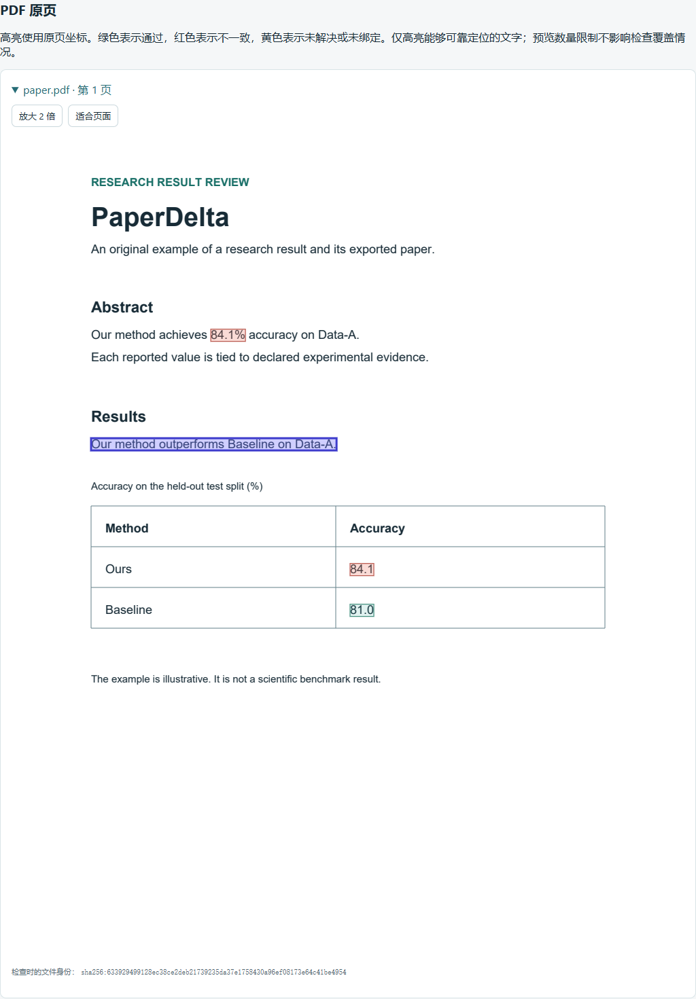

# PDF 与多稿件审查

[English](../pdf.md)

静态 `.md` 和 `.qmd` 稿件共用同一证据与复核流程。核心演示、原始位置、只读边界和
明确的源稿/PDF 比较见 [Markdown/Quarto 源码支持](markdown-quarto.md)。

PaperDelta 1.1 可以读取受支持的文字型 PDF，并将明确绑定的结果与明确声明的
实验证据核对。同一配置可以包含 LaTeX、Word 和 PDF 稿件。PDF 与 Word 文件始终只读。

## 试用导出稿示例

```sh
python -m pip install 'paperdelta[pdf]'
paperdelta --lang zh-CN demo --document pdf --out pdf-demo --open
```

原创示例包含一个小型 LaTeX 源稿及其 PDF，无需安装 TeX。实验结果从 84.1% 变为
80.9%，源稿已更新，但 PDF 仍显示 84.1%。报告会指出过期的导出结果与失效的比较
结论。打开 `pdf-demo/review/report.html`，可以切换中英文、查看原页高亮并放大页面。
每次演示需要新的输出目录。`--scenario baseline` 保持源稿、PDF 与证据一致；
`safe-update` 演示另一种过期导出。两种变化场景均不会生成原生文档写回补丁。



## 接入自己的 PDF

```sh
paperdelta init --paper paper.pdf --data results.csv
paperdelta pdf inspect --file paper.pdf
paperdelta guide
paperdelta check --report build/review
```

CSV 结果表可使用 `paperdelta batch guide`。候选 ID 保留文件、页码、边界框、
原文和解析身份。请明确选择正确的实验、单位、聚合方式和位置；数字相同不能证明
结果含义相同。比较结论仍然需要明确的谓词声明。

`pdf inspect --format json` 会列出页面尺寸、能够可靠定位的数字、已声明区域及
解析限制。坐标单位为 PDF 点（1/72 英寸），以**页面旋转后可见裁切区域的左上角**为原点，形式为
`[x0, top, x1, bottom]`。页码从 1 开始。坐标采用十进制数值；抽取文本偏移不是
PDF 文件的字节偏移，不生成虚构的源码行号或可写入地址。

## 声明区域

```sh
paperdelta pdf region-add --file paper.pdf --name abstract --page 1 --bbox 30 120 570 240 --kind abstract
# 检查预览后，重复命令并增加 --accept 才会保存。
paperdelta pdf region-remove --file paper.pdf --name abstract
```

请使用**自己的 PDF** 中的坐标，上方边界框仅为命令示例。区域必须有名称、位于指定
页面内且互不重叠。`text` 表示正文；`abstract` 还可用于现有摘要审查范围；`table`
要求完整包含支持的边框表，不能截断或隐藏已检测的表格。若实际绘图几何能够唯一
确定单元格，则支持常见合并表头和规则纵向合并；一致的实际横线端点可以补全开放
外边界。不会推测通用无边框或不规则表格。未指定区域时也可检测表格。

选择区域不会排除其余内容。审查范围或合理排除请使用 `scope`；已接受的失败绑定
仍然显示。更改或移除区域可能导致绑定失效，请检查预览并通过 `repair` 重新选择
位置。配置变更需要明确传入 `--accept`，在写锁内重新检查输入哈希，并保留配置
备份。它们不会修改 PDF 文件。

## 多份稿件共享指标

从已经初始化的源稿项目开始：

```sh
paperdelta manuscript add --file submitted.pdf --export-of paper/main.tex
paperdelta manuscript add --file submitted.pdf --export-of paper/main.tex --accept
paperdelta manuscript list
paperdelta guide
paperdelta check --report build/review
```

第一条命令只预览声明。在 `guide` 中选择**现有指标**，再选择它在 PDF 中的位置。
如使用 Word 源稿，安装 `paperdelta[docx,pdf]` 并指定 `--export-of paper.docx`。
其他关联稿件可以省略 `--export-of`，仍可共享同一套明确选择的证据。

```yaml
schema_version: 4
paper:
  entry: paper/main.tex
  companions:
    - entry: submitted.pdf
      export_of: paper/main.tex
```

只有显式 `export_of` 关系才触发源稿与导出稿检查。源稿必须是已声明的 LaTeX 或
Word 入口；LaTeX 包含文件归属于其入口。重复或重叠入口会被拒绝，以避免冲突的
解析设置。主稿件最多可以附带 20 份关联稿件。

报告比较每个指标**已经声明的绑定**：

| 状态 | 含义 |
| --- | --- |
| `aligned` | 两份文档中已绑定的位置均与当前证据一致。 |
| `stale` | 源稿中已绑定的位置全部通过，但至少一处 PDF 位置不一致。 |
| `source_outdated` | 至少一处已定位的源稿结果需要复核。 |
| `unknown` | 一侧缺少绑定，或某个绑定无法验证。 |

一致状态不代表两份文档完全相同、覆盖完整、统计结论正确或已适合发表。缺失或
失效的对应绑定会明确显示。过期 PDF 产生 `EXPORT_STALE` 和重新导出操作建议，
不会直接改动导出文件。重新导出前，应先审核报告中的失效结论。

`manuscript remove --file supplement.docx` 可预览移除未被引用的关联稿件，加
`--accept` 才会提交；仍被绑定引用的稿件及主稿件不能这样移除。Watch 监听全部
声明入口，包括 Word/PDF 部分保存后的恢复。已有批量绑定、范围、快照、修复和
只读 MCP 流程均保留 PDF 原生位置。

## 可靠性与解析身份

支持样例包括普通横排中英文、分离的多栏、拆分绘制的文字、十进制/科学计数/带
符号数字、多页文档，以及能明确识别表头与行身份的规则表格。支持页面旋转
0/90/180/270 度、CropBox 裁切与非零 MediaBox 原点，所有位置和原页渲染使用
一致的可见坐标。文字抽取采用
[pdfplumber](https://github.com/jsvine/pdfplumber) 与 pdfminer.six，原页渲染采用
pdfplumber 安装时带入的 PDFium 依赖。

对已识别的不支持内容，程序保守地拒绝验证：扫描或空白页、图像上的 OCR 文字层、
无法解码的字形、上下标、重叠或任意角度旋转文字、隐藏/透明/被裁掉的内容、表单或可选图层、
复杂单元格等。图片与 Form XObject 图形区域保持未验证，区域之外的普通正文仍
可能参与核对。有作用域的矩形裁剪可以保留完全可见字形；不明确的裁剪路径、文字
裁剪和绘图状态保持未知。非直角页面旋转、无效页面框与非默认 UserUnit 不支持。加密、损坏或超出上限的
PDF 返回明确错误。**不进行 OCR**，也不保证能够识别每一种视觉或编码异常，
请结合原页预览复核。

PDF 锚点与位置记录 PaperDelta 适配器、pdfplumber 和 pdfminer 的版本。解析身份
变化或缺失时返回 `PDF_EXTRACTION_CHANGED`，需要重新检查并明确修复绑定；不要
直接替换旧提案中的解析器字符串来跳过审核。段落跨页、正文、表头或区域变化也
可能需要修复；在稳定上下文中仅更改数字可以保留绑定。提案另有工具版本与输入
身份约束，升级后请重新生成尚未接受的提案。

当前资源上限：每文件 32 MiB、200 页、200 个命名区域，每页 100,000 个字形和
10,000 条边；原生抽取文本最多 4 MiB、10,000 个块。这些是资源保护，不代表极限
输入的性能承诺。离线 HTML 最多嵌入 12 页原图、共 1,200 万渲染像素和 8 MiB PNG
数据，每页最多 500 处高亮。预览省略与检查覆盖分开；渲染失败不会改变数值结论。
检查后字节已经变化的 PDF 不会被用于错位的预览。

参见[报告契约](report-format.md)、[原生试验与发行检查](v1.1.md)和
[Word 支持](word.md)。原生留出 PDF 的 32 项目标中支持 4、漏检 4、未知 24；
单词与数字拼接造成漏检，不代表通用抽取准确率。扫描 OCR、通用表格重建与
原生文档写回仍不在支持范围内。
