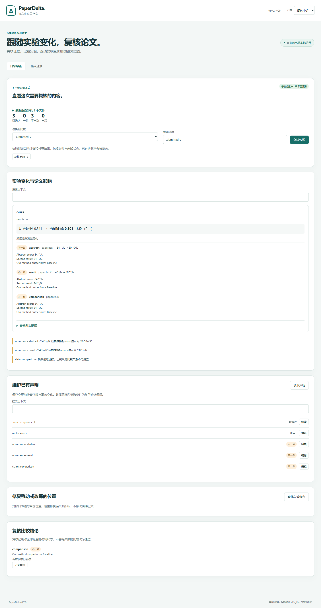

# 论文审查工作台

[English](../studio.md)

静态 `.md` 和 `.qmd` 稿件共用同一证据与复核流程。核心演示、原始位置、只读边界和
明确的源稿/PDF 比较见 [Markdown/Quarto 源码支持](markdown-quarto.md)。

1.0 的统计绑定要求明确声明种子、n、SD 约定和区间方法；复合显示、批量模板与
只读智能体共用契约，详见[统计指南](statistics.md)。

PaperDelta 1.2 在 `paperdelta studio` 中整合首次接入、批量绑定和日常审查：在本地浏览器中，
根据 CSV/TSV/JSON、静态 Excel 与实验导出持续核对 LaTeX、Markdown、Quarto、Word、文字型 PDF 论文。它复用 CLI 的类型化草稿、精确计算、
定位锚点和明确确认流程，界面可随时切换中英文。



## 启动

```sh
python -m pip install --upgrade paperdelta
paperdelta --lang zh-CN -C path/to/your/project studio
```

需要 Word/PDF 时安装 `paperdelta[docx,pdf]`。运行环境为 Python 3.11+ 和现代浏览器，
无需 Node.js、模型密钥、云账号或 TeX。浏览器会自动打开；也可复制终端输出的
**完整网址**，包括 `#` 后面的片段。

```sh
paperdelta --lang zh-CN -C path/to/your/project studio --no-open
paperdelta --lang zh-CN -C path/to/your/project studio --port 8765
```

请保持终端运行，按 Ctrl+C 停止。服务始终绑定 `127.0.0.1`，默认自动选择空闲端口。
这是本机桌面工具，不是网络服务；请在同一台电脑打开网址，重启服务器会生成新会话。
macOS/Linux 创建虚拟环境时可能需要使用 `python3`。

## 接入论文

1. **创建配置。** 在没有 `paperdelta.yaml` 的目录中，填写主论文和证据文件的项目
   相对路径。自动发现会推荐常见输入，跳过隐藏目录和生成目录，也可直接填写路径。
   创建配置不会确认任何绑定。已有配置会直接打开；其他配置路径可使用全局
   `--config` 参数指定。

2. **查看并声明数据源。** 展开“添加数据源”，填写路径并检查数据行，命名为
   `experiment` 等标识。明确每列类型，以及共同唯一标识一行记录的主键列。
   `001` 等模型编号应保持为文本。典型主键是“数据集 + 模型 + 划分 + 种子”。
   重复记录和不符合列类型的数据会被拒绝。XLSX 还需明确选择工作表和含表头的
   矩形区域。可移植导出保留列类型/主键声明，并显示快照来源，详见
   [实验证据指南](experiment-evidence.md)。

3. **计算指标。** 选择数据源、数字列或精确 JSON Pointer，勾选所有实验身份条件，
   声明单位、计算方式和预期记录数。未勾选的列不参与筛选；勾选后留空代表筛选真实
   空字符串。三个随机种子的平均值应明确选择平均值、数量 3；需要时逐行填写完整种子
   集合。原始值 `0.841` 应选择比例单位。查看实际参与计算的记录和精确结果。
   派生指标支持差值、比值、百分点差、相对百分比变化。

4. **选择论文位置。** 按文件或上下文筛选，逐个勾选候选数字。LaTeX 展示源文上下文
   和行号，Word 展示原生段落/表格位置，PDF 展示页码、坐标和原始页面。
   可点击 PDF 高亮数字，或使用上下文列表、键盘选择和 2 倍放大。
   相同数字的不同引用始终单独选择；已绑定或暂存的位置不能重复添加。

5. **暂存绑定。** 选择指标、绑定名称、显示方式及精度。多个位置会使用名称前缀加
   编号。填写实验身份与数字含义的对应理由。百分比显示可将 `0.841` 转为 `84.1%`，
   转换依据是单位声明，不是数字恰好相等。

6. **预览并保存。** 预览使用现有检查引擎。每张卡片展示具体位置和上下文、当前值与
   期望显示、理由及证据。保存复选框不会预先勾选。逐项选择已核对的绑定，确认实验
   证据和论文位置后，点击“保存选中的绑定”。配置会写入所选绑定及其依赖的指标和
   数据源，原配置备份到 `.paperdelta/config-backups/`。未选中的暂存内容会在保存后
   丢弃。有效的对应关系也可能揭示数值不一致；保存绑定不会自动修改论文。

顶部统计反映**已经确认的配置**，暂存预览单独展示。未绑定数字、不支持内容和不完整
检查都会明确显示。工作台不会写入论文或实验数据文件。

## 批量绑定与实验模板

声明表格数据源后，打开**批量绑定**。选择结果列、区分实验组的身份列，以及测试划分等
固定筛选条件，再声明共用的证据单位、计算方式、预期记录数、种子集合和论文显示方式。
单位或计算方式不同时，应分批处理。同一列不能同时用于分组和固定筛选。

**查看实验分组**会计算各组结果，不接受任何绑定。选中指标、核对原始类型、身份与证据，
再选择论文位置。推荐位置会列出上下文中匹配和缺失的身份字段；不会以数字相同证明身份，
不会预选位置。上下文列表包含所有可选位置，支持搜索和每页 20 项的分页；PDF 候选可打开
高亮原页。缺记录、缺种子等未知结果不能暂存为有效绑定。证据卡片展示前十条参与记录，
计算仍验证全部记录；最终复核可查看完整证据。跨页与切换语言保留选择，输入变化会使目录
和位置选择失效。

填写对应理由并暂存后，在**核对并保存**中明确选择需要接受的子集。暂存会保存可恢复草稿；
暂存前的位置选择只保留在当前浏览器标签页。修改批量表单后，需要重新生成实验目录才能暂存。

在**实验模板**中，可为有效目录保存命名模板，也可加载或下载已有模板。迁移到另一项目时，
先选择该项目已声明的数据源，再导入模板文件。模板复用列类型、主键、原始筛选文本、单位、
聚合、种子和显示设置，不包含论文位置或输入哈希。加载只填充表单，仍需核对分组并明确选择
新论文位置。来源格式、所需列类型和主键必须兼容，允许增加新列。模板保存在
`.paperdelta/studio/templates/`，不能覆盖同名文件，最多 100 个，每个不超过 64 KiB。
损坏模板会单独报告，不会隐藏有效模板。

## 复核已有 CLI 或 MCP 提案

在**核对并保存**中使用**导入 CLI / MCP 提案**，打开现有 CLI 或只读 MCP 工具生成的提案 JSON。
应先完成或明确丢弃当前暂存草稿。导入器核验原始提案身份、工具版本、项目配置和输入哈希；
过期提案需要针对当前输入重新生成，不会被静默更新。

数字引用、比较结论和图表声明都使用明确确认流程：检查位置、状态、理由以及可展开的准确
定义，只勾选已经复核的绑定再确认。所选子集会带上必需的数据源和指标，未选择的绑定不会
接受。图表展示实际文件路径，不虚构正文位置。导入内容同样支持本地草稿恢复；此功能不会
使 MCP 获得写入能力。

可复现案例及操作量对比见 [0.8 说明](v0.8.md)。

## 草稿、输入变化与报告

已有确认绑定的项目默认打开**日常审查**。下一轮实验前创建命名快照，在比较菜单中
选择它，再用平常的工具保存实验数据或稿件。首页按指标汇总证据变化，以及受影响的
数字、比较结论和图表。展开证据可查看筛选条件、原始类型和参与记录。快照同样保留
失败和未知状态；创建快照不认证论文正确性，也不能覆盖已有快照。

持续检查区分“等待文件稳定后重查”与“结果已更新”。Word/PDF 保存到一半，或者
CSV 尚不完整时，结果保持未知。没有暂存内容的绑定草稿会自动刷新；有暂存内容时，
输入变化后会保留草稿供恢复。已确认配置的日常审查独立继续，不受旧草稿影响。

**维护已有声明**列出数据源、指标、数字绑定、比较结论和图表。编辑字段、填写理由，
预览前后定义、依赖结果和覆盖变化，再明确确认。删除共享声明时，需要逐项选择
必须一起删除的依赖声明，不会自动勾选。删除失败检查会减少覆盖；与快照比较时仍能
看到删除记录。原配置会备份，稿件和证据文件始终保持只读。

**修复位置**对照旧表述与当前候选。数字修复通过选择具体位置完成，PDF 可查看原页
高亮；结论修复填写当前准确原文。预览后确认科学含义未变再保存。**记录复核**将明确
说明关联到某个比较结论的当前状态；失败比较在记录复核后仍然失败。

- **撤销上一步暂存**：撤销内存中的一次暂存（最多 20 步），包括恢复草稿；
  不撤销已经确认写入的配置。
- **下载草稿 / 恢复草稿**：以 JSON 保存精确类型，恢复前验证工具版本、配置和所有
  输入哈希。长小数和形似数字的字符串编号经过浏览器仍保持原样。
- 每次成功暂存也会在 `.paperdelta/studio/` 保存本地恢复副本。重启服务后可恢复、
  下载或明确丢弃。这仍是草稿，恢复不会接受绑定。不同服务会话不能静默覆盖对方副本。
- 当前版本及兼容的较早 0.6–1.1 草稿，核验原始身份和全部输入哈希后可以恢复到 1.2；
  未知或未来版本会被拒绝。
- 输入变化后，**重建所选草稿声明**列出原有内容。选择需保留的声明，用当前输入
  预览，再确认暂存。预览明确包含必需依赖；名称冲突或旧位置无法解析时会拒绝。
  如果正文位置需要重选，可仅保留数据源和指标。原恢复记录归档到
  `.paperdelta/studio/archives/`；重建不会接受配置。
- **重新扫描项目**：明确清空暂存内容、归档已保存副本并读取最新输入。过期草稿和
  预览不能接受，第二个标签页也不能覆盖较新的会话版本。不要手工改哈希强行恢复。
- **下载当前检查报告**：生成已确认配置的离线 HTML 报告，不包含暂存内容。
  报告自带中英文切换。工作台语言只影响展示，不改变声明。

## 范围和常见问题

新增结论或图表的编写、PDF 区域和伴随稿件管理、范围排除、论文补丁仍通过
[CLI 工作流](workflows.md)和 [PDF 命令](pdf.md)处理；已有提案（包括结论和图表）可以
导入 Studio 确认，已有声明可以在 Studio 中维护和复核。
已经配置的伴随稿件和派生指标可以在工作台中使用。Word/PDF 保持只读；扫描 PDF
需要在 PaperDelta 外进行 OCR，OCR 输出也不保证可检查。

候选搜索覆盖全部已扫描位置，能查到此前 5,000 项界面上限之后的候选。候选每页
30 项；指标与影响卡片每页 20 项，均可搜索。跨页和语言切换保留选择，输入身份
变化后位置选择失效。仍最多保留 500 个暂存定义，每次最多选择 200 个绑定；
表格样本每页 100 行，JSON 最多展示 50 个叶子样本，数据查看不等于完整 JSON 浏览器。
草稿导入限制低于 1 MiB，本地恢复记录上限为 4 MiB。损坏或超大的恢复文件会报告
错误，不阻止检查项目，也不会被覆盖。应保留副本，将提示的恢复文件移到项目之外，
再开始新草稿。PDF 预览继承[页面和图像限制](pdf.md)，每页最多显示
500 个高亮框，上下文列表仍可使用。超过交互范围的项目可使用 CLI 或拆分小批次。

连接失败时，请保持终端运行并使用最新完整网址。缺少格式依赖时，应在运行 Studio 的
同一个 Python 环境安装对应 extra。不支持的结构会明确显示；原页预览不可用不改变
检查结论。在打开草稿期间编辑文档，需要重新扫描。

不使用 CDN、统计上报、外部字体或远程 API。项目数据接口要求会话令牌、准确的本机
来源和有效项目相对路径；服务器只提供固定资源，不提供任意文件服务或命令执行。
这些约束用于本地浏览器边界，不是多用户认证系统。会话网址应保持私密。

## 复现浏览器验收

常规 Python 测试覆盖真实本地 HTTP 和三种格式。浏览器验收需要先安装项目的
`.[dev,mcp]` 和独立 Playwright，然后在仓库运行
`node tools/validate_studio_browser.cjs build/studio-check`，输出目录必须是新的。
可通过 `PAPERDELTA_PYTHON`、`PLAYWRIGHT_MODULE`、`BROWSER_EXECUTABLE` 指定运行时。
脚本检查三种格式 × 两种语言的六条完整流程、精确筛选值、草稿恢复、子集确认、
源文件哈希、桌面/窄屏布局、网络和控制台错误，输出截图与 JSON 记录。
这些是机器验收结果，不作为真人易用性测量。

运行 `node tools/validate_review_browser.cjs build/review-check` 验证六条第二轮实验
流程，包括原生位置修复、重启、输入变化后的恢复、明确选择依赖删除和即时语言切换。
运行 `node tools/validate_studio_scale.cjs build/scale-check` 验证 5,101 个候选的完整
搜索、跨页确认，以及 500 指标/10 MB CSV 的交互负载。输出目录必须是新的。规模
脚本记录本机浏览器实际耗时，不能视为任意项目的延迟承诺。
