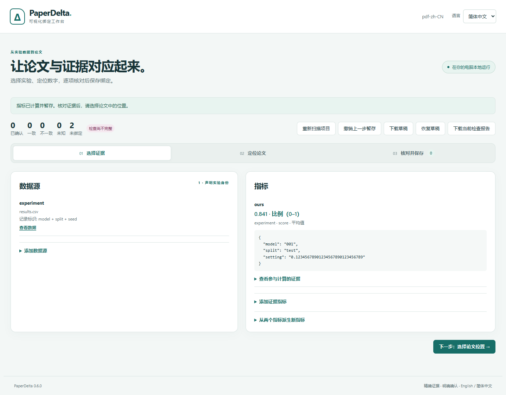

# 可视化绑定工作台

[English](../studio.md)

PaperDelta 0.6 增加 `paperdelta studio`：在本地浏览器中，将 CSV/JSON 证据关联到
已有 LaTeX、Word、文字型 PDF 论文中的数字。它复用 CLI 的类型化草稿、精确计算、
定位锚点和明确确认流程，界面可随时切换中英文。



## 启动

```sh
python -m pip install --upgrade paperdelta
paperdelta --lang zh-CN -C path/to/your/project studio
```

需要 Word/PDF 时安装 `paperdelta[docx,pdf]`。运行环境为 Python 3.11+ 和现代浏览器，
无需 Node.js、模型密钥、云账号或 TeX。浏览器会自动打开；也可复制终端输出的
**完整网址**，包括 `#` 后面的片段。

```sh
paperdelta --lang zh-CN -C path/to/your/project studio --no-open
paperdelta --lang zh-CN -C path/to/your/project studio --port 8765
```

请保持终端运行，按 Ctrl+C 停止。服务始终绑定 `127.0.0.1`，默认自动选择空闲端口。
这是本机桌面工具，不是网络服务；请在同一台电脑打开网址，重启服务器会生成新会话。
macOS/Linux 创建虚拟环境时可能需要使用 `python3`。

## 接入论文

1. **创建配置。** 在没有 `paperdelta.yaml` 的目录中，填写主论文和 CSV/JSON 的项目
   相对路径。自动发现会推荐常见输入，跳过隐藏目录和生成目录，也可直接填写路径。
   创建配置不会确认任何绑定。已有配置会直接打开；其他配置路径可使用全局
   `--config` 参数指定。

2. **查看并声明数据源。** 展开“添加数据源”，填写路径并检查数据行，命名为
   `experiment` 等标识。明确每列类型，以及共同唯一标识一行记录的主键列。
   `001` 等模型编号应保持为文本。典型主键是“数据集 + 模型 + 划分 + 种子”。
   重复记录和不符合列类型的数据会被拒绝。

3. **计算指标。** 选择数据源、数字列或精确 JSON Pointer，勾选所有实验身份条件，
   声明单位、计算方式和预期记录数。未勾选的列不参与筛选；勾选后留空代表筛选真实
   空字符串。三个随机种子的平均值应明确选择平均值、数量 3；需要时逐行填写完整种子
   集合。原始值 `0.841` 应选择比例单位。查看实际参与计算的记录和精确结果。
   派生指标支持差值、比值、百分点差、相对百分比变化。

4. **选择论文位置。** 按文件或上下文筛选，逐个勾选候选数字。LaTeX 展示源文上下文
   和行号，Word 展示原生段落/表格位置，PDF 展示页码、坐标和原始页面。
   可点击 PDF 高亮数字，或使用上下文列表、键盘选择和 2 倍放大。
   相同数字的不同引用始终单独选择；已绑定或暂存的位置不能重复添加。

5. **暂存绑定。** 选择指标、绑定名称、显示方式及精度。多个位置会使用名称前缀加
   编号。填写实验身份与数字含义的对应理由。百分比显示可将 `0.841` 转为 `84.1%`，
   转换依据是单位声明，不是数字恰好相等。

6. **预览并保存。** 预览使用现有检查引擎。每张卡片展示具体位置和上下文、当前值与
   期望显示、理由及证据。保存复选框不会预先勾选。逐项选择已核对的绑定，确认实验
   证据和论文位置后，点击“保存选中的绑定”。配置会写入所选绑定及其依赖的指标和
   数据源，原配置备份到 `.paperdelta/config-backups/`。未选中的暂存内容会在保存后
   丢弃。有效的对应关系也可能揭示数值不一致；保存绑定不会自动修改论文。

顶部统计反映**已经确认的配置**，暂存预览单独展示。未绑定数字、不支持内容和不完整
检查都会明确显示。工作台不会写入论文或实验数据文件。

## 草稿、输入变化与报告

- **撤销上一步暂存**：撤销内存中的一次暂存（最多 20 步），包括恢复草稿；
  不撤销已经确认写入的配置。
- **下载草稿 / 恢复草稿**：以 JSON 保存精确类型，恢复前验证工具版本、配置和所有
  输入哈希。长小数和形似数字的字符串编号经过浏览器仍保持原样。
- 刷新浏览器标签页会重新连接正在运行的会话。停止终端会丢失内存草稿，
  停止前应下载未完成内容。
- **重新扫描项目**：明确丢弃暂存内容并读取最新输入。论文、数据或配置变化后，
  过期草稿不能保存；应根据最新输入重建，不要手工改哈希强行恢复。
  第二个标签页也不能覆盖更新后的会话版本。
- **下载当前检查报告**：生成已确认配置的离线 HTML 报告，不包含暂存内容。
  报告自带中英文切换。工作台语言只影响展示，不改变声明。

## 范围和常见问题

本版图形界面覆盖**数字绑定接入**。结论谓词、图表来源、修改/删除已确认声明、
锚点修复、PDF 区域和伴随稿件管理、范围排除、快照、论文补丁仍通过
[CLI 工作流](workflows.md)、[修复向导](guided-bindings.md)和 [PDF 命令](pdf.md)处理。
已经配置的伴随稿件和派生指标可以在工作台中使用。Word/PDF 保持只读；扫描 PDF
需要在 PaperDelta 外进行 OCR，OCR 输出也不保证可检查。

界面最多展示 5,000 个候选数字，保留 500 个暂存定义，每次最多选择 200 个绑定；
CSV 样本每页 100 行，JSON 最多展示 50 个叶子样本，数据查看不等于完整 JSON 浏览器。
草稿导入限制低于 1 MiB。PDF 预览继承[页面和图像限制](pdf.md)，每页最多显示
500 个高亮框，上下文列表仍可使用。超过交互范围的项目可使用 CLI 或拆分小批次。

连接失败时，请保持终端运行并使用最新完整网址。缺少格式依赖时，应在运行 Studio 的
同一个 Python 环境安装对应 extra。不支持的结构会明确显示；原页预览不可用不改变
检查结论。在打开草稿期间编辑文档，需要重新扫描。

不使用 CDN、统计上报、外部字体或远程 API。项目数据接口要求会话令牌、准确的本机
来源和有效项目相对路径；服务器只提供固定资源，不提供任意文件服务或命令执行。
这些约束用于本地浏览器边界，不是多用户认证系统。会话网址应保持私密。

## 复现浏览器验收

常规 Python 测试覆盖真实本地 HTTP 和三种格式。浏览器验收需要先安装项目的
`.[dev]` 和独立 Playwright，然后在仓库运行
`node tools/validate_studio_browser.cjs build/studio-check`，输出目录必须是新的。
可通过 `PAPERDELTA_PYTHON`、`PLAYWRIGHT_MODULE`、`BROWSER_EXECUTABLE` 指定运行时。
脚本检查三种格式 × 两种语言的六条完整流程、精确筛选值、草稿恢复、子集确认、
源文件哈希、桌面/窄屏布局、网络和控制台错误，输出截图与 JSON 记录。
这些是机器验收结果，不作为真人易用性测量。
