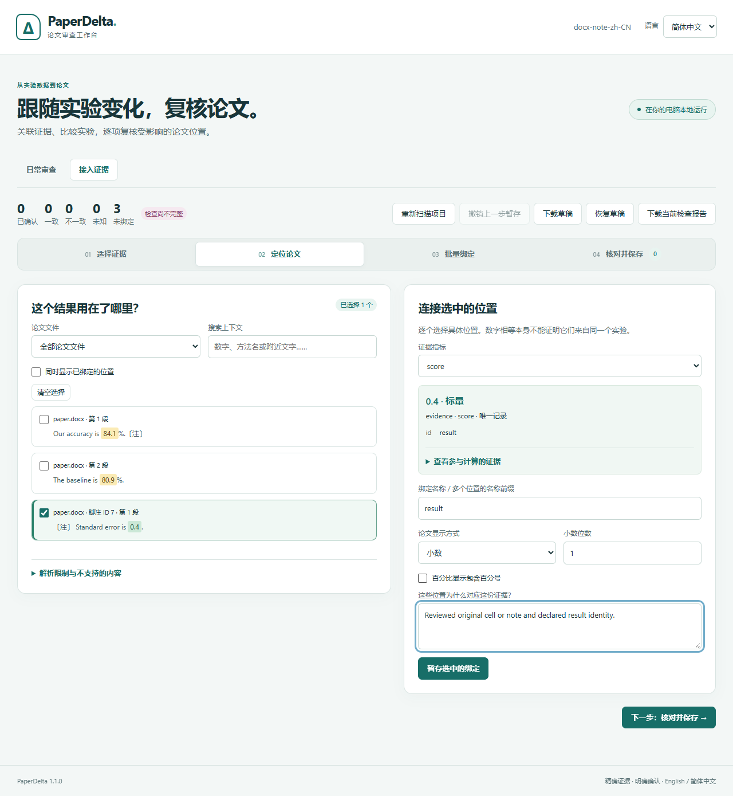
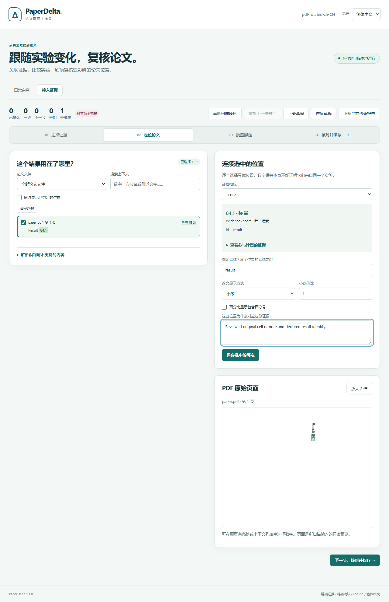

# PaperDelta 1.1：原生文档位置

[English](../v1.1.md)

1.1 扩展 Word/PDF 排版支持，继续要求明确选择证据，原生稿件保持只读。
安装命令：`python -m pip install --upgrade 'paperdelta[docx,pdf]'`。
检查无需 Word、TeX 或云服务。

## 变化

- Word：支持通过有效关系引用的可见脚注/尾注、横向合并表头与规则纵向合并，
  保留 OOXML 原位置。明确的表头层数和原文题注区分表格，不用相同数字猜身份。
- PDF：支持页面 0/90/180/270 度旋转、CropBox/MediaBox 偏移和裁切页预览，
  均使用可见原页坐标。规则边框表支持合并表头，可依据一致的实际横线端点补全
  开放外边界；通用无边框或不规则表格仍不支持。
- 按绘图状态作用域拒绝不可见、透明、裁掉或可靠性不明的字形；区域选择和原页
  高亮使用同一坐标变换。
- 双语 Studio、终端和离线报告显示注释部件及原位置，切换语言保留选择。
  检查、绑定和报告生成都不改变原稿字节。

详见 [Word 指南](word.md)、[PDF 指南](pdf.md)和[报告契约](report-format.md)。

## 升级

新表头/题注锚点以及 Word 注释/合并位置需要 schema 7。旧配置和报告保留语义；
新增声明经过预览、明确接受和备份才升级配置。兼容的 0.6–1.0 Studio 草稿经验证
可以恢复。

适配器升级为 `paperdelta-docx/2` 和 `paperdelta-pdf/2`。旧 PDF 绑定检测到提取身份
变化后需要明确修复。请重新生成受工具版本约束的未接受提案，不要改解析器字符串
绕过审核。普通旧 Word 正文位置保持兼容。

## 验证与实测边界

[原生文档试验](../../validation/native-v1/README.zh-CN.md)保留四个获得许可的 PLOS
论文家族、八个原文件、独立位置标注、实现冻结和首次留出结果，公布全部四类结果：

| 运行 | 目标 | 支持 | 漏检 | 错位 | 未知 |
| --- | ---: | ---: | ---: | ---: | ---: |
| 1.0 开发基线 | 64 | 1 | 0 | 0 | 63 |
| 1.1 开发集 | 64 | 49 | 0 | 0 | 15 |
| 1.1 首次留出 | 64 | 4 | 4 | 0 | 56 |

这是小规模单出版商试验，不代表通用准确率。未知是不具备可靠绑定，不能算成功。
多值单元格与不确定表格身份仍是主要限制；PDF 单词和数字拼接导致四个漏检。
1.0 基线仅检查匹配证据，比 1.1 的“通过→改证据→不一致”检查更窄。受控证据不是
复现论文实验。开发者兼任标注者，不宣称独立人工验证。

自有样例另行覆盖合并/不规则表格、隐藏或未引用注释、修订、全部旋转方向、
非零页面框、裁剪与透明度、解析坐标、栅格对齐和过期预览拒绝。
[八条浏览器流程记录](../assets/v1.1/browser-evidence.json)覆盖两个 Word 与两个 PDF
场景 × 中英文，以及明确接受、证据变化、原哈希不变、离线预览和移动端宽度。





```sh
python -m pip install '.[dev,mcp,wandb]'
python tools/run_tests.py -q
node tools/validate_layout_browser.cjs build/layout-browser
python tools/replay_native.py --out build/native-replay
```

使用新输出目录。可通过 `PAPERDELTA_PYTHON`、`PLAYWRIGHT_MODULE` 和
`BROWSER_EXECUTABLE` 指定本机运行时。[交付记录](roadmap.md)仅在平台 CI 和公开
发行包核验后记录完成。原生试验不进入 MIT Python 包，旧评测目录与许可保留原字节。
