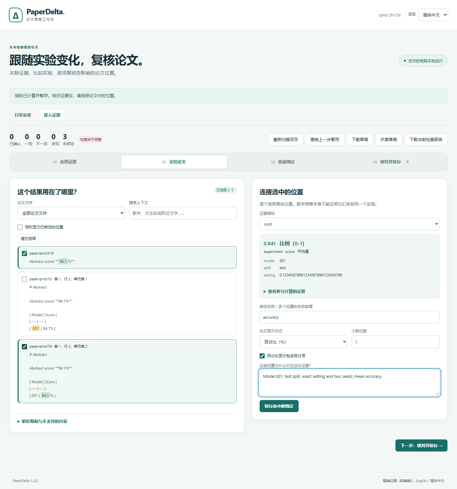
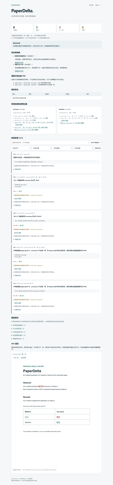

# 1.2：静态稿件源码

[English](../v1.2.md)

1.2 将 Markdown 和 Quarto 接入既有的实验证据审查流程。字面段落与竖线表格保留
原始 UTF-8 字节、行列、章节和表格位置，不调用渲染或执行引擎。
[源码指南](markdown-quarto.md)明确说明支持子集。

## 使用

```sh
python -m pip install --upgrade paperdelta
paperdelta --lang zh-CN demo --document markdown --out markdown-demo --open
paperdelta --lang zh-CN demo --document quarto --out quarto-demo --open
```

核心安装包含两个演示。Studio 可以发现 `.md`/`.qmd`，支持同一套类型化证据、
独立绑定复核、统计、批量、模板、快照、日常检查、位置修复和本地草稿恢复。
[原创示例](../../examples/static-manuscript/README.zh-CN.md)让 Quarto 正文、Markdown
附录和明确声明的 PDF 导出共享指标。

## 边界与兼容性

两种格式均只读。代码、元数据、原始 HTML、图片、动态包含、公式及不确定语法
保留为可见的未验证覆盖。存在不支持区块时，即使其他绑定通过，也返回退出码 2；
结果不代表完整的渲染文档覆盖。不计算生成内容、Quarto 项目配置或远程输入。

配置/报告 schema 8 增加静态源码位置及 `.md`/`.qmd` 导出源稿。Schema 1–7 继续
可读，原有已接受身份保持不变。新增附属稿件先预览 schema 升级，再明确接受并
备份。兼容的 0.6–1.1 Studio 草稿可经验证后恢复。原文上下文变化或身份歧义需要
明确复核绑定修复。

## 验证

新增浏览器验收覆盖十四条格式、语言和流程组合：

- [四条首次接入流程](../assets/v1.2/studio-browser.json)：Markdown/Quarto × 中英文，
  正文及表格选择、精确类型筛选、部分接受、切换语言保留状态、手机布局及过期预览拒绝。
- [八条统计流程](../assets/v1.2/statistics-browser.json)：两种格式和语言，明确统计
  约定、完整复合表达式、置信水平、批量选择和已保存模板。
- [两条离线源码/PDF 流程](../assets/v1.2/static-reports.json)：已改正的源码数值、
  过期 PDF、原页高亮、双语筛选、手机布局、禁用 JavaScript 的静态阅读及无远程请求。

源码测试使用独立指定的字面位置与反例，覆盖 BOM/CRLF/Unicode、数字表头、重复
上下文、代码、隐藏 div、多段公式、拆分数字、不规则表格、资源上限、经复核的修复、
只读 MCP 提案和按内容监听。这些是原创回归用例，不是所有 Markdown/Quarto 文档的
准确率实测。

[1.1 原生试验](v1.1.md)继续冻结并保留首次留出的失败。独立重放使用归档的确切
实现与原始用例；新增静态源码能力不重新评分或改写历史结果。
[本版重放记录](../assets/v1.2/native-replay.json)与全部 128 项原结果一致。





平台与公开发行核验完成后写入[交付记录](roadmap.md)。发布验收要求全新安装的
完整测试套件、十七个指定跨平台/浏览器 CI 检查、发行包审计及精确公开产物的
全新安装验证。
