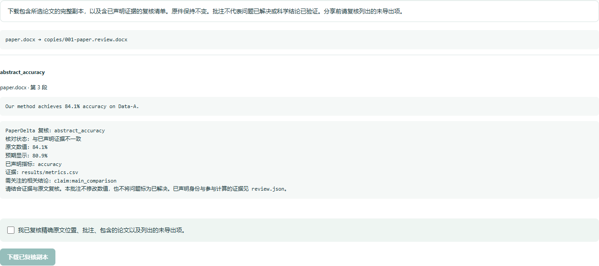

# 1.8：经过复核的 Word 和 PDF 副本

[English](../v1.8.md)

本次升级可以导出带定位批注的 Word 副本，以及带高亮和审查说明的 PDF 副本。
原始稿件保持不变。本地 Studio 和命令行都会先展示准确位置的预览，明确确认后才导出。
稳定版发布与各平台验收记录见已批准路线图。

## 复核与导出

安装 `paperdelta[docx,pdf]`，在已经接入并确认配置的项目中打开 `paperdelta studio`。
在修改工作台勾选原生稿件位置，预览批注副本，检查原文、证据对应显示、证据来源和
相关结论提醒，再确认并下载。ZIP 的 `copies/` 中是新副本；`review.json` 保留
原输入哈希、选定位置、证据及副本哈希。这不会自动修改数字，也不认证科学结论。

命令行使用相同流程：

```sh
paperdelta --lang zh-CN annotate preview --only abstract_accuracy --only table_accuracy --out comments-preview.json
paperdelta --lang zh-CN annotate create --plan comments-preview.json --out annotated-copies.zip --attest-reviewed
```

位置名称应来自你已经确认的项目。预览时使用 `--lang zh-CN` 会生成中文批注。
输出路径必须是新路径。原稿、证据或配置变化会使旧计划失效，工具版本变化也需要重新预览。
Studio 切换语言会保留勾选位置，但清除旧预览和确认状态，确保下载的批注语言与复核时一致。
进程重启不会恢复导出权限。

Word 保留已有批注、文字格式和无关包文件的原字节；支持正文和表格段落中的批注。
脚注/尾注仍可在现有支持范围内检查，但这些部分的批注、选区内嵌套运行和签名包会明确拒绝。
PDF 副本保留页面内容、已有批注、旋转和裁剪位置。加密或签名文件、无法确认的原位置也会拒绝。
被拒绝的选择会保留说明，其他支持的文件仍可导出。上限为 500 个位置、单副本 48 MiB、
整个压缩包 128 MiB。

## 原生解析

当原始 Word 运行格式或 PDF 字形几何能够证明指数上标时，可以检查完整的 `a × 10` 科学计数值。
组成部分必须可见、受支持且连续。歧义、部分隐藏或只有基线数字的公式，不会被拆成通过检查的尾数。
指数运算边界仍为 1000，超出边界的极小值不会被悄悄改为零。

PDF 打开时定位到本地页，与可执行或串联动作分开处理：只允许经过验证的静态本地视图。
交互表单、脚本、远程动作和无法验证的 Form 内容仍不参与确认。
使用这些新增 PDF 能力的文档采用 `paperdelta-pdf/4` 解析身份，旧绑定如果不再匹配，
需要修复并重新确认。出现受支持上标科学计数值的 Word 使用 `paperdelta-docx/3`。

原文表头和行身份要求仍然有效。例如，变体标签前面有迭代编号的表格，可以展示完整科学计数值，
但仍需要明确复核行身份，这不计作自动绑定成功。新试验把范围、计数与百分比、置信区间单元格
保留为完整目标；不支持的完整显示计为未知，不把拆出的局部数字算成功。

## 验证与兼容

[第三批原生试验](../../validation/native-v3/README.zh-CN.md) 保留八个新论文家族的十二份许可原件，
在解析器开发前完成选择和分组。四个家族用于开发，其余四个在实现冻结后才检查。
独立原位置标注、全部结果和失败均保留。此前试验的字节不变，重跑属于已见输入回归，
不称作新的留出评估。受控证据不是对原论文实验的复现。

新留出集首次结果为 29 支持、1 漏检、0 误定位、50 未知，共 80 个有效目标，另有
16 个未填名额。公开 1.7 在同一标注上支持 18 个；开发集 96 个目标的支持数从 18 增至
34。未知不算成功，首次漏检和 Word 自动身份确认失败全部保留。

继续使用配置 schema 10 和报告 schema 9。批注计划使用独立版本及输入身份，不是改稿补丁。
检查、Studio、MCP 和组合 Action 不执行论文代码。已有 LaTeX/Markdown/Quarto 的受控数值修改
和事务恢复流程继续可用。另见 [Word](word.md)、[PDF](pdf.md) 和[已批准路线图](roadmap.md)。





82 个安装后浏览器案例覆盖中英文接入、修订恢复、批注、统计、原生定位和规模检查。
[批注流程记录](../assets/v1.8/annotations-installed.json) · [原生定位](../assets/v1.8/reliability-installed.json) ·
[真实 1.7 草稿升级](../assets/v1.8/draft-upgrade.json) · [事务恢复](../assets/v1.8/transaction-upgrade.json)。
首轮完整安装测试的 978 项断言通过、3 项仅限 POSIX 的测试跳过，但 499 秒超过原
480 秒时限，该轮仍记失败；时限调整和首次原生试验失败均保留在
[开发修正记录](../assets/v1.8/development-adjustments.json)，当时仍需完成最终发布验收。

最终本地安装套件随后在 512.36 秒完成，978 项通过、3 项 POSIX 专项跳过。首次远程 CI [37577011131](https://github.com/amos689/paperdelta/actions/runs/37577011131) 的 Windows/Python 3.13 和 3.14 又达到独立的 15 分钟作业时限而被取消。标准测试作业已调整为 30 分钟，保留全部断言；运行 wheel 和冻结的原生试验保持不变。最终候选提交随后通过全部 17 项 CI。

已完成 [GitHub](https://github.com/amos689/paperdelta/releases/tag/v1.8.0) 与 [PyPI](https://pypi.org/project/paperdelta/1.8.0/) 正式发行核验。[发布记录](../assets/v1.8/publication.json) 包含 17 个作业全部通过、公开下载哈希一致，以及全新安装后的五格式中英文检查。
