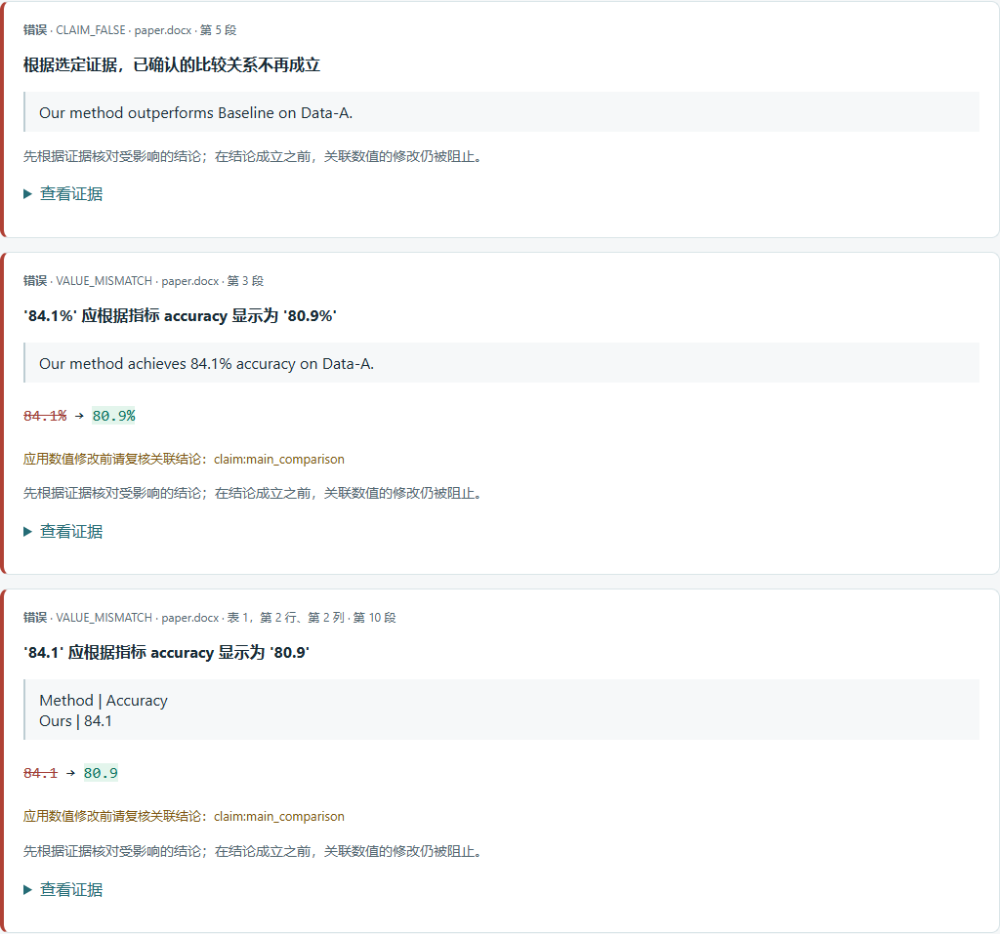

# 检查 Word 稿件

[English](../word.md)

PaperDelta 1.8 可读取 `.docx` 稿件，将明确绑定的数字和比较论断与明确声明的
实验证据核对。检查过程无需 Microsoft Word、TeX、模型密钥或网络连接。

## 试用原创示例

```sh
python -m pip install 'paperdelta[docx]'
paperdelta --lang zh-CN demo --document docx --out word-demo --open
```

示例首先使用 84.1% 的准确率，然后将三次实验结果改为均值 80.9%。同一稿件中，
两处准确率数字因此过期，与 81.0% 基线的比较论断也不再成立。
`word-demo/before/` 保存原报告，`word-demo/review/` 保存变化后的报告。
两者引用的 Word 文件完全相同。演示创建成功时命令退出码为 0，变化检查的
预期退出码为 1。每次运行演示请使用新的输出目录。

使用 `--lang en` 可切换英文界面。离线报告也有语言切换菜单。稿件正文保留原语言。



## 接入自己的稿件

```sh
paperdelta --lang zh-CN init --paper manuscript.docx --data results.csv
paperdelta --lang zh-CN scan
paperdelta --lang zh-CN guide
paperdelta --lang zh-CN check --report build/review
paperdelta --lang zh-CN watch --report build/review --open
```

向导要求明确指定证据行、指标、单位和稿件中的具体使用位置，不会仅因数字相同就
确认映射。普通结果表格也支持 `paperdelta batch`，详见[工作流指南](workflows.md)。
改写已绑定段落或修改表格标签后，可运行 `paperdelta repair scan` 和
`paperdelta repair guide`；修复提案需要显式接受。

## 位置的含义

- **段落：** 按正文遍历顺序从 1 开始编号，包含表格中的段落。拆分的格式片段、
  超链接、制表符和换行保留可见文字。
- **表、行、列：** 受支持表格中从 1 开始的逻辑网格位置；合并延续单元格指向原始
  所有者，不重复计算结果。段落编号沿用正文遍历序号。
  这些位置用于导航；实际绑定依赖未变的表头和明确的行标签。
- **脚注/尾注：** 原始 OOXML 部件、`note_id` 与注释内段落序号。ID 不是 Word
  显示的脚注编号；只有有效内部关系及可见正文引用才能启用对应注释。
- **章节和样式：** JSON 原生位置附带原文标题和样式元数据。可识别的摘要标题和
  样式支持摘要审查范围。
- **解析器和输入哈希：** JSON 记录提取实现与解析器版本；报告校验原始 DOCX 包的哈希。

Word 页码依赖排版，本工具不推测页码。原生位置的 `start`/`end` 指向提取文本模型，
**不是 DOCX 字节地址**。Word 位置没有 `byte_start`、`byte_end` 或虚构的源码行号。

段落非数字上下文不变时，修正数字可以保留绑定。无法区分的重复段落会产生歧义。
表头和行标签保持唯一时，表格换行顺序后绑定仍然有效；更换表头或行标签则需要修复。
不要将实验结果值作为行身份。

## 支持边界

支持正文段落、跨格式片段数字、十进制/科学记数/百分比、标题、普通题注及表头和
行标签唯一的表格。常见横向合并表头与规则纵向合并保留逻辑所有者；明确的
`header_rows` 和可选原文 `caption` 用于区分含数字表头及重复表格。横向合并的
数值单元格不会被当作身份唯一的普通结果单元格。

脚注与尾注依赖原始部件和可见正文引用；不会根据数字相同猜测未引用注释、无效、
重复或外部关系。注释标记显示为“〔注〕”，不会把两侧数字拼接为一个新数字。
注释正文可通过相同的明确流程选择、绑定、核对和修复。

修订、域/自动生成结果、公式、绘图、文本框、隐藏格式、自动列表编号、上下标
数字、嵌套/修订/不规则表格及无法唯一解释的合并仍未验证。页眉、页脚和批注
不属于支持范围；不支持结构继续显示在诊断与覆盖信息中。旧 `.doc`、`.docm`、
加密或损坏包不支持。资源限制：压缩 32 MiB、展开 64 MiB、2,000 个成员、
每成员 16 MiB、10,000 个文本块及 4 MiB 提取文字；不访问外部关系或解压到磁盘。

**Word 检查只读。** 在文档编辑器中改数值后重新检查。`fix` 对 Word 返回明确的
只读诊断，接受映射只改变审核后的配置。已有受保护 LaTeX 补丁仍可使用。

## 兼容与验证

普通 Word 项目继续使用配置/报告 schema 3；新表头/题注锚点及注释/合并位置需要
schema 7。旧身份仍可读取，新特性经预览、明确接受和备份才升级。LaTeX 只需核心
安装，Word 加 MCP 使用 `paperdelta[docx,mcp]`。

自有测试覆盖结构位置、原字节不变、证据变化、表格重排、注释与隐藏引用、异常
合并、修复、论断、范围、快照、监听、双语报告及只读 MCP，不代表所有 Word 排版。
单独许可的原生试验中，**留出 Word 标量目标为 0/32 支持**，主要限制是多值单元格
和不确定表格身份。参见[完整四类结果](v1.1.md)。

## 1.3 的改进

OOXML 明确声明的边缘缺格（`gridBefore`/`gridAfter`）保留逻辑列位置，未声明的缺口
仍保持未验证。Studio 可以先复核字面行标签和表头行数，再创建绑定。数字行标识仍为
字符串，提议身份必须解析到所选原文位置。一格中的多个值可以通过唯一的非数值结构
与上下文分别绑定；选择某个分量不代表核验了完整统计显示。

新的分量与仅数字上下文需要配置 schema 9，存储报告仍为 schema 8。诊断区分未读取
与身份歧义，并说明下一步复核操作。详见[升级指南](v1.3.md)和
[新原生试验](../../validation/native-v2/README.zh-CN.md)。上文 1.1 的结果保留为历史
测量，不代表当前版本成绩。

## 1.8 的批注副本与完整科学计数值

原始文件仍保持只读。现在可以在 Studio 或 `paperdelta annotate` 中选择已绑定位置，预览并明确确认后导出新批注副本。Word 保留已有批注和文字格式，PDF 保留原页内容与旋转/裁剪位置。脚注等不支持的批注位置会明确列出。中英文切换保留选择、清除旧预览；原稿或证据变化需要重新预览。

当原始运行或字形证明完整指数时，支持带上标的 `a × 10` 科学计数值；其他上下标和公式限制继续有效。静态本地 PDF 打开视图不再被整体视为动态内容。详细边界、命令及新独立试验见 [1.8 指南](v1.8.md)。前文各版本试验数字保留为历史记录。
