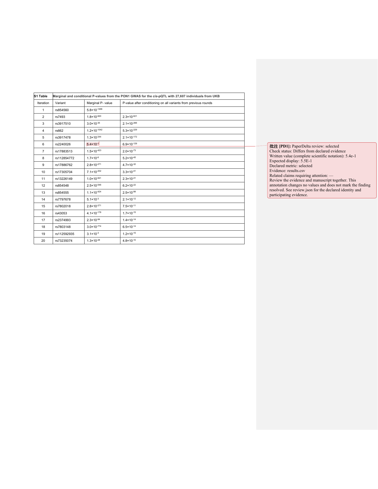

# Native review study 3

[简体中文](README.zh-CN.md)

This is the preregistered document study for the approved PaperDelta 1.8 work.
Selection, independent annotation, implementation freeze and the first held-out
run are complete. This is a bounded developer-operated study, not a general
extraction-accuracy claim or an independent human study.

Eight new article families provide twelve unchanged originals: eight PDFs and
four publisher DOCX supplements. PLOS Genetics, PLOS Medicine, PeerJ and Scientific
Reports supply the four metadata strata. Each first eligible family is used for
development and each second for held-out evaluation. An article and its supplement
stay together: four families and six files per split. No original layout or result
text was inspected before the [pre-development lock](pre-development-lock.json).

[The plan](protocol-plan.json) fixes bounded metadata windows, eligibility, the
family split, independent original-position annotation and all four outcomes.
[The authoritative selection lock](selection-lock-cloud-transport.json) precedes
original-file downloads. [Sources](sources.json) retain titles, authors, DOI,
licenses, distribution URLs and exact file hashes. All originals are CC BY 4.0;
their authors retain copyright. These articles are paired with controlled
synthetic evidence, not reproductions of their experiments.

The first attempt used an invalid Europe PMC field and returned no candidates for
two strata. The corrected attempt encountered the retired PMC OA API. The original
zero-result records, four-family shortage lock, collector snapshots and amendments
remain here. The completed collection uses the official public PMC Cloud Service.
Sample windows, article eligibility and split rules were not relaxed after these
transport corrections; original pages and result text had not been inspected.

Metadata is provided by PLOS and Europe PMC. PMC originals were accessed through
the NIH NLM NCBI PubMed Central Article Datasets on 2026-10-07. This frozen research
snapshot does not represent the most current data available from NLM. No NLM, NIH
or publisher endorsement is implied. See the [official distribution documentation](https://pmc.ncbi.nlm.nih.gov/tools/pmcaws/).

Held-out pages, text and positions were inspected only after the separate
[implementation freeze](implementation-lock.json). Published native-v1/native-v2
originals, gold and first results remain unchanged. Re-runs use observed inputs.


## Complete-value outcomes

| Inputs / implementation | Supported | Missed | Mislocated | Unknown | Eligible targets |
| --- | ---: | ---: | ---: | ---: | ---: |
| Development / public 1.7 | 18 | 0 | 0 | 78 | 96 |
| Development / frozen 1.8 | 34 | 0 | 0 | 62 | 96 |
| Held-out / public 1.7 | 18 | 0 | 0 | 62 | 80 |
| Held-out / first frozen 1.8 | 29 | 1 | 0 | 50 | 80 |

The held-out plan has 96 slots. The five-page PLOS Genetics Word attachment
contains allele identifiers, mutation descriptions, genomic coordinates and
sequences, with **zero eligible measured outcomes**. It is retained, and its
16 unfilled slots are neither successes nor fabricated unknown targets.

Supported requires a unique correct original position, an accepted binding,
`pass` on matching controlled evidence, and `mismatch` after the evidence changes.
Unknown is not success. Ranges, inequalities, fractions, count-percent cells and
confidence intervals remain whole targets. Extracting one component does not
establish support for the full expression. Locations are independently selected
from original OOXML and PDFium glyphs, with original-page visual review.

The gains on these new families come from admitting validated static local PDF
opening views; executable/chained actions remain refused. Complete raised
`a × 10` values now have guarded parsing, but all sixteen development Word targets
still fail automatic binding: fourteen need explicit table-row identity review,
and two exceed the unchanged exponent bound. The new Word-copy test uses an
explicitly reviewed identity, so it is separate from the automatic-binding score.

The first held-out miss is `held-050`, `0.54` on page 2 of the Scientific Reports
original. Version 1.7 refused that entire PDF; version 1.8 supports eleven targets
and misses this one. No post-held-out parser tuning is included in these results.
Other unknowns include complete unsupported compounds, quarantined original
content and unresolved identity; see the per-target reasons below.

## Preserved records

- [Development gold lock](development-gold-lock.json) precedes product scoring and parser edits.
- [Held-out gold lock](held-out-gold-lock.json) follows implementation freeze and original visual review, before [first-run start](first-run-start.json).
- [Development final](results/development-final.json) and [first held-out](results/held-out-first.json) match the frozen implementation.
- [Public 1.7 development baseline](baseline-1.7-development-amended.json) and [held-out baseline](results/baseline-1.7-held-out.json) use the same whole-value gold.
- [Earlier development attempt](development-run1.json) and [initial baseline](baseline-1.7-development.json) retain the original scoring behavior.
- [Scoring amendment before held-out access](scoring-amendment-before-held-out.json) records a 0.0001-point quarantine-boundary rounding allowance and a scientific-value evidence increment large enough to change the displayed value. Supported-position tolerances were not relaxed.
- [Observed-input native-v2 regression](results/native-v2-regression.json): 159 supported, 0 missed, 0 mislocated, 63 unknown across 222 original targets. One old complete scientific value is newly supported; two formerly reported misses are correctly classified as already-quarantined unknowns under the recorded coordinate amendment. Historical first results remain unchanged.

The annotation script at the held-out gold lock is preserved under
`annotation-tools/held-out-at-lock.py`. Later string line-wrapping in the active
script changes no emitted gold. Eighteen viewed original-page renders are retained
under `review/held-out/`; colored outlines identify the complete PDF targets.

## Reviewed annotation copies

[Four export records](annotated-copies/evidence.json) and the
[exact installed-wheel repeat](annotated-copies/installed-evidence.json) cover English and Chinese
Word/PDF copies of two licensed development originals. Original hashes, exact
locations, controlled before/after evidence, copy hashes and preview plans are
retained. The Word table identity was explicitly reviewed (iteration 6,
`rs2240026`, marginal P-value); this is not automatic mapping success.

[Actual Microsoft Word rendering](annotated-copies/word-render.json) verifies
that each comment scopes the entire `5.4 × 10⁻¹` value. Original text and formatting
stay unchanged; comment text expresses the complete scientific value as `5.4e-1`.
PDF page content and crop/media geometry are compared before and after export.
The authored unit tests additionally cover existing annotations, eight PDF
rotation/origin combinations, stale/forged plans and partially refused selections.



These copies and renders derive from Christian Benner, Anubha Mahajan and Matti
Pirinen, *Refining fine-mapping: Effect sizes and regional heritability*,
[original article and supplement](https://doi.org/10.1371/journal.pgen.1011480),
[CC BY 4.0](https://creativecommons.org/licenses/by/4.0/). PaperDelta adds review
comments/highlights and controlled synthetic evidence; the original authors do
not endorse these additions. The other original-page renders retain their authors
and CC BY 4.0 attribution in [sources](sources.json) and
[third-party notices](../../THIRD_PARTY_NOTICES.md). The MIT wheel excludes these materials.

## Reproduce

Install the matching source checkout with `.[dev,mcp,wandb]` and the separately
licensed evaluation bundle when using the source distribution. Run:

```sh
python tools/replay_native_v3.py --out build/native-v3-replay
python tools/validate_native_copies_v18.py --out build/native-v3-copies
```

Use new output directories. The replay validates the archived implementation and
compares every outcome with the recorded development/first-held-out run; subsequent
runs are regressions. The copy validator renders PDFs with PDFium and checks Word
package/text invariants. Actual Word visual verification additionally uses
`tools/render_native_copies_v18.ps1` on Windows with Word and Poppler installed;
these are validation-only tools, not product runtime requirements.
