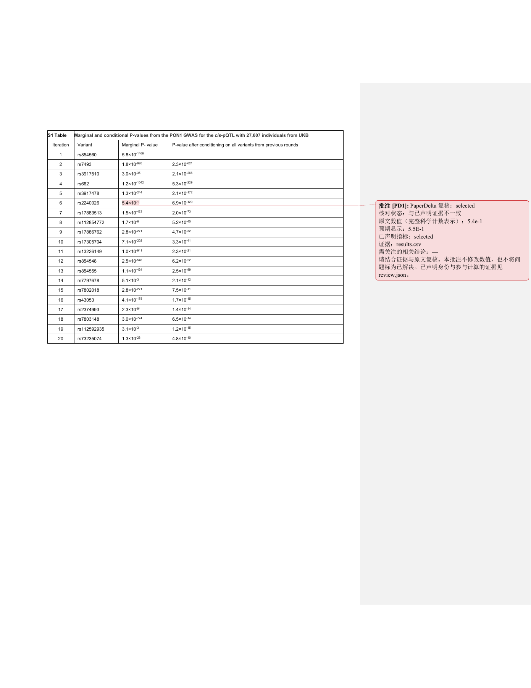

# 原生文档审查试验 3

[English](README.md)

本试验对应已批准的 PaperDelta 1.8 工作。样本选择、独立标注、实现冻结和首次留出
评测已完成。这是有界的开发者操作试验，不是一般提取准确率声明或独立真人研究。

八个新论文家族提供十二份保持原字节的文件：八份 PDF、四份出版社 DOCX 补充材料。
PLOS Genetics、PLOS Medicine、PeerJ 和 Scientific Reports 构成四个元数据分层。
每层首个合格家族用于开发，第二个用于留出评测；正文及补充材料始终属于同一划分。
两侧各四个家族、六份文件。[开发前锁](pre-development-lock.json) 写入前，尚未查看
任何原始版面或结果正文。

[预定方案](protocol-plan.json) 固定了有界元数据窗口、合格条件、家族划分、独立原文
位置标注和全部四类结果。[有效选择锁](selection-lock-cloud-transport.json) 先于原件
下载。[来源清单](sources.json) 保留标题、作者、DOI、许可、分发地址和文件哈希。
原件均采用 CC BY 4.0，著作权归各原作者。评测配套的是受控合成证据，不是复现论文实验。

首次采集误用了 Europe PMC 字段，使两个分层返回空结果。修正后又遇到已停用的 PMC
OA API。最初的空结果、四家族不足记录、采集器快照和修订说明均保留。完成的采集使用
官方公开 PMC Cloud Service。这些传输层修正没有放宽样本窗口、合格条件或划分规则；
修正时仍未查看原始页面或结果正文。

元数据由 PLOS 和 Europe PMC 提供。PMC 原件于 2026-10-07 从 NIH NLM NCBI PubMed
Central Article Datasets 获取。本冻结研究快照不代表 NLM 当前最新数据，也不表示
NLM、NIH 或出版社为本项目背书。详见[官方分发说明](https://pmc.ncbi.nlm.nih.gov/tools/pmcaws/)。

留出页面、正文和位置只在单独的[实现冻结](implementation-lock.json)后查看。
已发布的 native-v1/native-v2 原件、标注和首次结果保持不变。重跑属于已见输入回归。


## 完整数值结果

| 输入与实现 | 支持 | 漏检 | 误定位 | 未知 | 有效目标 |
| --- | ---: | ---: | ---: | ---: | ---: |
| 开发集／公开 1.7 | 18 | 0 | 0 | 78 | 96 |
| 开发集／冻结 1.8 | 34 | 0 | 0 | 62 | 96 |
| 留出集／公开 1.7 | 18 | 0 | 0 | 62 | 80 |
| 留出集／首次冻结 1.8 | 29 | 1 | 0 | 50 | 80 |

留出计划有 96 个名额。PLOS Genetics 的五页 Word 附件包含等位基因标识、突变描述、
基因组坐标和序列，**没有符合条件的测量结果**。原件保留，16 个未填名额单独记录，
不算成功，也不编造为未知目标。

“支持”要求唯一且正确的原始位置、能够接受的绑定、合成证据匹配时 `pass`，以及改变
证据后 `mismatch`。未知不算成功。范围、不等式、分数、计数与百分比及置信区间保留
为完整目标，提取一个组成数字不算支持整个表达式。位置来自独立的原始 OOXML 与
PDFium 字形，并核对原件渲染画面。

新家族上的增益来自允许已验证的静态本地 PDF 打开视图，可执行和串联动作仍拒绝。
完整的带上标 `a × 10` 值已有受控解析，但开发集 Word 的 16 个目标仍不能自动绑定：
14 个需要明确复核表格行身份，2 个超出未变的指数边界。Word 副本测试明确复核了行
身份，所以与自动绑定成绩分开记录。

首次留出漏检是 Scientific Reports 原件第 2 页的 `held-050`，数值 `0.54`。1.7 整体
拒绝该 PDF；1.8 支持其中 11 个目标，并漏掉此处。本次结果没有在查看留出集后调整
解析器。其他未知包括完整复合值尚不支持、原文内容已隔离和身份无法确认；逐项原因
见下方记录。

## 保留记录

- [开发标注锁](development-gold-lock.json) 先于产品评分和解析器修改。
- [留出标注锁](held-out-gold-lock.json) 在实现冻结、原件视觉核对之后，[首次运行](first-run-start.json)之前。
- [开发集最终结果](results/development-final.json)与[首次留出结果](results/held-out-first.json)匹配冻结实现。
- [公开 1.7 开发基线](baseline-1.7-development-amended.json)和[留出基线](results/baseline-1.7-held-out.json)使用同一完整数值标注。
- [较早开发尝试](development-run1.json)与[最初基线](baseline-1.7-development.json)保留原评分行为。
- [留出访问前的评分修订](scoring-amendment-before-held-out.json)记录：隔离区域边界允许 0.0001 点的坐标舍入差；科学计数值的受控证据增量应足以改变显示值。没有放宽支持位置的判定误差。
- [旧 native-v2 输入回归](results/native-v2-regression.json)：222 个原目标中，159 支持、0 漏检、0 误定位、63 未知。一个旧的完整科学计数值新增支持；两个曾记为漏检的已隔离位置，按记录的坐标修订正确归为未知。旧首次结果未改写。

留出标注锁对应脚本保存在 `annotation-tools/held-out-at-lock.py`，活动脚本后续只将长
字符串换行，不改变生成标注。18 张已核对的原件画面保存在 `review/held-out/`，彩色
边框标出完整 PDF 目标。

## 经过复核的批注副本

[四份导出记录](annotated-copies/evidence.json)及[准确安装包复验](annotated-copies/installed-evidence.json)覆盖两个许可开发原件的中英文 Word/PDF
副本，保留原件哈希、准确位置、受控证据变化、副本哈希及预览计划。Word 表格身份
经过明确复核：迭代 6、`rs2240026`、边际 P 值；这不是自动映射成功。

[实际 Microsoft Word 渲染](annotated-copies/word-render.json)确认批注范围是完整的
`5.4 × 10⁻¹`。原文与格式不变，说明中的完整科学计数表示为 `5.4e-1`。PDF 在导出前后
比较页面内容及裁剪／媒体框。自建测试还覆盖已有批注、8 种 PDF 旋转／原点组合、过期
或伪造计划，以及部分选择被拒绝的情况。



这些副本和画面来自 Christian Benner、Anubha Mahajan、Matti Pirinen 的
*Refining fine-mapping: Effect sizes and regional heritability*，
[论文及原附件](https://doi.org/10.1371/journal.pgen.1011480)，采用
[CC BY 4.0](https://creativecommons.org/licenses/by/4.0/)。PaperDelta 添加复核批注／高亮
和受控合成证据，不表示原作者认可这些新增内容。其他原件画面的作者和 CC BY 4.0
归属保留在[来源](sources.json)与[第三方声明](../../THIRD_PARTY_NOTICES.zh-CN.md)中。
MIT wheel 不包含这些材料。

## 重放

在匹配源码中安装 `.[dev,mcp,wandb]`。若使用源码发行包，另解压带许可的评测材料包，运行：

```sh
python tools/replay_native_v3.py --out build/native-v3-replay
python tools/validate_native_copies_v18.py --out build/native-v3-copies
```

使用新的输出目录。重放校验归档实现，并逐项比较开发／首次留出结果；后续运行属于
回归。副本验证器用 PDFium 渲染 PDF，检查 Word 包和文字不变量。实际 Word 视觉验收
另用 `tools/render_native_copies_v18.ps1`，需要 Windows 上的 Word 和 Poppler；这些
只用于验证，不是产品运行依赖。
